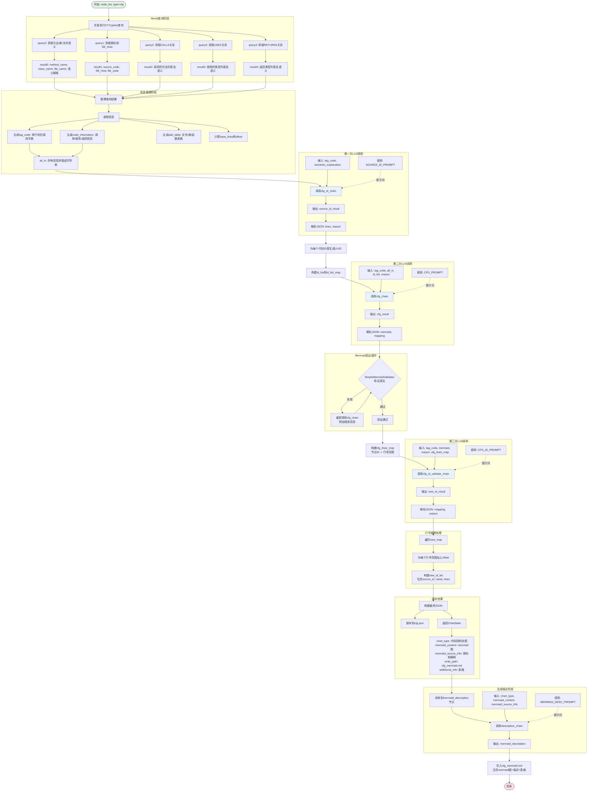

# java_wiki

```mermaid
  flowchart TD
      Start([开始: node_list, type=cfg]) --> Query

      subgraph Neo4j查询阶段
          Query[并发执行5个Cypher查询]
          Query --> Q0[query0: 获取方法/类/文件语义]
          Query --> Q1[query1: 获取源码和SE_How]
          Query --> Q2[query2: 获取CALLS关系]
          Query --> Q3[query3: 获取USES关系]
          Query --> Q4[query4: 获取RETURNS关系]

          Q0 --> R0[result0: method_name, class_name, file_name, 语义解释]
          Q1 --> R1[result1: source_code, SE_How, file_code]
          Q2 --> R2[result2: 调用的方法列表及语义]
          Q3 --> R3[result3: 使用的类型列表及语义]
          Q4 --> R4[result4: 返回类型列表及语义]
      end

      R0 --> Process
      R1 --> Process
      R2 --> Process
      R3 --> Process
      R4 --> Process

      subgraph 信息整理阶段
          Process[整理查询结果]
          Process --> ExtractInfo[提取信息]
          ExtractInfo --> TagCode[生成tag_code: 带行号的源码字典]
          ExtractInfo --> NodeInfo[生成node_information: 调用/使用/返回信息]
          ExtractInfo --> Table[生成add_table: 文件/类/函数表格]
          ExtractInfo --> BaseLines[计算base_lines和offset]

          TagCode --> AllIn[all_in: 所有信息拼接成字符串]
          NodeInfo --> AllIn
      end

      AllIn --> LLM1

      subgraph 第一次LLM调用
          LLM1[调用cfg_id_chain]
          LLM1Input[输入: tag_code, semantic_explanation]
          LLM1Prompt[使用: SOURCE_ID_PROMPT]
          LLM1Output[输出: source_id_result]

          LLM1Input --> LLM1
          LLM1Prompt -.提示词.-> LLM1
          LLM1 --> LLM1Output
          LLM1Output --> ParseID[解析JSON: lines, reason]
      end

      ParseID --> GenUUID[为每个代码片段生成UUID]
      GenUUID --> IDList[构建id_list和id_list_map]
      IDList --> LLM2

      subgraph 第二次LLM调用
          LLM2[调用cfg_chain]
          LLM2Input[输入: tag_code, all_in, id_list, reason]
          LLM2Prompt[使用: CFG_PROMPT]
          LLM2Output[输出: cfg_result]

          LLM2Input --> LLM2
          LLM2Prompt -.提示词.-> LLM2
          LLM2 --> LLM2Output
          LLM2Output --> ParseCFG[解析JSON: mermaid, mapping]
      end

      ParseCFG --> Validate

      subgraph Mermaid验证循环
          Validate{SimpleMermaidValidator<br/>验证语法}
          Validate -->|失败| Retry[重新调用cfg_chain<br/>附加错误信息]
          Retry --> Validate
          Validate -->|通过| ValidOK[验证通过]
      end

      ValidOK --> BuildMap[构建cfg_lines_map<br/>节点ID -> 行号范围]
      BuildMap --> LLM3

      subgraph 第三次LLM调用
          LLM3[调用cfg_id_validate_chain]
          LLM3Input[输入: tag_code, mermaid, reason, cfg_lines_map]
          LLM3Prompt[使用: CFG_ID_PROMPT]
          LLM3Output[输出: new_id_result]

          LLM3Input --> LLM3
          LLM3Prompt -.提示词.-> LLM3
          LLM3 --> LLM3Output
          LLM3Output --> ParseNew[解析JSON: mapping, reason]
      end

      ParseNew --> Offset

      subgraph 行号偏移处理
          Offset[遍历new_map]
          Offset --> AddOffset[为每个行号范围加上offset]
          AddOffset --> NewIDList[构建new_id_list<br/>包含source_id, name, lines]
      end

      NewIDList --> Save

      subgraph 保存结果
          Save[构建最终JSON]
          Save --> SaveJSON[保存到cfg.json]
          Save --> ReturnState[返回ChartState]

          ReturnState --> StateContent[chart_type: 代码控制流图<br/>mermaid_content: mermaid图<br/>mermaid_source_info: 源码和解释<br/>write_path: cfg_mermaid.md<br/>additional_info: 表格]
      end

      StateContent --> NextNode[流转到mermaid_description节点]

      subgraph 生成描述阶段
          NextNode --> LLM4[调用description_chain]
          LLM4Input[输入: chart_type, mermaid_content, mermaid_source_info]
          LLM4Prompt[使用: MERMIAD_DESC_PROMPT]
          LLM4Output[输出: mermaid_description]

          LLM4Input --> LLM4
          LLM4Prompt -.提示词.-> LLM4
          LLM4 --> LLM4Output
      end

      LLM4Output --> WriteMD[写入cfg_mermaid.md<br/>包含mermaid图+描述+表格]
      WriteMD --> End([结束])

      style Start fill:#e1f5e1
      style End fill:#ffe1e1
      style LLM1 fill:#e6f3ff
      style LLM2 fill:#e6f3ff
      style LLM3 fill:#e6f3ff
```