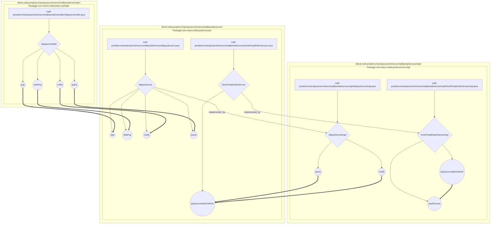

下面介绍出现的包和功能模块的基本信息

| 类型 | 名称 | 语义解释 |
| --- | --- | --- |
| Package | com.macro.mall.portal.controller | com.macro.mall.portal.controller包包含商城门户系统的多个Spring MVC控制器类，这些控制器类负责处理面向前端用户的核心HTTP请求，涵盖订单管理、商品展示、购物车操作、会员管理、优惠券使用、退货申请、收货地址维护、浏览历史记录、品牌展示、支付宝支付以及会员商品收藏等业务模块，作为客户端请求与后端服务交互的入口。 |
| Package | com.macro.mall.portal.service | com.macro.mall.portal.service 包含商城门户模块中所有的服务接口定义，这些接口抽象了门户层的业务逻辑契约，涵盖了商品管理、订单处理、购物车、会员管理、促销、支付、收藏与关注、收货地址等多个核心业务领域，支持前端系统对商城功能的调用和业务数据的交互。 |
| Package | com.macro.mall.portal.service.impl | com.macro.mall.portal.service.impl包包含商城门户业务层的具体实现类，负责处理商城前台涉及会员管理、购物车、订单、促销、品牌、商品、支付、收货地址、会员优惠券、会员关注和浏览历史等核心业务逻辑，支撑商城门户的各项功能模块服务。 |
| Block | mall-portal/src/main/java/com/macro/mall/portal/controller/ | 这些模块共同致力于为商城门户系统提供统一、标准化的对外RESTful接口，分别聚焦于支付、会员、订单购物车和门户展示等核心业务的分层管理与整合。通过接口聚合与职责分离，提升了系统的可维护性、一致性和模块化，便于前后端协作和功能扩展。 |
| Block | PortalOrderAndReturnService | 该服务统一抽象门户订单全生命周期管理及订单退货管理相关业务逻辑，涵盖订单创建、支付、取消、确认收货、查询、删除和退货申请等功能，为前端系统提供一站式订单操作接口，简化业务调用并提升维护性和扩展性。 |
| Block | mall-portal/src/main/java/com/macro/mall/portal/service/ | 这些模块共同致力于为商城门户前台提供核心业务能力的服务抽象与实现，涵盖品牌、商品、会员、订单、支付、内容及促销等主要领域，通过接口和模块化设计实现前后端解耦、业务逻辑集中封装与统一对外服务，提升系统的可维护性、可扩展性和前端数据交互的一致性。 |
| Block | mall-portal/src/main/java/com/macro/mall/portal/service/impl/ | 这些模块共同致力于实现和完善商城门户前台的核心业务，包括会员管理、支付、订单、促销、内容与商品等主要功能，旨在通过业务逻辑的集中封装提升系统的可维护性、安全性和扩展性，并优化用户体验和数据一致性。 |
| Block | PortalOrderAndPromotionServiceImpl | 该合并模块集中实现了商城门户前台的订单全生命周期管理、购物车业务、促销优惠计算及订单退货申请等核心服务。通过统一整合订单与促销相关的业务逻辑，简化接口调用，提升订单处理流程的完整性、灵活性和系统维护效率。 |
