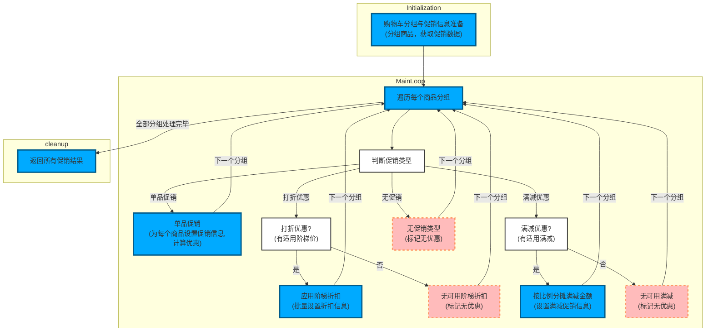

```mermaid
flowchart TD
  direction TB
  subgraph Initialization
    A1["购物车分组与促销信息准备\n(分组商品，获取促销数据)"]
    style A1 fill:#0af,stroke:#005b8a,stroke-width:3px
  end
  subgraph MainLoop
    B1["遍历每个商品分组"]
    style B1 fill:#0af,stroke:#005b8a,stroke-width:3px
    B2["判断促销类型"]
    style B2 fill:#fff,stroke:#333,stroke-width:2px,shape:diamond
    B3["单品促销\n(为每个商品设置促销信息,计算优惠)"]
    style B3 fill:#0af,stroke:#005b8a,stroke-width:3px
    B4["打折优惠?\n(有适用阶梯价)"]
    style B4 fill:#fff,stroke:#333,stroke-width:2px,shape:diamond
    B5["应用阶梯折扣\n(批量设置折扣信息)"]
    style B5 fill:#0af,stroke:#005b8a,stroke-width:3px
    B6["无可用阶梯折扣\n(标记无优惠)"]
    style B6 fill:#fbb,stroke:#f96,stroke-dasharray:5 5,stroke-width:3px
    B7["满减优惠?\n(有适用满减)"]
    style B7 fill:#fff,stroke:#333,stroke-width:2px,shape:diamond
    B8["按比例分摊满减金额\n(设置满减促销信息)"]
    style B8 fill:#0af,stroke:#005b8a,stroke-width:3px
    B9["无可用满减\n(标记无优惠)"]
    style B9 fill:#fbb,stroke:#f96,stroke-dasharray:5 5,stroke-width:3px
    B10["无促销类型\n(标记无优惠)"]
    style B10 fill:#fbb,stroke:#f96,stroke-dasharray:5 5,stroke-width:3px
  end
  subgraph cleanup
    C1["返回所有促销结果"]
    style C1 fill:#0af,stroke:#005b8a,stroke-width:3px
  end
  A1 --> B1
  B1 --> B2
  B2 -- "单品促销" --> B3
  B2 -- "打折优惠" --> B4
  B2 -- "满减优惠" --> B7
  B2 -- "无促销" --> B10
  B4 -- "是" --> B5
  B4 -- "否" --> B6
  B7 -- "是" --> B8
  B7 -- "否" --> B9
  B3 -- "下一个分组" --> B1
  B5 -- "下一个分组" --> B1
  B6 -- "下一个分组" --> B1
  B8 -- "下一个分组" --> B1
  B9 -- "下一个分组" --> B1
  B10 -- "下一个分组" --> B1
  B1 -- "全部分组处理完毕" --> C1

```