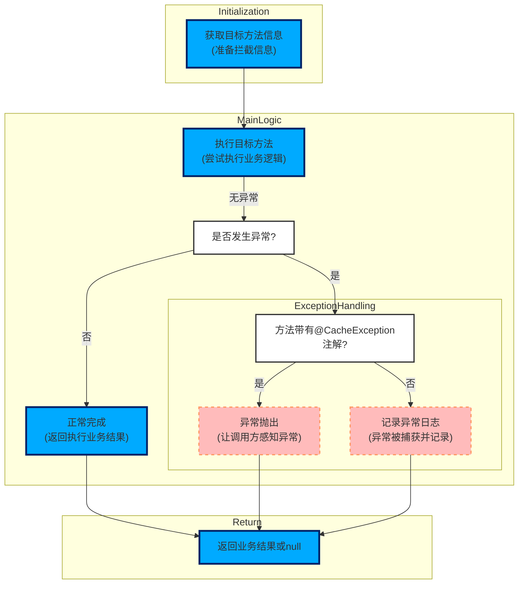

- 本图为“代码控制流图”，描述了doAround方法的核心执行流程，具体如下：
    - **初始化阶段**  
        - 获取目标方法相关信息，为后续拦截和处理做准备。
    - **主逻辑阶段**  
        - 执行目标方法（即调用joinPoint.proceed()），尝试完成业务逻辑。
        - 判断目标方法执行过程中是否发生异常：
            - 若**未发生异常**，则直接返回业务方法的正常执行结果。
            - 若**发生异常**，进入异常处理分支。
                - 判断该方法是否带有@CacheException注解：
                    - 若**有@CacheException注解**，则异常被直接抛出，让调用方能够感知此异常。
                    - 若**没有@CacheException注解**，则捕获异常并通过LOGGER记录异常日志，异常不会继续抛出。
    - **返回阶段**  
        - 最终返回业务结果：正常情况下返回目标方法的执行结果；发生异常且未抛出时返回null。

- 该流程图准确反映了doAround方法的控制流逻辑，重点体现了：
    - 业务方法执行与异常捕获的分支流程；
    - @CacheException注解对异常处理策略的影响；
    - 日志记录器LOGGER的作用为记录未抛出的异常信息。

下面介绍该函数所属的文件、类、函数的基本信息

| 文件 | 类 | 函数 |
| --- | --- | --- |
| mall-security/src/main/java/com/macro/mall/security/aspect/RedisCacheAspect.java | RedisCacheAspect | RedisCacheAspect.doAround |
| 该文件定义了一个基于Spring AOP的切面类RedisCacheAspect，用于拦截com.macro.mall.portal.service和com.macro.mall.service包中所有以CacheService结尾的类的公共方法，主要负责对这些方法的调用进行环绕通知，统一捕获并处理方法执行过程中发生的异常，尤其是与Redis缓存操作相关的异常。 | RedisCacheAspect是一个基于Spring AOP的切面类，用于拦截com.macro.mall.portal.service和com.macro.mall.service包下所有以CacheService结尾的类的公共方法，实现对这些方法的调用进行环绕通知，统一捕获和处理执行过程中发生的异常，尤其是与Redis缓存操作相关的异常，防止Redis宕机影响正常业务逻辑，保证业务流程的稳定性。 | 该方法是一个基于Spring AOP的环绕通知方法，用于拦截符合切点cacheAspect()定义的目标方法调用。该方法执行目标方法并捕获其执行过程中抛出的异常，针对带有@CacheException注解的方法会将异常继续抛出，否则仅记录异常日志，保证业务流程在缓存操作异常时仍能继续执行，返回目标方法的执行结果或null。 |
