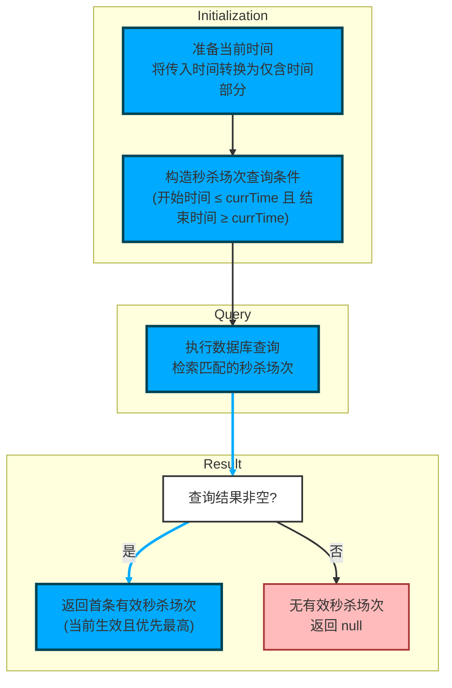

- 该图为代码控制流图，对应方法：private SmsFlashPromotionSession getFlashPromotionSession(Date date)
- Initialization（初始化）
  - 调用 DateUtil.getTime(date) 将传入的 Date 转换为仅含时间部分的 Date 对象 currTime（日期部分被重置为 1970-01-01，时间部分保留）
  - 构造 SmsFlashPromotionSessionExample 查询条件：通过 createCriteria 添加两个约束
    - andStartTimeLessThanOrEqualTo(currTime)：秒杀场次的开始时间 ≤ currTime
    - andEndTimeGreaterThanOrEqualTo(currTime)：秒杀场次的结束时间 ≥ currTime
- Query（查询）
  - 使用 promotionSessionMapper.selectByExample(sessionExample) 在数据库中检索满足上述条件的 SmsFlashPromotionSession 列表
- Result（结果判断与返回）
  - 判断查询结果列表 promotionSessionList 是否非空
    - 若“是”：返回列表的首条记录 promotionSessionList.get(0)（即当前生效且优先最高的秒杀场次）
    - 若“否”：返回 null（表示当前时间点无有效秒杀场次）
- 相关要点（来自代码/类说明）
  - SmsFlashPromotionSessionExample 用于动态构建查询条件，createCriteria 保证至少有一个 Criteria 用于添加条件
  - promotionSessionMapper 是用于执行 selectByExample 的 MyBatis Mapper，用以从数据库检索 SmsFlashPromotionSession 实体列表
  - 方法最终返回类型为 SmsFlashPromotionSession，或在无匹配时返回 null

下面介绍该函数所属的文件、类、函数的基本信息

| 文件 | 类 | 函数 |
| --- | --- | --- |
| mall-portal/src/main/java/com/macro/mall/portal/service/impl/HomeServiceImpl.java | HomeServiceImpl | HomeServiceImpl.getFlashPromotionSession |
| HomeServiceImpl 是商城门户首页内容管理的服务实现类，实现了 HomeService 接口。该类负责整合和处理首页所需的多种业务数据，包括首页广告、推荐品牌、秒杀促销活动、新品推荐、人气推荐以及推荐专题内容。它通过调用多个 Mapper 和 DAO 层接口从数据库获取数据，封装为供前端展示的结构化结果，支持商城首页的动态内容渲染。 | HomeServiceImpl 是商城门户首页内容管理的服务实现类，实现了 HomeService 接口。该类主要负责处理商城首页的核心业务逻辑，包括获取首页广告、推荐品牌、秒杀促销活动、新品推荐、人气推荐以及推荐专题等多种数据，并将这些数据整合封装为供前端展示的结果对象。 | 该方法getFlashPromotionSession用于根据传入的日期参数，查询并返回在该时间点对应的秒杀促销活动时间场次（SmsFlashPromotionSession）对象。其通过比较秒杀场次的开始时间和结束时间，筛选出当前时间段内有效的秒杀场次。 |
