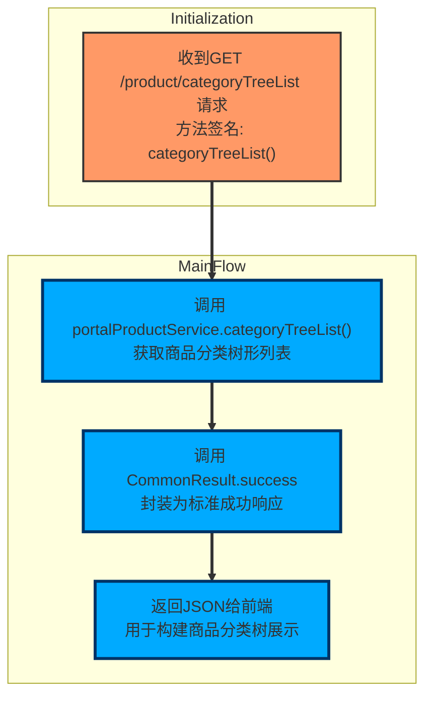

- 概要：这是一个代码控制流图，表示控制器方法 categoryTreeList 在接收到 GET /product/categoryTreeList 请求后的执行流程与返回结果封装过程（方法签名：categoryTreeList()），用于以树形结构获取所有商品分类并返回给前端。
- 执行顺序（控制流）：
  - 接收到 HTTP GET 请求访问 /product/categoryTreeList，Spring MVC 将该请求映射到 controller 的 categoryTreeList() 方法。
  - 在方法内部，调用注入的 portalProductService.categoryTreeList()，由该服务方法获取商品分类的树形结构列表（返回类型为 List<PmsProductCategoryNode>）。
  - 将获取到的列表作为参数，调用 CommonResult.success(list) 静态方法，将数据封装为一个标准的成功响应对象（使用预定义的成功状态码和成功消息）。
  - 将封装后的 CommonResult 作为 JSON 响应体返回给前端，用于前端构建商品分类树形展示。
- 关键类型与职责（基于提供信息）：
  - portalProductService：由 Spring 注入的 PmsPortalProductService 类型字段，负责提供商品相关的核心业务服务（包括获取分类树形结构）。
  - PmsProductCategoryNode：构成分类树的节点类型，封装在返回的 List 中以表示层级关系。
  - CommonResult<T>：通用的接口返回结果封装类（包含 code、message、data 三个成员），其静态泛型方法 success 用于生成表示操作成功的统一返回结果并封装传入的数据。
- 额外重要点（代码说明中明确的约束）：
  - 该控制器方法不接受任何请求参数，所有业务逻辑和数据构建均由 service 层完成。
  - 最终返回的数据以 JSON 格式提供给前端，用于展示商品分类的树形结构。

下面介绍该函数所属的文件、类、函数的基本信息

| 文件 | 类 | 函数 |
| --- | --- | --- |
| mall-portal/src/main/java/com/macro/mall/portal/controller/PmsPortalProductController.java | PmsPortalProductController | PmsPortalProductController.categoryTreeList |
| 该文件定义了商城门户系统中负责前台商品管理的控制器类PmsPortalProductController。它通过提供RESTful接口处理商品相关的HTTP请求，包括商品的综合搜索（支持关键词、品牌、分类筛选及多种排序方式）、以树形结构获取商品分类列表、以及获取指定商品的详细信息。控制器将请求参数传递给业务层服务PmsPortalProductService，并将服务返回的结果封装成统一的响应格式返回给前端。 | PmsPortalProductController是商城门户前台的商品管理控制器类，负责处理与商品相关的HTTP请求。它提供了商品综合搜索（支持关键词、品牌和分类筛选及多种排序方式）、以树形结构获取商品分类列表，以及获取指定商品详细信息的接口。该控制器通过调用PmsPortalProductService的业务方法，实现具体的商品查询和数据组织，并将结果以统一格式返回给前端。 | categoryTreeList方法是商城门户前台商品管理控制器中的一个接口，用于以树形结构获取所有商品分类。该方法通过调用业务服务portalProductService的categoryTreeList方法，获取包含商品分类节点的列表，并将其封装在统一的CommonResult成功响应中返回给前端，便于前端展示商品分类的层级关系。 |
