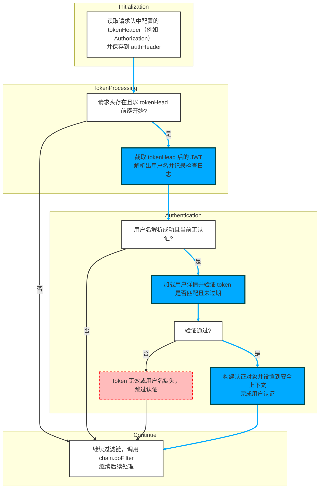

- 总体说明（代码控制流对应关系）
  - 该控制流图对应 doFilterInternal 方法的执行路径，描述了从请求头读取 JWT、解析用户名、根据条件加载并验证用户、设置认证信息到 SecurityContext，以及最终继续过滤链的流程（完全基于提供的源码说明与图）。

- 初始化
  - 读取配置的 tokenHeader（例如 Authorization）并保存到局部变量 authHeader（图中节点 A1，对应源码首行获取 request.getHeader(this.tokenHeader)）。

- 判断请求头与前缀
  - 检查请求头是否存在且以预定义 tokenHead（例如 "Bearer "）开头（图中菱形判断 D1，对应 if (authHeader != null && authHeader.startsWith(this.tokenHead))）。
  - 若为否，直接跳到继续过滤链（A5，对应 chain.doFilter）并结束本次处理。

- 截取并解析 token
  - 若为是，则截取 tokenHead 后的 JWT（authToken = authHeader.substring(this.tokenHead.length())），并调用 jwtTokenUtil.getUserNameFromToken(authToken) 解析出用户名，记录检查日志（图中 A2 与源码中的 LOGGER.info("checking username:{}" , username)）。

- 判断是否需要认证
  - 判断解析出的用户名非空且当前 SecurityContext 中无认证信息（D2，对应 username != null && SecurityContextHolder.getContext().getAuthentication() == null）。
  - 若为否，跳过认证并继续过滤链（A5）。

- 加载用户并验证 token
  - 若为是，使用 userDetailsService.loadUserByUsername(username) 加载 UserDetails（图中 A3）。
  - 调用 jwtTokenUtil.validateToken(authToken, userDetails) 验证 token 是否与该用户匹配且未过期（图中 D3，validateToken 的语义在源码说明中给出）。

- 验证通过分支
  - 若验证通过（D3 为是），构建 UsernamePasswordAuthenticationToken，将请求详细信息设置到该认证对象（authentication.setDetails(new WebAuthenticationDetailsSource().buildDetails(request))），并将其设置到 SecurityContextHolder 中完成认证（图中 A4，对应源码中构造、设置和 LOGGER.info("authenticated user:{}") 的步骤）。
  - 该从读取到成功认证的主路径在图中被标记为关键路径（加粗/上色），表示正常的成功认证流程。

- 验证不通过或用户名缺失分支
  - 若验证未通过或用户名为 null（D3 为否或 D2 为否），则视为 Token 无效或用户名缺失、跳过认证（图中 E1，带有跳过说明）。

- 始终继续过滤链
  - 无论是否完成认证，方法最终都会调用 chain.doFilter(request, response) 继续后续过滤器或请求处理（图中 A5，为所有分支的汇合点）。

下面介绍该函数所属的文件、类、函数的基本信息

| 文件 | 类 | 函数 |
| --- | --- | --- |
| mall-security/src/main/java/com/macro/mall/security/component/JwtAuthenticationTokenFilter.java | JwtAuthenticationTokenFilter | JwtAuthenticationTokenFilter.doFilterInternal |
| 该文件定义了一个名为JwtAuthenticationTokenFilter的Spring Security过滤器类，继承自OncePerRequestFilter，用于在每次HTTP请求时从请求头中提取JWT令牌，解析用户名，基于用户名通过UserDetailsService加载用户详情，验证JWT令牌的有效性，并将认证信息设置到SecurityContext中，从而实现基于JWT的用户身份认证和授权。 | JwtAuthenticationTokenFilter是一个继承自Spring Security的OncePerRequestFilter的过滤器类，用于在每次HTTP请求时从请求头中提取JWT令牌，解析出用户名，加载用户详情，验证令牌的有效性，并将认证信息设置到SecurityContext中，从而实现基于JWT的用户身份认证和授权。 | 该方法是继承自Spring Security的OncePerRequestFilter的JWT登录授权过滤器的核心方法，用于在每次HTTP请求时从请求头中提取JWT令牌，解析出用户名，验证令牌的有效性，并将认证信息存入Spring Security的SecurityContext，从而实现基于JWT的用户身份验证和授权。 |
