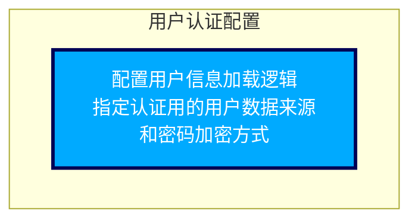

- 该图为“代码控制流图”，描述了Spring Security用户认证配置的核心控制逻辑。
- 图中唯一节点A1表示：  
  - 配置用户信息加载逻辑，包括指定认证所用的用户数据来源（即自定义的UserDetailsService），以及指定密码加密方式（BCryptPasswordEncoder）。
- 控制流对应的代码实现为：  
  - 在`configure`方法中，调用`auth.userDetailsService(userDetailsService())`，指定用户信息的加载方式；
  - 再调用`.passwordEncoder(new BCryptPasswordEncoder())`，指定密码的加密和校验算法。
- 此配置确保Spring Security在认证流程中：
  - 通过自定义的UserDetailsService实现动态加载用户详情（如通过数据库查询）；
  - 使用BCryptPasswordEncoder进行密码加密与比对，提高认证安全性。

下面介绍该函数所属的文件、类、函数的基本信息

| 文件 | 类 | 函数 |
| --- | --- | --- |
| mall-demo/src/main/java/com/macro/mall/demo/config/SecurityConfig.java | SecurityConfig | SecurityConfig.configure |
| SecurityConfig 是基于 Spring Security 框架的安全配置类，继承自 WebSecurityConfigurerAdapter，用于配置整个应用的安全策略。它定义了 HTTP 请求的授权规则、认证机制、登录与退出页面行为，并禁用了 CSRF 保护和部分安全头部。该类还通过自定义 UserDetailsService 从数据库中加载用户信息，完成用户认证。 | SecurityConfig 是基于 Spring Security 框架的安全配置类，通过继承 WebSecurityConfigurerAdapter，负责配置整个应用程序的安全策略。它主要定义了 HTTP 请求的访问授权规则、认证机制、登录和注销流程，以及密码加密方式。同时，SecurityConfig 自定义了 UserDetailsService，从数据库动态加载用户信息进行认证，保障认证流程的安全性。 | 该方法是Spring Security框架中继承自WebSecurityConfigurerAdapter的安全配置类中的重写方法，负责配置AuthenticationManagerBuilder，指定用户认证时使用的自定义UserDetailsService以及密码加密器。通过该方法，系统能够使用基于数据库的用户信息加载逻辑和BCrypt加密算法来完成用户认证。 |
