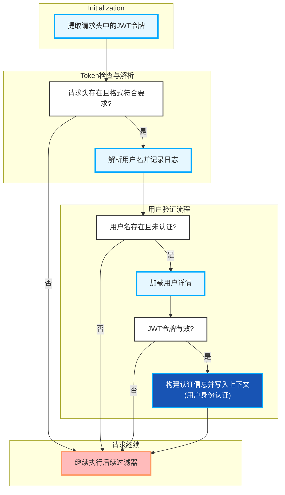

- 本图为 doFilterInternal 方法的代码控制流图，描述了处理HTTP请求时JWT令牌认证的主要逻辑流程。

- 主要流程如下：
  - **初始化阶段**
    - 从HTTP请求头中提取JWT令牌（Authorization头，提取并去除"Bearer "前缀）。
  - **Token检查与解析阶段**
    - 判断请求头是否存在且格式正确（非空且以tokenHead开头），否则直接跳转到后续处理。
    - 若格式正确，解析JWT令牌获取用户名，并记录日志。
  - **用户验证流程**
    - 判断解析出的用户名是否存在，且当前安全上下文未认证（即未登录）。
      - 如果条件成立，加载该用户名对应的用户详情（UserDetailsService）。
      - 验证JWT令牌是否合法且与用户详情匹配（validateToken方法）。
        - 若验证通过，构建认证信息（UsernamePasswordAuthenticationToken），并写入安全上下文，完成用户身份认证。
    - 任一步骤失败（用户名不存在、已认证、token无效），则跳转到后续处理。
  - **请求继续阶段**
    - 无论认证是否通过，最终都继续执行过滤器链（chain.doFilter），进行后续的过滤或请求处理。
  
- 图中各判断与操作节点、流转关系严格对应doFilterInternal方法的实际控制流程，体现了JWT认证在请求处理过程中的关键分支。

下面介绍该函数所属的文件、类、函数的基本信息

| 文件 | 类 | 函数 |
| --- | --- | --- |
| mall-security/src/main/java/com/macro/mall/security/component/JwtAuthenticationTokenFilter.java | JwtAuthenticationTokenFilter | JwtAuthenticationTokenFilter.doFilterInternal |
| 该文件定义了一个名为JwtAuthenticationTokenFilter的Spring Security过滤器类，继承自OncePerRequestFilter，用于在每次HTTP请求时从请求头中提取JWT令牌，解析用户名，基于用户名通过UserDetailsService加载用户详情，验证JWT令牌的有效性，并将认证信息设置到SecurityContext中，从而实现基于JWT的用户身份认证和授权。 | JwtAuthenticationTokenFilter是一个继承自Spring Security的OncePerRequestFilter的过滤器类，用于在每次HTTP请求时从请求头中提取JWT令牌，解析出用户名，加载用户详情，验证令牌的有效性，并将认证信息设置到SecurityContext中，从而实现基于JWT的用户身份认证和授权。 | 该方法是继承自Spring Security的OncePerRequestFilter的JWT登录授权过滤器的核心方法，用于在每次HTTP请求时从请求头中提取JWT令牌，解析出用户名，验证令牌的有效性，并将认证信息存入Spring Security的SecurityContext，从而实现基于JWT的用户身份验证和授权。 |
