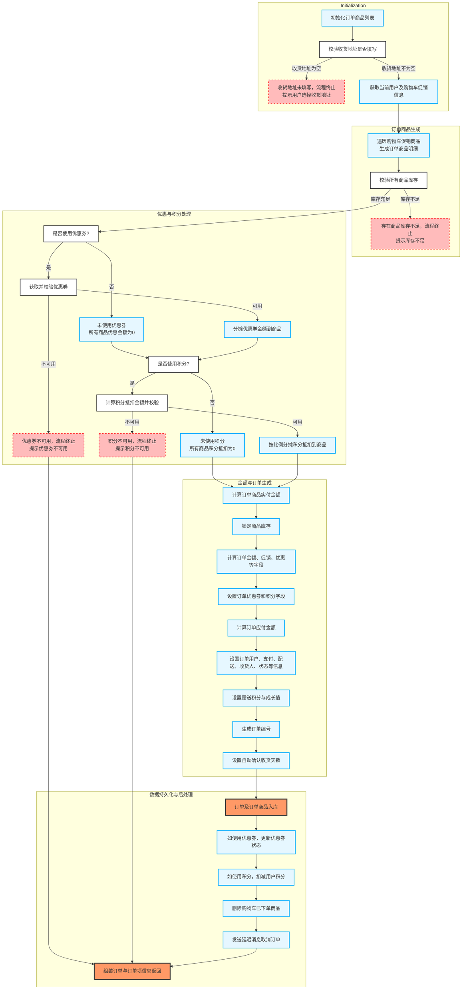

- 本图是`generateOrder`方法的**代码控制流图**，完整展现了订单生成流程的主要逻辑分支与执行路径，核心内容如下：

- **初始化阶段**
  - 初始化订单商品列表（A1）。
  - 校验收货地址是否填写（A2），如未填写则终止流程并提示用户选择收货地址（A3）；如已填写则继续获取用户信息和购物车促销信息（A4）。

- **订单商品生成阶段**
  - 遍历购物车促销商品，生成订单商品明细（B1）。
  - 校验所有商品库存（B2），如有商品库存不足则终止流程并提示库存不足（B3）；库存充足则进入优惠与积分处理环节。

- **优惠与积分处理阶段**
  - 判断是否使用优惠券（C1）：
    - 未使用优惠券，所有商品优惠金额为0（C2）。
    - 使用优惠券则获取并校验优惠券（C3）：不可用则终止流程并提示优惠券不可用（C4）；可用则分摊优惠券金额到商品（C5）。
  - 判断是否使用积分（D1）：
    - 未使用积分，所有商品积分抵扣为0（D2）。
    - 使用积分则计算积分抵扣金额并校验（D3）：积分不可用则终止流程并提示积分不可用（D4）；积分可用则按比例分摊积分抵扣到商品（D5）。

- **金额与订单生成阶段**
  - 计算订单商品实付金额（E1）。
  - 锁定商品库存（E2）。
  - 计算订单金额、促销、优惠等字段（E3）。
  - 设置订单优惠券和积分字段（E4）。
  - 计算订单应付金额（E5）。
  - 设置订单用户、支付、配送、收货人、状态等信息（E6）。
  - 设置赠送积分与成长值（E7）。
  - 生成订单编号（E8）。
  - 设置自动确认收货天数（E9）。

- **数据持久化与后处理阶段**
  - 订单及订单商品入库（F1）。
  - 若使用优惠券则更新优惠券状态（F2）。
  - 若使用积分则扣减用户积分（F3）。
  - 删除购物车已下单商品（F4）。
  - 发送延迟消息用于超时取消订单（F5）。
  - 最终组装订单与订单项信息返回（F6）。

- **特殊流程分支说明**
  - 若收货地址为空、商品库存不足、优惠券不可用或积分不可用，流程均会提前终止，并立即返回相应的异常提示。

- **控制流体现**
  - 图中菱形节点表示条件判断，虚线节点表示流程终止及错误提示，其它节点为主要功能步骤，流程严格按照代码实际执行顺序和分支展开。

下面介绍该函数所属的文件、类、函数的基本信息

| 文件 | 类 | 函数 |
| --- | --- | --- |
| mall-portal/src/main/java/com/macro/mall/portal/service/impl/OmsPortalOrderServiceImpl.java | OmsPortalOrderServiceImpl | OmsPortalOrderServiceImpl.generateOrder |
| 该文件OmsPortalOrderServiceImpl是商城门户前台订单管理的核心服务实现类，负责涵盖订单生命周期管理的关键业务逻辑，包括订单确认（生成确认订单信息）、订单创建（从购物车和用户输入生成订单）、支付成功处理（更新订单状态及库存扣减）、订单取消（自动超时取消及手动取消）、订单收货确认、订单分页查询、订单详情查询以及订单删除等功能，确保前台用户订单操作的完整流程和数据一致性。 | OmsPortalOrderServiceImpl类是商城门户前台订单管理的核心服务实现，负责处理用户订单的整个生命周期，包括订单确认信息生成、订单创建、支付成功处理、订单取消（自动超时取消和手动取消）、订单确认收货、订单分页查询、订单详情查看及订单删除等功能。该类协调购物车、用户信息、库存、优惠券、积分等多个子系统，确保订单业务流程的完整性和数据一致性。 | 该方法generateOrder用于根据用户提交的订单参数（OrderParam）生成一个完整的订单及其订单商品项信息，涵盖订单数据校验、优惠券和积分使用处理、库存校验与锁定、订单金额计算、订单数据持久化，以及相关的后续操作（如购物车商品删除、积分扣减和延迟取消订单消息发送）。最终返回包含生成的订单实体和订单商品列表的结果。 |
