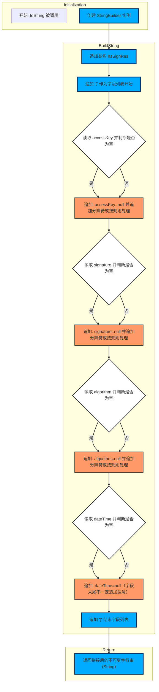

```mermaid
flowchart TB
    direction TB
    subgraph Initialization
        A1["开始: toString 被调用"]
        A2["创建 StringBuilder 实例"]
        style A2 fill:#0af,stroke:#036,stroke-width:3px
    end

    subgraph BuildString
        A2 --> A3["追加类名 IrsSignRes"]
        style A3 fill:#0af,stroke:#036,stroke-width:3px

        A3 --> A4["追加 '(' 作为字段列表开始"]
        style A4 fill:#0af,stroke:#036,stroke-width:3px

        A4 --> F1_check{"读取 accessKey 并判断是否为空"}
        style F1_check fill:#fff,stroke:#333,stroke-width:2px,shape:diamond
        F1_check -->|是| F1_append["追加: accessKey=null 并追加分隔符或按规则处理"]
        F1_check -->|否| F1_append
        style F1_append fill:#f96,stroke:#333,stroke-width:2px

        F1_append --> F2_check{"读取 signature 并判断是否为空"}
        style F2_check fill:#fff,stroke:#333,stroke-width:2px,shape:diamond
        F2_check -->|是| F2_append["追加: signature=null 并追加分隔符或按规则处理"]
        F2_check -->|否| F2_append
        style F2_append fill:#f96,stroke:#333,stroke-width:2px

        F2_append --> F3_check{"读取 algorithm 并判断是否为空"}
        style F3_check fill:#fff,stroke:#333,stroke-width:2px,shape:diamond
        F3_check -->|是| F3_append["追加: algorithm=null 并追加分隔符或按规则处理"]
        F3_check -->|否| F3_append
        style F3_append fill:#f96,stroke:#333,stroke-width:2px

        F3_append --> F4_check{"读取 dateTime 并判断是否为空"}
        style F4_check fill:#fff,stroke:#333,stroke-width:2px,shape:diamond
        F4_check -->|是| F4_append["追加: dateTime=null（字段末尾不一定追加逗号）"]
        F4_check -->|否| F4_append
        style F4_append fill:#f96,stroke:#333,stroke-width:2px

        F4_append --> G1["追加 ')' 结束字段列表"]
        style G1 fill:#0af,stroke:#036,stroke-width:3px
    end

    subgraph Return
        G1 --> G2["返回拼接后的不可变字符串 (String)"]
        style G2 fill:#0af,stroke:#036,stroke-width:3px
    end

    %% 边样式：主要流程保持较粗线条，默认流程为中等粗细
    linkStyle default stroke-width:2px

```
- 概览（控制流）：调用 IrsSignRes.toString() 时，按照图中顺序构造字符串并返回不可变的 java.lang.String，不修改对象状态。
- 初始化：
  - 开始：toString 被调用。
  - 创建一个 StringBuilder 实例用于拼接字符串。
- 构建字符串的固定部分：
  - 先追加类名 "IrsSignRes"。
  - 追加 '(' 开始字段列表。
- 按字段顺序依次处理（顺序：accessKey → signature → algorithm → dateTime）：
  - 每个字段的处理流程相同的控制逻辑：
    - 调用对应的 getter（由 Lombok @Data 生成的标准 getter）读取字段值；getter 仅返回字段引用，不改变对象状态。
    - 判断读取到的值是否为 null（图中为决策菱形）。
    - 若为 null，则以文本形式追加 "字段名=null" 并按照 toString 的规则追加分隔符或其它处理（图中用“追加分隔符或按规则处理”描述）。
    - 若不为 null，则按典型实现以 name=value 的形式追加字段值，并在字段之间以逗号分隔（图和说明指出以 name=value 形式拼接并以逗号分隔）。
  - 对 dateTime 字段有特殊说明：作为最后一个字段时图中指出“字段末尾不一定追加逗号”（即末尾分隔符的处理可能不同）。
- 字段语义（来自源信息，均为私有 String 字段）：
  - accessKey：承载访问凭证标识（String），由 getAccessKey() 返回。
  - signature：承载签名结果的文本（String），由 getSignature() 返回。
  - algorithm：承载签名/摘要算法标识的字符串（String），由 getAlgorithm() 返回。
  - dateTime：承载签名相关时间戳的字符串（String），由 getDateTime() 返回。
- 完成与返回：
  - 追加 ')' 结束字段列表。
  - 调用 StringBuilder.toString() 返回最终的不可变 String。
- 行为约束（来自源信息）：
  - 拼接过程仅构造并返回字符串，不修改对象状态。
  - 若字段值为 null，toString 中以字符串 "null" 表示（即按典型 Lombok 实现的语义）。

下面介绍该函数所属的文件、类、函数的基本信息

| 文件 | 类 | 函数 |
| --- | --- | --- |
| ruoyi-system/src/main/java/com/ruoyi/wlx/domain/utils/IrsSignRes.java | IrsSignRes | IrsSignRes.toString |
| IrsSignRes 是一个位于 com.ruoyi.wlx.domain.utils 包下的简单数据传输对象（DTO/POJO），使用 Lombok 的 @Data 注解自动生成 getter/setter、toString、equals/hashCode 等方法。类仅包含四个私有字符串字段：accessKey、signature、algorithm 和 dateTime，用于封装与签名/认证相关的返回或元数据信息（例如签名结果、签名者标识、所用算法和时间戳）。 | IrsSignRes 是位于 com.ruoyi.wlx.domain.utils 包下的一个简单 Java 数据载体（POJO/DTO）。类使用 Lombok 的 @Data 注解声明，包含四个私有 String 字段：accessKey、signature、algorithm 和 dateTime。该类本身不包含业务逻辑，仅用于封装签名相关的元数据（访问凭证标识、签名值、所用算法标识和时间戳），以便在模块间或通过 HTTP/JSON 接口传递这些信息。 | IrsSignRes 的 toString() 是由 Lombok 的 @Data 在编译期自动生成的对象字符串表示方法，用于返回包含类名与四个字段（accessKey、signature、algorithm、dateTime）名称和值的可读文本形式，方便调试与日志记录。 |
