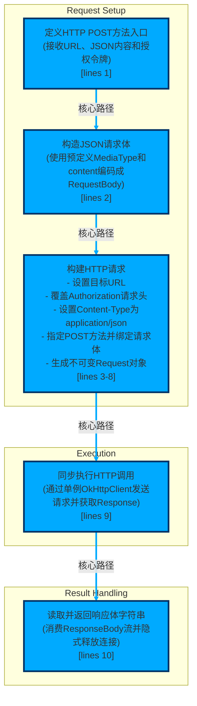

```mermaid
flowchart TD
    direction TB

    subgraph RequestSetup[Request Setup]
        A1["定义HTTP POST方法入口
(接收URL、JSON内容和授权令牌)\n[lines 1]"]
        style A1 fill:#0af,stroke:#003366,stroke-width:3px

        A2["构造JSON请求体
(使用预定义MediaType和content编码成RequestBody)\n[lines 2]"]
        style A2 fill:#0af,stroke:#003366,stroke-width:3px

        A3["构建HTTP请求
- 设置目标URL
- 覆盖Authorization请求头
- 设置Content-Type为application/json
- 指定POST方法并绑定请求体
- 生成不可变Request对象\n[lines 3-8]"]
        style A3 fill:#0af,stroke:#003366,stroke-width:3px
    end

    subgraph Execution[Execution]
        B1["同步执行HTTP调用
(通过单例OkHttpClient发送请求并获取Response)\n[lines 9]"]
        style B1 fill:#0af,stroke:#003366,stroke-width:3px
    end

    subgraph ResultHandling[Result Handling]
        C1["读取并返回响应体字符串
(消费ResponseBody流并隐式释放连接)\n[lines 10]"]
        style C1 fill:#0af,stroke:#003366,stroke-width:3px
    end

    %% Control Flow
    A1 -->|核心路径| A2
    A2 -->|核心路径| A3
    A3 -->|核心路径| B1
    B1 -->|核心路径| C1

    linkStyle 0,1,2,3 stroke-width:3px,stroke:#0af

```
- 整体含义  
  - 该图是函数 `httpPost4JsonAndHead(String url, String content, String Authorization)` 的同步执行控制流：从构造 JSON POST 请求，到通过 OkHttpClient 发送，再到读取并返回响应体字符串。

- Request Setup 阶段（请求构造）  
  - **A1 定义方法入口**（行 1）  
    - 方法签名：接收 `url`、`content`（JSON 字符串内容）、`Authorization`（授权令牌），返回 `String`，并可能抛出 `IOException`。  
  - **A2 构造 JSON 请求体**（行 2）  
    - 调用 `RequestBody.create(parse, content)`：  
      - 使用类中预先定义好的 `MediaType parse`（由 `"application/json;charset=utf-8"` 解析而来）作为请求体类型。  
      - 将传入的 `content` 字符串编码为字节并封装为 `RequestBody`，用于后续 POST 请求的请求体。  
  - **A3 构建 HTTP Request 对象**（行 3–8）  
    - 创建 `new Request.Builder()`：得到一个可变的构建器，用于累积请求信息。  
    - 调用 `url(url)`：  
      - 将传入的 URL 字符串解析为内部 `HttpUrl`，设置为本次请求的目标地址，仅保存信息不发送请求。  
    - 调用 `header("Authorization", Authorization)`：  
      - 把 `Authorization` 请求头设置为传入的授权令牌，若已存在同名头则覆盖。  
    - 调用 `header("Content-Type", "application/json")`：  
      - 显式设置/覆盖 `Content-Type` 请求头为 `application/json`。  
    - 调用 `post(requestBody)`：  
      - 将 HTTP 方法设为 `POST`，并绑定前面构造好的 `RequestBody` 作为请求体。  
    - 调用 `build()`：  
      - 对 builder 中的 URL、方法、头、请求体等进行校验，并构造一个不可变且线程安全的 `Request` 实例；若缺少必要信息或方法/请求体不合法会抛异常。

- Execution 阶段（请求执行）  
  - **B1 同步执行 HTTP 调用**（行 9）  
    - 使用类中定义的共享单例 `OkHttpClient client`：  
      - 调用 `client.newCall(request)` 生成一个代表本次 HTTP 调用的 `Call` 实例（尚未执行）。  
      - 随后调用 `execute()`：  
        - 在当前线程阻塞式地沿 OkHttp 拦截器链发送请求、接收响应。  
        - 要么返回构造完成的 `Response`，要么在 I/O 错误等情况下抛出异常。  

- Result Handling 阶段（结果处理与返回）  
  - **C1 读取并返回响应体字符串**（行 10）  
    - 调用 `response.body()` 获取本次响应关联的 `ResponseBody`。  
    - 再调用 `response.body().string()`：  
      - 将整个响应体一次性读入内存，并按响应 `Content-Type` 中的字符集（或默认字符集）解码为 `String`。  
      - 在读取过程中消费并关闭底层数据源，使该 `ResponseBody` 之后不能再次读取，并隐式释放连接。  
    - 方法最终将该字符串作为返回值返回给调用方。

下面介绍该函数所属的文件、类、函数的基本信息

| 文件 | 类 | 函数 |
| --- | --- | --- |
| ruoyi-system/src/main/java/com/ruoyi/wlx/domain/utils/HttpClients.java | HttpClients | HttpClients.httpPost4JsonAndHead |
| HttpClients 是项目中一个基于 OkHttp 的简单静态 HTTP 工具类，位于 com.ruoyi.wlx.domain.utils 包。它以单例静态 OkHttpClient 和一个 JSON MediaType 常量为基础，暴露同步静态方法用于发起 HTTP 请求：httpGet（GET 请求）、httpPost4Json（POST JSON）、httpPost4JsonAndHead（带 Authorization 头的 POST JSON）和 httpPost4form（POST 表单）。每个方法直接同步调用 client.newCall(...).execute()，并返回 response.body().string() 作为调用结果字符串。该类不做响应状态码检查、不处理异常以外的错误路径，也不对客户端的超时、重试、连接池或并发调度等进行定制化配置。 | HttpClients 是项目中基于 OkHttp 的一个轻量静态 HTTP 工具类。它创建了一个静态单例 OkHttpClient 和一个用于 JSON 的 MediaType 常量，暴露同步阻塞的静态方法用于发起 HTTP 请求：httpGet（GET）、httpPost4Json（POST JSON）、httpPost4JsonAndHead（带 Authorization 头的 POST JSON）和 httpPost4form（POST 表单）。每个方法直接同步调用 client.newCall(...).execute() 并返回 response.body().string() 作为响应字符串，没有对状态码做检查或对异常做进一步封装或重试策略。 | 基于 OkHttp 的工具方法：以 application/json 媒体类型向指定 URL 发起同步的 HTTP POST 请求，允许在请求头中设置 Authorization 字段，最后将响应体读取为字符串并返回。 |
