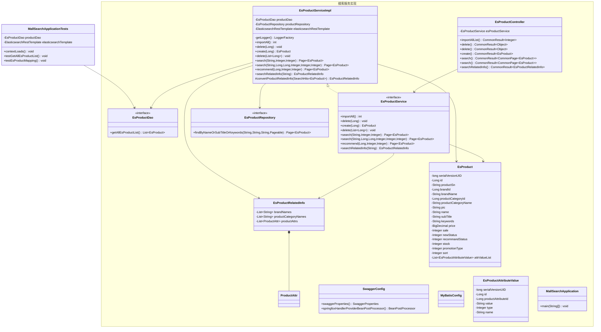

# 第一部分：整体概述
该模块顶层直接实现了测试类 MallSearchApplicationTests，用于在集成/单元测试中验证检索相关逻辑。模块对一个名为“搜索服务实现”的子模块存在直接依赖，主要使用该子模块提供的 DAO、服务实现、Repository、控制器与领域对象。整体协作模式为：控制器/测试驱动入口调用服务层，服务层委托给 Elasticsearch Repository 与自定义 DAO 完成数据访问，服务再组装或转换为领域对象（如 EsProduct、EsProductRelatedInfo）返回给上层。

# 第二部分：关联子模块中的类说明（按子模块分组）
子模块：搜索服务实现

- EsProductDao（接口）：负责自定义的 Elasticsearch 数据访问操作，核心方法 getAllEsProductList 用于批量读取或导入所有的 EsProduct；模块的测试与服务实现通过该 DAO 获取 ES 中的全部商品数据以完成导入或比对。  
- EsProductServiceImpl（服务实现类）：实现 EsProductService 的具体业务逻辑，核心职责包括批量导入(importAll)、按 id 创建/删除商品(create/delete)、以及多种搜索与推荐接口；它整合了 EsProductRepository 和 EsProductDao 并负责将搜索结果转换/封装为 EsProduct 和 EsProductRelatedInfo，因而是模块中业务调用的核心实现。  
- EsProductService（接口）：定义检索与管理商品的业务契约（如 importAll、create、search、recommend、searchRelatedInfo），通过返回 EsProduct 与 EsProductRelatedInfo 等类型来规范上层（控制器/测试）与实现层之间的交互，便于替换实现与单元测试。  
- EsProductRepository（接口）：继承自 ElasticsearchRepository，提供基于方法名的全文检索能力（如 findByNameOrSubTitleOrKeywords），供服务实现执行基于关键字和分页的查询；模块的搜索功能依赖于该 Repository 与 ES 索引的映射。  
- EsProductRelatedInfo（值对象/聚合）：封装与某次搜索相关的辅助信息（品牌名列表、分类名列表、属性列表），服务实现通过 convertProductRelatedInfo 等方法将原始搜索命中转换为该对象，以便控制器返回给客户端展示关联信息。  
- ProductAttr（内部/辅助类）：表示单个商品属性项，作为 EsProductRelatedInfo 的组成部分被包含，用于描述搜索相关的属性维度，服务在构建关联信息时需要该类的结构。  
- EsProduct（领域实体）：表示 Elasticsearch 中的商品文档（含 id、名称、品牌、价格、属性值列表等），是搜索、创建、导入等操作的核心数据载体，服务与 Repository/DAO 直接读写该实体。  
- EsProductAttributeValue（值对象）：表示商品的属性值（id、属性 id、值、类型、名称等），作为 EsProduct 的属性列表成员，用于描述商品的具体规格和特性，搜索结果与导入时需要解析/保留该信息。  
- EsProductController（控制器）：对外暴露 HTTP 接口（如 importAllList、create、delete、search、searchRelatedInfo），核心职责是接收请求并将操作委托给 EsProductService，模块通过该控制器发起对检索服务的端到端调用或接收外部请求。  
- SwaggerConfig（配置类）：提供 Swagger 相关配置（如 swaggerProperties 与 BeanPostProcessor），用于生成/定制 API 文档，模块依赖它以便控制器的接口可以被文档化与调试。  
- MyBatisConfig（配置类）：提供 MyBatis 相关的配置信息（类存在但未列出具体方法），模块可能依赖其数据库相关配置以支持与持久化层的集成。  
- MallSearchApplication（启动类）：应用入口类，负责引导该子模块的 Spring 上下文与组件扫描，模块在集成或运行时依赖它来启动搜索模块的应用环境。

# 第三部分：关系线逐条解读
- MallSearchApplicationTests --> EsProductDao：测试类调用 EsProductDao 的数据访问方法（如 getAllEsProductList），说明测试通过 DAO 获取 ES 中的商品数据以验证功能或映射。  
- EsProductServiceImpl <|.. EsProductService：EsProductServiceImpl 实现 EsProductService 接口；这样的设计利于接口与实现分离，便于替换实现、单元测试和解耦调用方与具体实现。  
- EsProductServiceImpl --> EsProductRepository：服务实现调用 Repository（如 findByNameOrSubTitleOrKeywords）来执行基于关键字与分页的 Elasticsearch 查询，这是服务层获取搜索结果的主要通道。  
- EsProductServiceImpl --> EsProductDao：服务实现通过自定义 DAO（getAllEsProductList 等）完成批量读取或特殊的 ES 访问逻辑（例如导入全部数据），DAO 提供了 Repository 以外的自定义查询能力。  
- EsProductServiceImpl --> EsProductRelatedInfo：服务实现使用或构建 EsProductRelatedInfo（通过 convertProductRelatedInfo 等方法）以将原始搜索命中转换为对客户端有用的关联信息。  
- EsProductServiceImpl --> EsProduct：服务实现产生并返回 EsProduct 实体（如 create、importAll、search 的结果），表示业务逻辑以该领域对象为核心的数据载体。  
- EsProductService --> EsProductRelatedInfo：服务接口声明返回 EsProductRelatedInfo，表示服务契约包含提供搜索相关联信息的能力，确保调用方能获取该聚合数据。  
- EsProductService --> EsProduct：服务接口声明以 EsProduct 作为主要返回/处理对象类型，明确了业务接口的领域模型。  
- EsProductController --> EsProductService：控制器将导入、创建、删除、搜索与推荐等请求委托给 EsProductService 执行，表明控制器负责请求-响应协调而将业务逻辑下沉到服务层。  
- EsProductRelatedInfo *-- ProductAttr：EsProductRelatedInfo 以组合关系包含 ProductAttr，表示 ProductAttr 是关联信息的组成部分，生命周期从属于 EsProductRelatedInfo。

