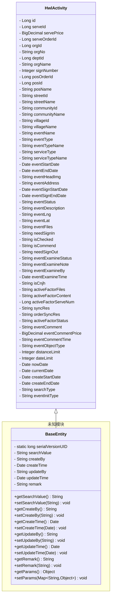

```mermaid
classDiagram
    class HwlActivity {
        - Long id
        - Long serveId
        - BigDecimal servePrice
        - Long serveOrderId
        - Long orgId
        - String orgNo
        - Long deptId
        - String orgName
        - Integer signNumber
        - Long posOrderId
        - Long posId
        - String posName
        - String streetId
        - String streetName
        - String communityId
        - String communityName
        - String villageId
        - String villageName
        - String eventName
        - String eventType
        - String eventTypeName
        - String serviceType
        - String serviceTypeName
        - Date eventStartDate
        - Date eventEndDate
        - String eventHeadImg
        - String eventAddress
        - Date eventSignStartDate
        - Date eventSignEndDate
        - String eventStatus
        - String eventDescription
        - String eventLng
        - String eventLat
        - String eventFiles
        - String needSignIn
        - String isChecked
        - String isCommend
        - String needSignOut
        - String eventExamineStatus
        - String eventExamineNote
        - String eventExamineBy
        - Date eventExamineTime
        - String isCnjh
        - String activeFactorFiles
        - String activeFactorContent
        - Long activeFactorServeNum
        - String syncRes
        - String orderSyncRes
        - String activeFactorStatus
        - String eventComment
        - BigDecimal eventCommentPrice
        - String eventCommentTime
        - String eventObjectType
        - Integer distanceLimit
        - Integer dateLimit
        - Date nowDate
        - Date currentDate
        - Date createStartDate
        - Date createEndDate
        - String searchType
        - String eventInitType
    }

    namespace 未知模块 {
        class BaseEntity {
            - static long serialVersionUID
            - String searchValue
            - String createBy
            - Date createTime
            - String updateBy
            - Date updateTime
            - String remark
            +getSearchValue() String
            +setSearchValue(String) void
            +getCreateBy() String
            +setCreateBy(String) void
            +getCreateTime() Date
            +setCreateTime(Date) void
            +getUpdateBy() String
            +setUpdateBy(String) void
            +getUpdateTime() Date
            +setUpdateTime(Date) void
            +getRemark() String
            +setRemark(String) void
            +getParams() Object
            +setParams(Map~String,Object~) void
        }
    }

    HwlActivity <|-- BaseEntity

```
# 第一部分：整体概述
本模块直接实现了核心实体类 HwlActivity，该类封装了大量活动相关的业务属性（如机构/位置、时间区间、签到配置、评价与同步状态等）。图中显示 HwlActivity 与一个子模块提供的 BaseEntity 存在直接依赖关系；整体协作模式是：模块自身的业务实体通过继承子模块的通用实体类来复用审计字段、序列化与通用参数处理能力，从而将领域属性与通用基础属性分离并复用子模块实现。  

# 第二部分：关联子模块中的类说明
子模块：未知模块
- BaseEntity：提供通用实体基础能力，包含序列化标识（serialVersionUID）、审计相关字段（searchValue、createBy/createTime、updateBy/updateTime、remark）以及通用参数容器（Map<String,Object> params）。其关键方法如 getCreateTime()/setCreateTime()、getUpdateTime()/setUpdateTime() 用于统一管理创建/更新时间，getParams()/setParams(...) 用于承载和传递额外查询或扩展参数；HwlActivity 依赖它以避免重复实现这些通用字段和方法，并保证实体的一致性与可序列化能力。

# 第三部分：关系线逐条解读
- HwlActivity <|-- BaseEntity：图中表示两者是继承关系；在业务上这意味着 HwlActivity 与子模块中的 BaseEntity 存在父子类层级，用于让 HwlActivity 复用 BaseEntity 中的通用审计字段、参数容器和序列化支持，从而保持实体层的共性实现。

