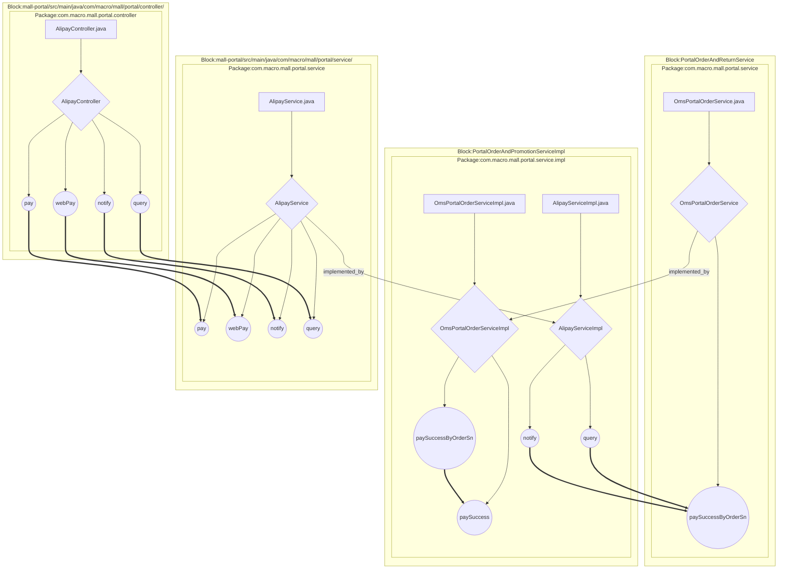

```mermaid
graph TD
subgraph block1["Block:PortalOrderAndPromotionServiceImpl"]
    subgraph pkg1["Package:com.macro.mall.portal.service.impl"]
        fileOmsPortalOrderServiceImpl["OmsPortalOrderServiceImpl.java"]
        classOmsPortalOrderServiceImpl{"OmsPortalOrderServiceImpl"}
        methodPaySuccessByOrderSnOmsPortalOrderServiceImpl(("paySuccessByOrderSn"))
        methodPaySuccessOmsPortalOrderServiceImpl(("paySuccess"))
        fileAlipayServiceImpl["AlipayServiceImpl.java"]
        classAlipayServiceImpl{"AlipayServiceImpl"}
        methodQueryAlipayServiceImpl(("query"))
        methodNotifyAlipayServiceImpl(("notify"))
        
        fileOmsPortalOrderServiceImpl --> classOmsPortalOrderServiceImpl
        classOmsPortalOrderServiceImpl --> methodPaySuccessByOrderSnOmsPortalOrderServiceImpl
        classOmsPortalOrderServiceImpl --> methodPaySuccessOmsPortalOrderServiceImpl
        fileAlipayServiceImpl --> classAlipayServiceImpl
        classAlipayServiceImpl --> methodQueryAlipayServiceImpl
        classAlipayServiceImpl --> methodNotifyAlipayServiceImpl
    end
end

subgraph block2["Block:PortalOrderAndReturnService"]
    subgraph pkg2["Package:com.macro.mall.portal.service"]
        fileOmsPortalOrderService["OmsPortalOrderService.java"]
        classOmsPortalOrderService{"OmsPortalOrderService"}
        methodPaySuccessByOrderSnOmsPortalOrderService(("paySuccessByOrderSn"))
        
        fileOmsPortalOrderService --> classOmsPortalOrderService
        classOmsPortalOrderService --> methodPaySuccessByOrderSnOmsPortalOrderService
    end
end

subgraph block3["Block:mall-portal/src/main/java/com/macro/mall/portal/controller/"]
    subgraph pkg3["Package:com.macro.mall.portal.controller"]
        fileAlipayController["AlipayController.java"]
        classAlipayController{"AlipayController"}
        methodPayAlipayController(("pay"))
        methodWebPayAlipayController(("webPay"))
        methodNotifyAlipayController(("notify"))
        methodQueryAlipayController(("query"))

        fileAlipayController --> classAlipayController
        classAlipayController --> methodPayAlipayController
        classAlipayController --> methodWebPayAlipayController
        classAlipayController --> methodNotifyAlipayController
        classAlipayController --> methodQueryAlipayController
    end
end

subgraph block4["Block:mall-portal/src/main/java/com/macro/mall/portal/service/"]
    subgraph pkg4["Package:com.macro.mall.portal.service"]
        fileAlipayService["AlipayService.java"]
        classAlipayService{"AlipayService"}
        methodPayAlipayService(("pay"))
        methodWebPayAlipayService(("webPay"))
        methodNotifyAlipayService(("notify"))
        methodQueryAlipayService(("query"))

        fileAlipayService --> classAlipayService
        classAlipayService --> methodPayAlipayService
        classAlipayService --> methodWebPayAlipayService
        classAlipayService --> methodNotifyAlipayService
        classAlipayService --> methodQueryAlipayService
    end
end


methodQueryAlipayServiceImpl ==> methodPaySuccessByOrderSnOmsPortalOrderService
methodNotifyAlipayServiceImpl ==> methodPaySuccessByOrderSnOmsPortalOrderService
methodPayAlipayController ==> methodPayAlipayService
methodWebPayAlipayController ==> methodWebPayAlipayService
methodNotifyAlipayController ==> methodNotifyAlipayService
methodQueryAlipayController ==> methodQueryAlipayService

classAlipayService -- implemented_by --> classAlipayServiceImpl
classOmsPortalOrderService -- implemented_by --> classOmsPortalOrderServiceImpl
methodPaySuccessByOrderSnOmsPortalOrderServiceImpl ==> methodPaySuccessOmsPortalOrderServiceImpl
```