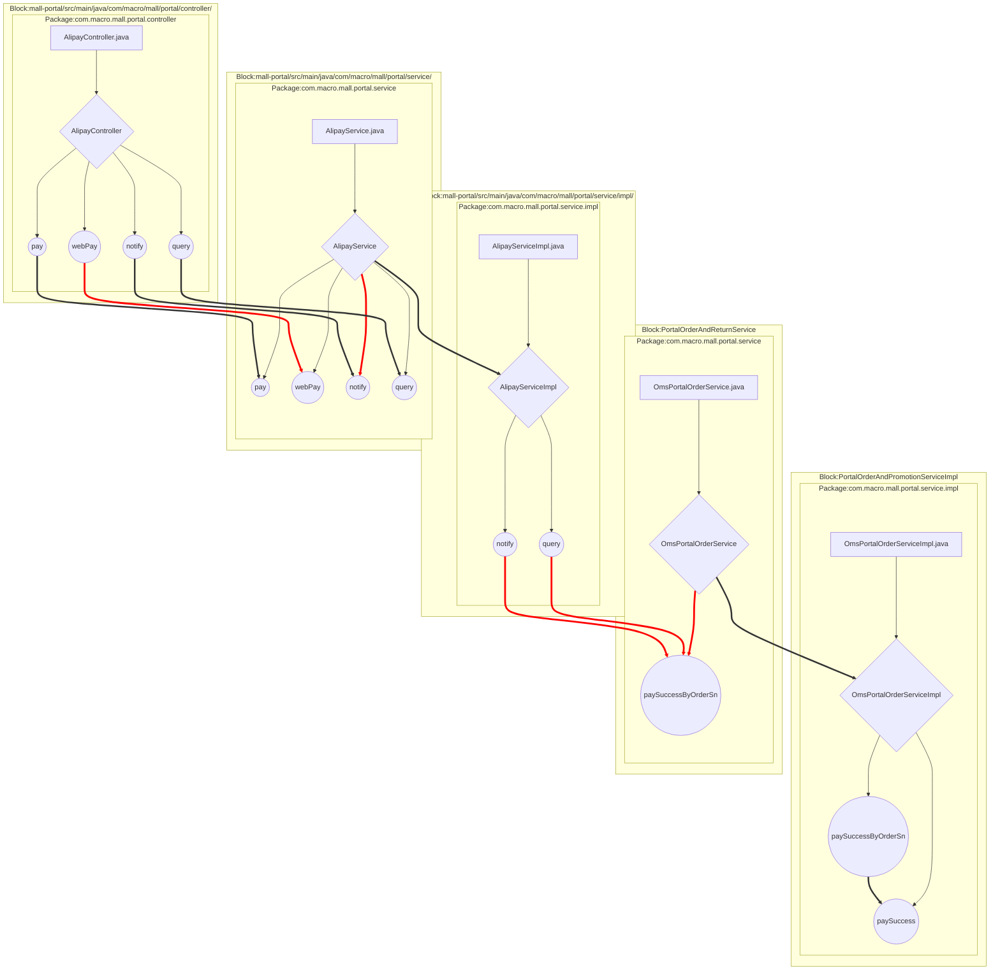

```mermaid
graph TD
subgraph block1["Block:PortalOrderAndPromotionServiceImpl"]
  subgraph pkg1["Package:com.macro.mall.portal.service.impl"]
    fileOmsPortalOrderServiceImpl[OmsPortalOrderServiceImpl.java]
    classOmsPortalOrderServiceImpl{OmsPortalOrderServiceImpl}
    methodPaySuccessByOrderSnOmsImpl((paySuccessByOrderSn))
    methodPaySuccessOmsImpl((paySuccess))
    fileOmsPortalOrderServiceImpl --> classOmsPortalOrderServiceImpl
    classOmsPortalOrderServiceImpl --> methodPaySuccessByOrderSnOmsImpl
    classOmsPortalOrderServiceImpl --> methodPaySuccessOmsImpl
  end
end
subgraph block2["Block:mall-portal/src/main/java/com/macro/mall/portal/service/impl/"]
  subgraph pkg2["Package:com.macro.mall.portal.service.impl"]
    fileAlipayServiceImpl[AlipayServiceImpl.java]
    classAlipayServiceImpl{AlipayServiceImpl}
    methodQueryAlipayImpl((query))
    methodNotifyAlipayImpl((notify))
    fileAlipayServiceImpl --> classAlipayServiceImpl
    classAlipayServiceImpl --> methodQueryAlipayImpl
    classAlipayServiceImpl --> methodNotifyAlipayImpl
  end
end
subgraph block3["Block:mall-portal/src/main/java/com/macro/mall/portal/controller/"]
  subgraph pkg3["Package:com.macro.mall.portal.controller"]
    fileAlipayController[AlipayController.java]
    classAlipayController{AlipayController}
    methodPayAlipayCtrl((pay))
    methodWebPayAlipayCtrl((webPay))
    methodNotifyAlipayCtrl((notify))
    methodQueryAlipayCtrl((query))
    fileAlipayController --> classAlipayController
    classAlipayController --> methodPayAlipayCtrl
    classAlipayController --> methodWebPayAlipayCtrl
    classAlipayController --> methodNotifyAlipayCtrl
    classAlipayController --> methodQueryAlipayCtrl
  end
end
subgraph block4["Block:PortalOrderAndReturnService"]
  subgraph pkg4["Package:com.macro.mall.portal.service"]
    fileOmsPortalOrderService[OmsPortalOrderService.java]
    classOmsPortalOrderService{OmsPortalOrderService}
    methodPaySuccessByOrderSnOms((paySuccessByOrderSn))
    fileOmsPortalOrderService --> classOmsPortalOrderService
    classOmsPortalOrderService --> methodPaySuccessByOrderSnOms
  end
end
subgraph block5["Block:mall-portal/src/main/java/com/macro/mall/portal/service/"]
  subgraph pkg5["Package:com.macro.mall.portal.service"]
    fileAlipayService[AlipayService.java]
    classAlipayService{AlipayService}
    methodPayAlipay((pay))
    methodWebPayAlipay((webPay))
    methodNotifyAlipay((notify))
    methodQueryAlipay((query))
    fileAlipayService --> classAlipayService
    classAlipayService --> methodPayAlipay
    classAlipayService --> methodWebPayAlipay
    classAlipayService --> methodNotifyAlipay
    classAlipayService --> methodQueryAlipay
  end
end
%% 方法间调用/实现关系
methodQueryAlipayImpl ==> methodPaySuccessByOrderSnOms
methodNotifyAlipayImpl ==> methodPaySuccessByOrderSnOms
methodPayAlipayCtrl ==> methodPayAlipay
methodWebPayAlipayCtrl ==> methodWebPayAlipay
methodNotifyAlipayCtrl ==> methodNotifyAlipay
methodQueryAlipayCtrl ==> methodQueryAlipay
classAlipayService ==> classAlipayServiceImpl
classOmsPortalOrderService ==> classOmsPortalOrderServiceImpl
methodPaySuccessByOrderSnOmsImpl ==> methodPaySuccessOmsImpl
%% 高亮关键调用链
linkStyle 12 stroke:#ff0000,stroke-width:4px
linkStyle 16 stroke:#ff0000,stroke-width:4px
linkStyle 18 stroke:#ff0000,stroke-width:4px
linkStyle 19 stroke:#ff0000,stroke-width:4px
linkStyle 21 stroke:#ff0000,stroke-width:4px
```