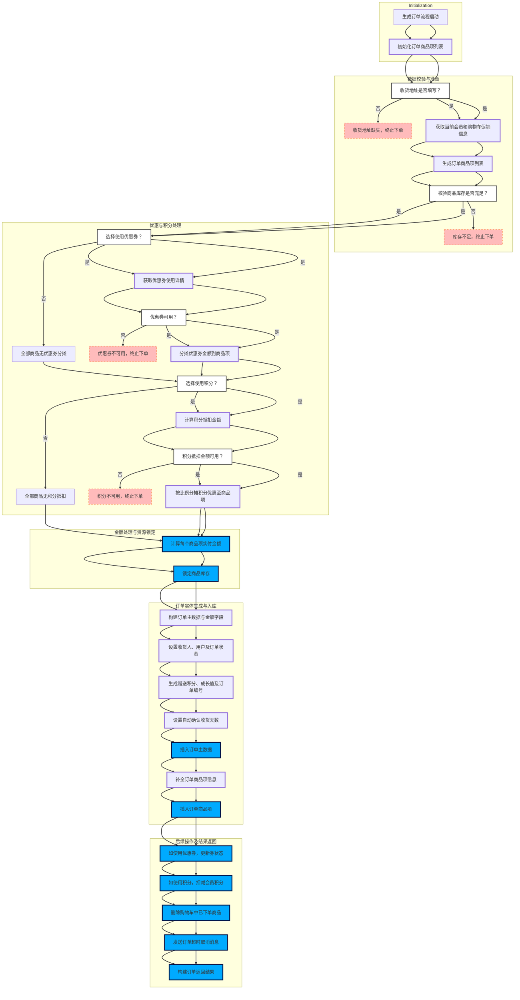

```mermaid
flowchart TD
    direction TB
    subgraph Initialization
        A1["生成订单流程启动"]
        A2["初始化订单商品项列表"]
    end
    subgraph 校验与准备[数据校验与准备]
        B1["收货地址是否填写？"]
        style B1 fill:#fff,stroke:#333,stroke-width:2px,shape:diamond
        B2["收货地址缺失，终止下单"]
        style B2 fill:#fbb,stroke:#f96,stroke-width:2px,stroke-dasharray:5 5
        B3["获取当前会员和购物车促销信息"]
        B4["生成订单商品项列表"]
        B5["校验商品库存是否充足？"]
        style B5 fill:#fff,stroke:#333,stroke-width:2px,shape:diamond
        B6["库存不足，终止下单"]
        style B6 fill:#fbb,stroke:#f96,stroke-width:2px,stroke-dasharray:5 5
    end
    subgraph 优惠处理[优惠与积分处理]
        C1["选择使用优惠券？"]
        style C1 fill:#fff,stroke:#333,stroke-width:2px,shape:diamond
        C2["全部商品无优惠券分摊"]
        C3["获取优惠券使用详情"]
        C4["优惠券可用？"]
        style C4 fill:#fff,stroke:#333,stroke-width:2px,shape:diamond
        C5["优惠券不可用，终止下单"]
        style C5 fill:#fbb,stroke:#f96,stroke-width:2px,stroke-dasharray:5 5
        C6["分摊优惠券金额到商品项"]
        D1["选择使用积分？"]
        style D1 fill:#fff,stroke:#333,stroke-width:2px,shape:diamond
        D2["全部商品无积分抵扣"]
        D3["计算积分抵扣金额"]
        D4["积分抵扣金额可用？"]
        style D4 fill:#fff,stroke:#333,stroke-width:2px,shape:diamond
        D5["积分不可用，终止下单"]
        style D5 fill:#fbb,stroke:#f96,stroke-width:2px,stroke-dasharray:5 5
        D6["按比例分摊积分优惠至商品项"]
    end
    subgraph 订单金额与锁定[金额处理与资源锁定]
        E1["计算每个商品项实付金额"]
        E2["锁定商品库存"]
    end
    subgraph 订单生成[订单实体生成与入库]
        F1["构建订单主数据与金额字段"]
        F2["设置收货人、用户及订单状态"]
        F3["生成赠送积分、成长值及订单编号"]
        F4["设置自动确认收货天数"]
        F5["插入订单主数据"]
        F6["补全订单商品项信息"]
        F7["插入订单商品项"]
    end
    subgraph 后续处理[后续操作及结果返回]
        G1["如使用优惠券，更新券状态"]
        G2["如使用积分，扣减会员积分"]
        G3["删除购物车中已下单商品"]
        G4["发送订单超时取消消息"]
        G5["构建订单返回结果"]
    end
    %% 控制流
    A1 --> A2
    A2 --> B1
    B1 -- 否 --> B2
    B1 -- 是 --> B3
    B3 --> B4
    B4 --> B5
    B5 -- 否 --> B6
    B5 -- 是 --> C1
    C1 -- 否 --> C2
    C1 -- 是 --> C3
    C3 --> C4
    C4 -- 否 --> C5
    C4 -- 是 --> C6
    C2 --> D1
    C6 --> D1
    D1 -- 否 --> D2
    D1 -- 是 --> D3
    D3 --> D4
    D4 -- 否 --> D5
    D4 -- 是 --> D6
    D2 --> E1
    D6 --> E1
    E1 --> E2
    E2 --> F1
    F1 --> F2
    F2 --> F3
    F3 --> F4
    F4 --> F5
    F5 --> F6
    F6 --> F7
    F7 --> G1
    G1 --> G2
    G2 --> G3
    G3 --> G4
    G4 --> G5
    %% 关键节点样式
    style F5 fill:#0af,stroke:#014,stroke-width:3px
    style F7 fill:#0af,stroke:#014,stroke-width:3px
    style G5 fill:#0af,stroke:#014,stroke-width:3px
    style E2 fill:#0af,stroke:#014,stroke-width:3px
    style G1 fill:#0af,stroke:#014,stroke-width:3px
    style G2 fill:#0af,stroke:#014,stroke-width:3px
    style G3 fill:#0af,stroke:#014,stroke-width:3px
    style G4 fill:#0af,stroke:#014,stroke-width:3px
    style E1 fill:#0af,stroke:#014,stroke-width:3px
    %% 线条样式
    linkStyle default stroke-width:2px
    %% 关键路径加粗
    A1 --> A2:::main
    A2 --> B1:::main
    B1 -- 是 --> B3:::main
    B3 --> B4:::main
    B4 --> B5:::main
    B5 -- 是 --> C1:::main
    C1 -- 是 --> C3:::main
    C3 --> C4:::main
    C4 -- 是 --> C6:::main
    C6 --> D1:::main
    D1 -- 是 --> D3:::main
    D3 --> D4:::main
    D4 -- 是 --> D6:::main
    D6 --> E1:::main
    E1 --> E2:::main
    E2 --> F1:::main
    F1 --> F2:::main
    F2 --> F3:::main
    F3 --> F4:::main
    F4 --> F5:::main
    F5 --> F6:::main
    F6 --> F7:::main
    F7 --> G1:::main
    G1 --> G2:::main
    G2 --> G3:::main
    G3 --> G4:::main
    G4 --> G5:::main
    classDef main stroke-width:3px;

```