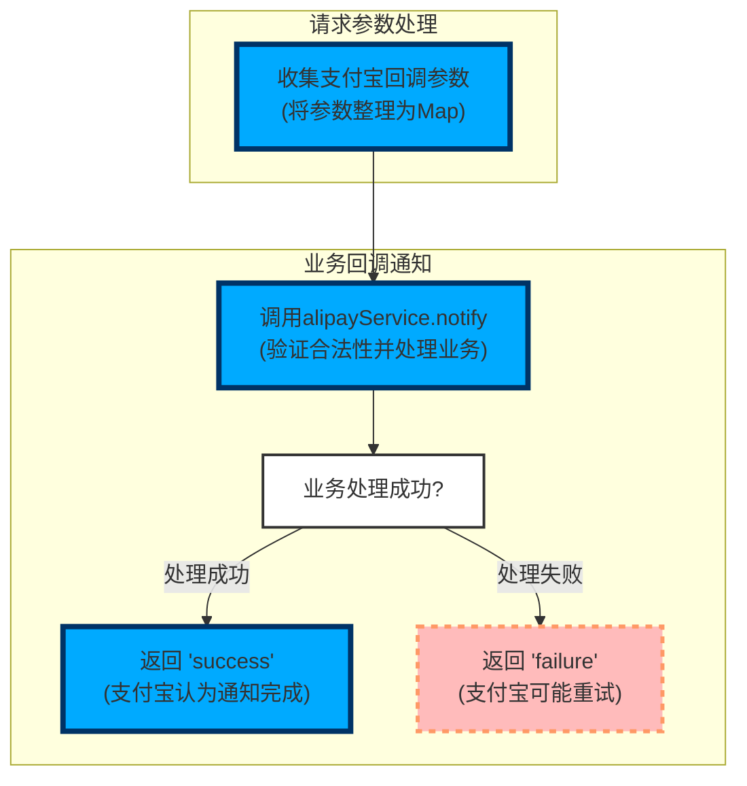

```mermaid
flowchart TD
    direction TB
    subgraph 请求参数处理
        A1["收集支付宝回调参数
(将参数整理为Map)"]
        style A1 fill:#0af,stroke:#036,stroke-width:4px
    end
    subgraph 业务回调通知
        B1["调用alipayService.notify
(验证合法性并处理业务)"]
        style B1 fill:#0af,stroke:#036,stroke-width:4px
        B2["业务处理成功?"]
        style B2 fill:#fff,stroke:#333,stroke-width:2px,shape:diamond
        B3["返回 'success'
(支付宝认为通知完成)"]
        style B3 fill:#0af,stroke:#036,stroke-width:4px
        B4["返回 'failure'
(支付宝可能重试)"]
        style B4 fill:#fbb,stroke:#f96,stroke-width:3px,stroke-dasharray:5 5
    end
    A1 --> B1
    B1 --> B2
    B2 -- 处理成功 --> B3
    B2 -- 处理失败 --> B4
    style B4 fill:#fbb,stroke:#f96,stroke-width:3px,stroke-dasharray:5 5
    style B3 fill:#0af,stroke:#036,stroke-width:4px
    style B1 fill:#0af,stroke:#036,stroke-width:4px
```