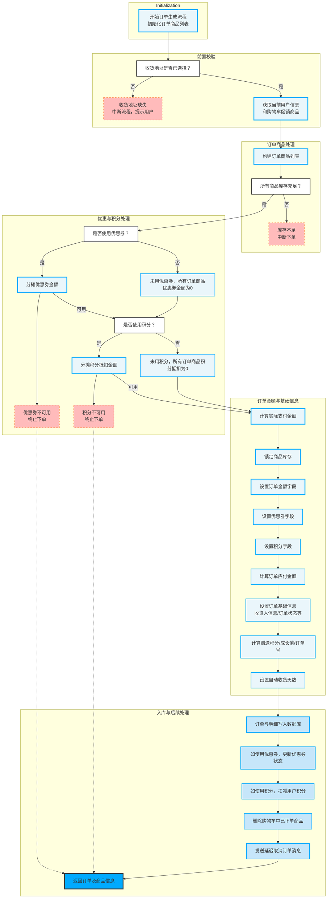

- 该Mermaid图是一个**代码控制流图**，直观展现了`generateOrder`方法的核心执行流程和主要分支逻辑，其内容与`mermaid_source_info`中的源代码和说明完全对应，具体流程如下：

- **初始化阶段**
  - 开始订单生成流程，初始化订单商品列表。

- **前置校验**
  - 判断用户是否已选择收货地址：
    - 若未选择，流程中断并提示用户（对应Asserts.fail("请选择收货地址！")）。
    - 若已选择，获取当前用户信息和购物车促销商品列表。

- **订单商品处理**
  - 构建订单商品列表，将购物车商品信息转为订单项。
  - 检查所有商品库存是否充足：
    - 如果库存不足，流程中断，提示“库存不足，无法下单”。
    - 如果库存充足，进入优惠与积分处理。

- **优惠与积分处理**
  - 是否使用优惠券：
    - 未使用：所有订单商品的优惠券金额设为0。
    - 使用优惠券：分摊优惠券金额到各订单项；若优惠券不可用，终止下单（Asserts.fail("该优惠券不可用")）。
  - 是否使用积分：
    - 未使用：所有订单商品的积分抵扣金额设为0。
    - 使用积分：分摊积分抵扣金额到各订单项；若积分不可用，终止下单（Asserts.fail("积分不可用")）。

- **订单金额与基础信息处理**
  - 计算订单商品的实际支付金额。
  - 锁定商品库存，防止超卖。
  - 设置订单金额相关字段（如总金额、运费、促销金额、优惠券金额、积分金额等）。
  - 设置订单基础信息，如收货人信息、订单状态、订单号、赠送积分和成长值、自动收货天数等。

- **入库与后续处理**
  - 将订单与订单明细写入数据库（orderMapper.insert, orderItemDao.insertList）。
  - 如使用优惠券，更新其状态。
  - 如使用积分，扣减用户积分（memberService.updateIntegration）。
  - 删除购物车中已下单商品。
  - 发送延迟取消订单消息（sendDelayMessageCancelOrder）。
  - 返回订单及商品信息作为最终结果。

- **流程终止点**
  - 在任一校验失败（如收货地址缺失、库存不足、优惠券不可用、积分不可用）时，流程中断并直接返回提示信息，不再往下执行。

- **整体逻辑特点**
  - 流程结构严谨，所有关键分支和异常中断均有明确判定和反馈。
  - 每一阶段的处理都与订单业务核心环节一一对应，体现了代码控制流的实际业务逻辑。
  - 图中节点和决策条件与源代码中的关键if分支、异常抛出、数据库写操作等高度对应。

下面介绍该函数所属的文件、类、函数的基本信息

| 文件 | 类 | 函数 |
| --- | --- | --- |
| mall-portal/src/main/java/com/macro/mall/portal/service/impl/OmsPortalOrderServiceImpl.java | OmsPortalOrderServiceImpl | OmsPortalOrderServiceImpl.generateOrder |
| 该文件OmsPortalOrderServiceImpl是商城门户前台订单管理的核心服务实现类，负责涵盖订单生命周期管理的关键业务逻辑，包括订单确认（生成确认订单信息）、订单创建（从购物车和用户输入生成订单）、支付成功处理（更新订单状态及库存扣减）、订单取消（自动超时取消及手动取消）、订单收货确认、订单分页查询、订单详情查询以及订单删除等功能，确保前台用户订单操作的完整流程和数据一致性。 | OmsPortalOrderServiceImpl类是商城门户前台订单管理的核心服务实现，负责处理用户订单的整个生命周期，包括订单确认信息生成、订单创建、支付成功处理、订单取消（自动超时取消和手动取消）、订单确认收货、订单分页查询、订单详情查看及订单删除等功能。该类协调购物车、用户信息、库存、优惠券、积分等多个子系统，确保订单业务流程的完整性和数据一致性。 | 该方法generateOrder用于根据用户提交的订单参数（OrderParam）生成一个完整的订单及其订单商品项信息，涵盖订单数据校验、优惠券和积分使用处理、库存校验与锁定、订单金额计算、订单数据持久化，以及相关的后续操作（如购物车商品删除、积分扣减和延迟取消订单消息发送）。最终返回包含生成的订单实体和订单商品列表的结果。 |
