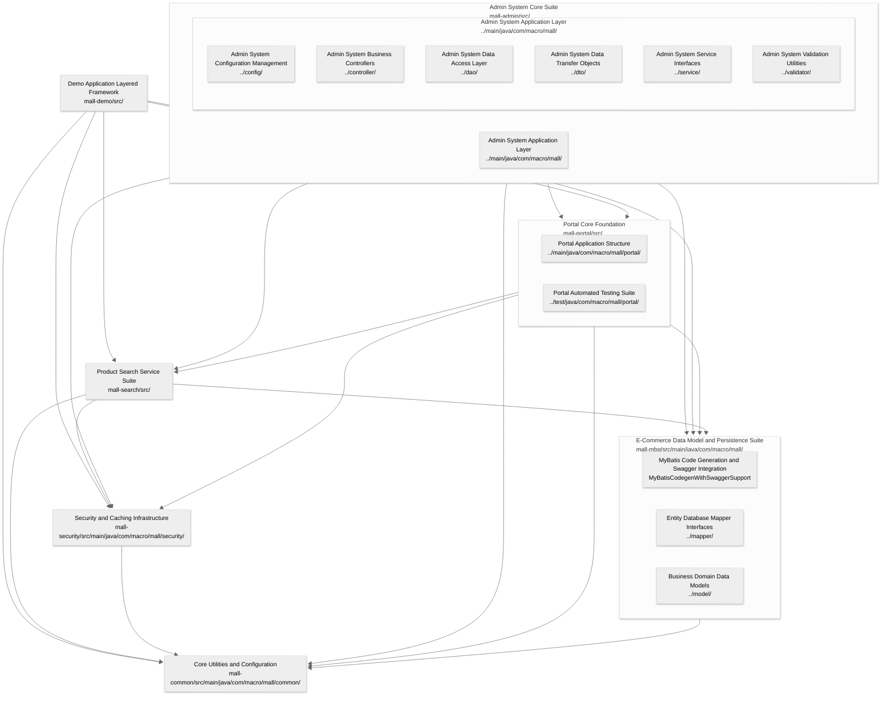

```mermaid
---
config:
  look: neo
  theme: neutral
  flowchart:
    nodeSpacing: 60
    rankSpacing: 100
    curve: basis
    htmlLabels: true
    useMaxWidth: true
---
flowchart TD
    subgraph A["Admin System Core Suite<br/>mall-admin/src/"]
        A1["Admin System Application Layer<br/>../main/java/com/macro/mall/"]
        subgraph A1sub["Admin System Application Layer<br/>../main/java/com/macro/mall/"]
            A1a["Admin System Configuration Management<br/>../config/"]
            A1b["Admin System Business Controllers<br/>../controller/"]
            A1c["Admin System Data Access Layer<br/>../dao/"]
            A1d["Admin System Data Transfer Objects<br/>../dto/"]
            A1e["Admin System Service Interfaces<br/>../service/"]
            A1f["Admin System Validation Utilities<br/>../validator/"]
        end
    end
    
    subgraph B["Core Utilities and Configuration<br/>mall-common/src/main/java/com/macro/mall/common/"]
    end

    subgraph C["Demo Application Layered Framework<br/>mall-demo/src/"]
    end

    subgraph D["E-Commerce Data Model and Persistence Suite<br/>mall-mbg/src/main/java/com/macro/mall/"]
        D1["MyBatis Code Generation and Swagger Integration<br/>MyBatisCodegenWithSwaggerSupport"]
        D2["Entity Database Mapper Interfaces<br/>../mapper/"]
        D3["Business Domain Data Models<br/>../model/"]
    end

    subgraph E["Portal Core Foundation<br/>mall-portal/src/"]
        E1["Portal Application Structure<br/>../main/java/com/macro/mall/portal/"]
        E2["Portal Automated Testing Suite<br/>../test/java/com/macro/mall/portal/"]
    end

    subgraph F["Product Search Service Suite<br/>mall-search/src/"]
    end

    subgraph G["Security and Caching Infrastructure<br/>mall-security/src/main/java/com/macro/mall/security/"]
    end

    %% 跨模块依赖关系
    A --> B
    A --> D
    A --> G
    A --> F
    A --> E
    C --> B
    C --> D
    C --> G
    C --> F
    C --> E
    E --> B
    E --> D
    E --> G
    E --> F
    F --> B
    F --> D
    F --> G
    G --> B
    D --> B
```