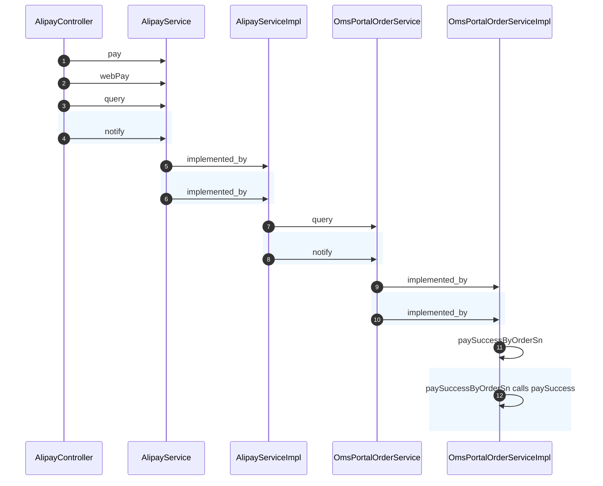

```mermaid
sequenceDiagram
    autonumber
    participant AlipayController as AlipayController
    participant AlipayService as AlipayService
    participant AlipayServiceImpl as AlipayServiceImpl
    participant OmsPortalOrderService as OmsPortalOrderService
    participant OmsPortalOrderServiceImpl as OmsPortalOrderServiceImpl

    AlipayController->>AlipayService: pay
    AlipayController->>AlipayService: webPay
    AlipayController->>AlipayService: query
    rect rgb(240,248,255)
        AlipayController->>AlipayService: notify
    end
    AlipayService->>AlipayServiceImpl: implemented_by
    rect rgb(240,248,255)
        AlipayService->>AlipayServiceImpl: implemented_by
    end
    AlipayServiceImpl->>OmsPortalOrderService: query
    rect rgb(240,248,255)
        AlipayServiceImpl->>OmsPortalOrderService: notify
    end
    OmsPortalOrderService->>OmsPortalOrderServiceImpl: implemented_by
    rect rgb(240,248,255)
        OmsPortalOrderService->>OmsPortalOrderServiceImpl: implemented_by
    end
    OmsPortalOrderServiceImpl->>OmsPortalOrderServiceImpl: paySuccessByOrderSn
    rect rgb(240,248,255)
        OmsPortalOrderServiceImpl->>OmsPortalOrderServiceImpl: paySuccessByOrderSn calls paySuccess
    end

```