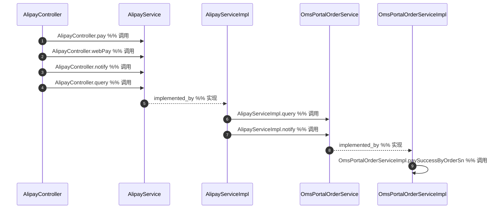

```mermaid
sequenceDiagram
    autonumber
    participant AlipayController as AlipayController
    participant AlipayService as AlipayService
    participant AlipayServiceImpl as AlipayServiceImpl
    participant OmsPortalOrderService as OmsPortalOrderService
    participant OmsPortalOrderServiceImpl as OmsPortalOrderServiceImpl

    AlipayController->>AlipayService: AlipayController.pay %% 调用
    AlipayController->>AlipayService: AlipayController.webPay %% 调用
    AlipayController->>AlipayService: AlipayController.notify %% 调用
    AlipayController->>AlipayService: AlipayController.query %% 调用
    AlipayService-->>AlipayServiceImpl: implemented_by %% 实现
    AlipayServiceImpl->>OmsPortalOrderService: AlipayServiceImpl.query %% 调用
    AlipayServiceImpl->>OmsPortalOrderService: AlipayServiceImpl.notify %% 调用
    OmsPortalOrderService-->>OmsPortalOrderServiceImpl: implemented_by %% 实现
    OmsPortalOrderServiceImpl->>OmsPortalOrderServiceImpl: OmsPortalOrderServiceImpl.paySuccessByOrderSn %% 调用
```

