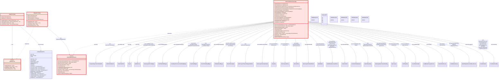

```mermaid
classDiagram
class AlipayController {
    +pay(AliPayParam, HttpServletResponse) void
    +webPay(AliPayParam, HttpServletResponse) void
    +notify(HttpServletRequest) String
    +query(String, String) CommonResult~String~
    -AlipayConfig alipayConfig
    -AlipayService alipayService
}
class AlipayService {
    <<interface>>
    +pay(AliPayParam) String
    +notify(Map~String, String~) String
    +query(String, String) String
    +webPay(AliPayParam) String
}
class AlipayServiceImpl {
    +pay(AliPayParam) String
    +notify(Map~String, String~) String
    +query(String, String) String
    +webPay(AliPayParam) String
    -AlipayConfig alipayConfig
    -AlipayClient alipayClient
    -OmsOrderMapper orderMapper
    -OmsPortalOrderService portalOrderService
}
class CommonResult~T~ {
    -long code
    -String message
    -T data
    +getCode() long
    +setCode(long)
    +getMessage() String
    +setMessage(String)
    +getData() T
    +setData(T)
    +success(T) CommonResult~T~
    +success(T, String) CommonResult~T~
    +failed(IErrorCode) CommonResult~T~
    +failed(IErrorCode, String) CommonResult~T~
    +failed(String) CommonResult~T~
    +failed() CommonResult~T~
    +validateFailed() CommonResult~T~
    +validateFailed(String) CommonResult~T~
    +unauthorized(T) CommonResult~T~
    +forbidden(T) CommonResult~T~
}
class OmsPortalOrderService {
    <<interface>>
    +generateConfirmOrder(List~Long~) ConfirmOrderResult
    +generateOrder(OrderParam) Map~String, Object~
    +paySuccess(Long, Integer) Integer
    +cancelTimeOutOrder() Integer
    +cancelOrder(Long)
    +sendDelayMessageCancelOrder(Long)
    +confirmReceiveOrder(Long)
    +list(Integer, Integer, Integer) CommonPage~OmsOrderDetail~
    +detail(Long) OmsOrderDetail
    +deleteOrder(Long)
    +paySuccessByOrderSn(String, Integer)
}
class OmsPortalOrderServiceImpl {
    +generateConfirmOrder(List~Long~) ConfirmOrderResult
    +generateOrder(OrderParam) Map~String, Object~
    +paySuccess(Long, Integer) Integer
    +cancelTimeOutOrder() Integer
    +cancelOrder(Long)
    +sendDelayMessageCancelOrder(Long)
    +confirmReceiveOrder(Long)
    +list(Integer, Integer, Integer) CommonPage~OmsOrderDetail~
    +detail(Long) OmsOrderDetail
    +deleteOrder(Long)
    +paySuccessByOrderSn(String, Integer)
    -UmsMemberService memberService
    -OmsCartItemService cartItemService
    -UmsMemberReceiveAddressService memberReceiveAddressService
    -UmsMemberCouponService memberCouponService
    -UmsIntegrationConsumeSettingMapper integrationConsumeSettingMapper
    -PmsSkuStockMapper skuStockMapper
    -SmsCouponHistoryMapper couponHistoryMapper
    -OmsOrderMapper orderMapper
    -PortalOrderItemDao orderItemDao
    -RedisService redisService
    -PortalOrderDao portalOrderDao
    -OmsOrderSettingMapper orderSettingMapper
    -OmsOrderItemMapper orderItemMapper
    -CancelOrderSender cancelOrderSender
    -String REDIS_KEY_ORDER_ID
    -String REDIS_DATABASE
}
AlipayController --> AlipayService : uses
AlipayController --> CommonResult~String~ : uses success()
AlipayServiceImpl ..|> AlipayService : implements
AlipayServiceImpl --> OmsPortalOrderService : uses paySuccessByOrderSn()
OmsPortalOrderServiceImpl ..|> OmsPortalOrderService : implements
OmsPortalOrderServiceImpl --> CommonPage~OmsOrderDetail~ : uses list()
OmsPortalOrderServiceImpl --> ConfirmOrderResult : uses generateConfirmOrder()
OmsPortalOrderServiceImpl --> OmsOrderDetail : uses detail(), list()
OmsPortalOrderServiceImpl --> Asserts : uses fail()
OmsPortalOrderServiceImpl --> RedisService : uses incr()
OmsPortalOrderServiceImpl --> SmsCouponHistoryMapper : uses selectByExample(), updateByPrimaryKeySelective()
OmsPortalOrderServiceImpl --> OmsOrderItemMapper : uses selectByExample()
OmsPortalOrderServiceImpl --> UmsIntegrationConsumeSettingMapper : uses selectByPrimaryKey()
OmsPortalOrderServiceImpl --> OmsOrderMapper : uses insert(), selectByExample(), updateByPrimaryKeySelective()
OmsPortalOrderServiceImpl --> OmsOrderSettingMapper : uses selectByPrimaryKey(), selectByExample()
OmsPortalOrderServiceImpl --> PmsSkuStockMapper : uses selectByPrimaryKey()
OmsPortalOrderServiceImpl --> OmsOrderExample : uses list(), paySuccess(), paySuccessByOrderSn(), cancelOrder()
OmsPortalOrderServiceImpl --> SmsCouponProductCategoryRelation : uses getProductCategoryId()
OmsPortalOrderServiceImpl --> SmsCouponHistoryExample : uses updateCouponStatus()
OmsPortalOrderServiceImpl --> OmsOrder : uses generateOrder(), paySuccess()
OmsPortalOrderServiceImpl --> SmsCouponHistory : uses setUseStatus(), setUseTime()
OmsPortalOrderServiceImpl --> OmsCartItem : uses getId(), getProductSkuId(), getProductName()
OmsPortalOrderServiceImpl --> SmsCouponProductRelation : uses getProductId()
OmsPortalOrderServiceImpl --> UmsMember : uses getIntegration(), getId(), getUsername()
OmsPortalOrderServiceImpl --> UmsMemberReceiveAddress : uses getName(), getPhoneNumber(), getPostCode(), getProvince(), getCity(), getRegion(), getDetailAddress()
OmsPortalOrderServiceImpl --> OmsOrderItem : uses generateOrder()
OmsPortalOrderServiceImpl --> OmsOrderItemExample : uses cancelOrder(), list(), detail()
OmsPortalOrderServiceImpl --> OmsOrderSetting : uses getConfirmOvertime(), getNormalOrderOvertime()
OmsPortalOrderServiceImpl --> UmsIntegrationConsumeSetting : uses getCouponStatus(), getMaxPercentPerOrder(), getUseUnit()
OmsPortalOrderServiceImpl --> SmsCoupon : uses getUseType(), getId(), getAmount()
OmsPortalOrderServiceImpl --> PmsSkuStock : uses setLockStock(), getLockStock()
OmsPortalOrderServiceImpl --> CancelOrderSender : uses sendMessage()
OmsPortalOrderServiceImpl --> UmsMemberCouponService : uses listCart()
OmsPortalOrderServiceImpl --> OmsCartItemService : uses delete(), listPromotion()
OmsPortalOrderServiceImpl --> UmsMemberService : uses getCurrentMember(), getById(), updateIntegration()
OmsPortalOrderServiceImpl --> UmsMemberReceiveAddressService : uses list(), getItem()
OmsPortalOrderServiceImpl --> PortalOrderDao : uses releaseSkuStockLock(), lockStockBySkuId(), reduceSkuStock(), getTimeOutOrders(), getDetail(), releaseStockBySkuId(), updateOrderStatus()
OmsPortalOrderServiceImpl --> PortalOrderItemDao : uses insertList()
%% 高亮目标节点
style AlipayController fill:#ffe4e1,stroke:#d60000,stroke-width:2px
style AlipayService fill:#ffe4e1,stroke:#d60000,stroke-width:2px
style AlipayServiceImpl fill:#ffe4e1,stroke:#d60000,stroke-width:2px
style OmsPortalOrderService fill:#ffe4e1,stroke:#d60000,stroke-width:2px
style OmsPortalOrderServiceImpl fill:#ffe4e1,stroke:#d60000,stroke-width:2px
linkStyle 0 stroke:#d60000,
stroke-width:2px
linkStyle 1 stroke:#d60000,
stroke-width:2px
linkStyle 2 stroke:#d60000,
stroke-width:2px
linkStyle 3 stroke:#d60000,
stroke-width:2px
linkStyle 4 stroke:#d60000,
stroke-width:2px

```