```mermaid
classDiagram
    class AlipayController {
        +pay(AliPayParam aliPayParam, HttpServletResponse response)
        +webPay(AliPayParam aliPayParam, HttpServletResponse response)
        +notify(HttpServletRequest request)
        +query(String outTradeNo, String tradeNo)
        -AlipayConfig alipayConfig
        -AlipayService alipayService
    }

    class AlipayService {
        <<interface>>
        +String pay(AliPayParam aliPayParam)
        +String webPay(AliPayParam aliPayParam)
        +String notify(Map~String,String~ params)
        +String query(String outTradeNo, String tradeNo)
    }

    class AlipayServiceImpl {
        +String pay(AliPayParam aliPayParam)
        +String webPay(AliPayParam aliPayParam)
        +String notify(Map~String,String~ params)
        +String query(String outTradeNo, String tradeNo)
        -AlipayConfig alipayConfig
        -AlipayClient alipayClient
        -OmsOrderMapper orderMapper
        -OmsPortalOrderService portalOrderService
    }
    AlipayService <|.. AlipayServiceImpl

    AlipayController --> AlipayService : uses

    class CommonResult~T~ {
        -long code
        -String message
        -T data
        +getData()
        +setData(T)
        +success(T)
        +success(T, String)
        +failed(IErrorCode)
        +failed(IErrorCode, String)
        +failed(String)
        +failed()
        +validateFailed()
        +validateFailed(String)
        +unauthorized(T)
        +forbidden(T)
        +getCode()
        +setCode(long)
        +getMessage()
        +setMessage(String)
        +getData()
        +setData(T)
    }
    AlipayController --> CommonResult~String~ : uses

    class OmsPortalOrderService {
        <<interface>>
        +ConfirmOrderResult generateConfirmOrder(List~Long~ cartIds)
        +Map~String,Object~ generateOrder(OrderParam orderParam)
        +Integer paySuccess(Long orderId, Integer payType)
        +Integer cancelTimeOutOrder()
        +void cancelOrder(Long orderId)
        +void sendDelayMessageCancelOrder(Long orderId)
        +void confirmReceiveOrder(Long orderId)
        +CommonPage~OmsOrderDetail~ list(Integer status, Integer pageNum, Integer pageSize)
        +OmsOrderDetail detail(Long orderId)
        +void deleteOrder(Long orderId)
        +void paySuccessByOrderSn(String orderSn, Integer payType)
    }

    class OmsPortalOrderServiceImpl {
        +ConfirmOrderResult generateConfirmOrder(List~Long~)
        +Map~String,Object~ generateOrder(OrderParam)
        +Integer paySuccess(Long, Integer)
        +Integer cancelTimeOutOrder()
        +void cancelOrder(Long)
        +void sendDelayMessageCancelOrder(Long)
        +void confirmReceiveOrder(Long)
        +CommonPage~OmsOrderDetail~ list(Integer, Integer, Integer)
        +OmsOrderDetail detail(Long)
        +void deleteOrder(Long)
        +void paySuccessByOrderSn(String, Integer)
    }
    OmsPortalOrderService <|.. OmsPortalOrderServiceImpl

    AlipayServiceImpl --> OmsPortalOrderService : uses
    OmsPortalOrderServiceImpl --> Asserts : uses
    OmsPortalOrderServiceImpl --> CommonPage~OmsOrderDetail~ : uses
    OmsPortalOrderServiceImpl --> RedisService : uses
    OmsPortalOrderServiceImpl --> SmsCouponHistoryMapper : uses
    OmsPortalOrderServiceImpl --> OmsOrderItemMapper : uses
    OmsPortalOrderServiceImpl --> UmsIntegrationConsumeSettingMapper : uses
    OmsPortalOrderServiceImpl --> OmsOrderMapper : uses
    OmsPortalOrderServiceImpl --> OmsOrderSettingMapper : uses
    OmsPortalOrderServiceImpl --> PmsSkuStockMapper : uses
    OmsPortalOrderServiceImpl --> OmsOrderExample : uses
    OmsPortalOrderServiceImpl --> SmsCouponProductCategoryRelation : uses
    OmsPortalOrderServiceImpl --> SmsCouponHistoryExample : uses
    OmsPortalOrderServiceImpl --> OmsOrder : uses
    OmsPortalOrderServiceImpl --> SmsCouponHistory : uses
    OmsPortalOrderServiceImpl --> OmsCartItem : uses
    OmsPortalOrderServiceImpl --> SmsCouponProductRelation : uses
    OmsPortalOrderServiceImpl --> UmsMember : uses
    OmsPortalOrderServiceImpl --> UmsMemberReceiveAddress : uses
    OmsPortalOrderServiceImpl --> OmsOrderItem : uses
    OmsPortalOrderServiceImpl --> OmsOrderSetting : uses
    OmsPortalOrderServiceImpl --> UmsIntegrationConsumeSetting : uses
    OmsPortalOrderServiceImpl --> SmsCoupon : uses
    OmsPortalOrderServiceImpl --> PmsSkuStock : uses
    OmsPortalOrderServiceImpl --> OmsOrderItemExample : uses
    OmsPortalOrderServiceImpl --> OmsOrderSettingExample : uses
    OmsPortalOrderServiceImpl --> CancelOrderSender : uses
    OmsPortalOrderServiceImpl --> UmsMemberCouponService : uses
    OmsPortalOrderServiceImpl --> OmsCartItemService : uses
    OmsPortalOrderServiceImpl --> UmsMemberService : uses
    OmsPortalOrderServiceImpl --> UmsMemberReceiveAddressService : uses
    OmsPortalOrderServiceImpl --> PortalOrderDao : uses
    OmsPortalOrderServiceImpl --> PortalOrderItemDao : uses
    OmsPortalOrderServiceImpl --> SmsCouponHistoryDetail : uses
    OmsPortalOrderServiceImpl --> ConfirmOrderResult : uses
    OmsPortalOrderServiceImpl --> OmsOrderDetail : uses
    OmsPortalOrderServiceImpl --> CommonPage~OmsOrderDetail~ : uses

    class CommonPage~T~ {
        -Integer pageNum
        -Integer pageSize
        -Integer totalPage
        -Long total
        -List~T~ list
        +restPage(List~T~)
        +restPage(Page~T~)
        +getPageNum()
        +setPageNum(Integer)
        +getPageSize()
        +setPageSize(Integer)
        +getTotalPage()
        +setTotalPage(Integer)
        +getList()
        +setList(List~T~)
        +getTotal()
        +setTotal(Long)
    }
    OmsPortalOrderService --> CommonPage~OmsOrderDetail~ : returns
    OmsPortalOrderServiceImpl --> CommonPage~OmsOrderDetail~ : returns

    class ConfirmOrderResult {
    }
    OmsPortalOrderService --> ConfirmOrderResult : returns
    OmsPortalOrderServiceImpl --> ConfirmOrderResult : returns

    class OmsOrderDetail {
    }
    OmsPortalOrderService --> OmsOrderDetail : returns
    OmsPortalOrderServiceImpl --> OmsOrderDetail : returns

    class Asserts {
        +fail(String message)
        +fail(IErrorCode errorCode)
    }
    class RedisService {
        <<interface>>
        +set(String key, Object value, long time)
        +set(String key, Object value)
        +Object get(String key)
        +Boolean del(String key)
        +Long del(List~String~)
        +Boolean expire(String key, long time)
        +Long getExpire(String key)
        +Boolean hasKey(String key)
        +Long incr(String key, long delta)
        +Long decr(String key, long delta)
        +Object hGet(String key, String hashKey)
        +Boolean hSet(String key, String hashKey, Object value, long time)
        +void hSet(String key, String hashKey, Object value)
        +Map~Object,Object~ hGetAll(String key)
        +Boolean hSetAll(String key, Map~String,Object~ map, long time)
        +void hSetAll(String key, Map~String,?~ map)
        +void hDel(String key, Object... hashKey)
        +Boolean hHasKey(String key, String hashKey)
        +Long hIncr(String key, String hashKey, Long delta)
        +Long hDecr(String key, String hashKey, Long delta)
        +Set~Object~ sMembers(String key)
        +Long sAdd(String key, Object... values)
        +Long sAdd(String key, long time, Object... values)
        +Boolean sIsMember(String key, Object value)
        +Long sSize(String key)
        +Long sRemove(String key, Object... values)
        +List~Object~ lRange(String key, long start, long end)
        +Long lSize(String key)
        +Object lIndex(String key, long index)
        +Long lPush(String key, Object value)
        +Long lPush(String key, Object value, long time)
        +Long lPushAll(String key, Object... values)
        +Long lPushAll(String key, Long time, Object... values)
        +Long lRemove(String key, long count, Object value)
    }
    class SmsCouponHistoryMapper {
        <<interface>>
    }
    class OmsOrderItemMapper {
        <<interface>>
    }
    class UmsIntegrationConsumeSettingMapper {
        <<interface>>
    }
    class OmsOrderMapper {
        <<interface>>
    }
    class OmsOrderSettingMapper {
        <<interface>>
    }
    class PmsSkuStockMapper {
        <<interface>>
    }
    class OmsOrderExample {
    }
    class SmsCouponProductCategoryRelation {
    }
    class SmsCouponHistoryExample {
    }
    class OmsOrder {
    }
    class SmsCouponHistory {
    }
    class OmsCartItem {
    }
    class SmsCouponProductRelation {
    }
    class UmsMember {
    }
    class UmsMemberReceiveAddress {
    }
    class OmsOrderItem {
    }
    class OmsOrderSetting {
    }
    class UmsIntegrationConsumeSetting {
    }
    class SmsCoupon {
    }
    class PmsSkuStock {
    }
    class OmsOrderItemExample {
    }
    class OmsOrderSettingExample {
    }
    class CancelOrderSender {
    }
    class UmsMemberCouponService {
        <<interface>>
    }
    class OmsCartItemService {
        <<interface>>
    }
    class UmsMemberService {
        <<interface>>
    }
    class UmsMemberReceiveAddressService {
        <<interface>>
    }
    class PortalOrderDao {
        <<interface>>
    }
    class PortalOrderItemDao {
        <<interface>>
    }
    class SmsCouponHistoryDetail {
    }

```

- 本UML类图展示了支付宝支付相关的核心类及其接口、实现和主要依赖关系，结构如下：

### 支付相关核心类
- **AlipayController**
  - Spring MVC Controller，负责对外暴露支付宝支付相关接口（如支付、回调、订单查询）。
  - 依赖注入了 `AlipayConfig` 和核心服务 `AlipayService`。
  - 主要方法有：`pay`, `webPay`, `notify`, `query`，均通过调用 `AlipayService` 实现业务逻辑。
  - 查询接口返回类型为 `CommonResult<String>`，用于统一结果封装。

- **AlipayService（接口）**
  - 抽象支付宝相关的支付操作，包括：
    - `pay(AliPayParam)`：生成电脑端支付页面
    - `webPay(AliPayParam)`：生成手机端支付页面
    - `notify(Map<String, String>)`：异步回调处理
    - `query(String, String)`：订单状态查询

- **AlipayServiceImpl**
  - 实现了 `AlipayService` 接口，承载实际的支付宝支付逻辑。
  - 依赖了 `AlipayConfig`, `AlipayClient`, `OmsOrderMapper`, `OmsPortalOrderService` 等。
  - 实现细节包括调用支付宝SDK进行签名校验、订单状态处理、订单支付成功后调用 `OmsPortalOrderService.paySuccessByOrderSn` 处理订单状态。

### 订单相关服务类
- **OmsPortalOrderService（接口）**
  - 抽象用户订单相关操作，包括生成确认单、生成订单、支付回调、超时取消、收货、订单详情与列表等。
  - 部分关键返回类型为 `CommonPage<OmsOrderDetail>`、`ConfirmOrderResult`。

- **OmsPortalOrderServiceImpl**
  - 实现了 `OmsPortalOrderService`，为所有订单业务提供具体实现。
  - 注入了会员、购物车、收货地址、优惠券、积分、库存、订单表和相关DAO等多种依赖。
  - 主要实现细节包括：订单校验、库存锁定、优惠券处理、积分计算、订单状态流转、延迟消息实现订单超时自动取消、订单详情组装等。
  - 内部调用了大量的Mapper/Service类进行数据库操作和业务处理。

### 主要工具与通用类
- **CommonResult<T>**
  - 用于Controller层统一返回结构，封装了状态码、消息、数据等。
  - 提供了多种静态方法用于快速返回成功、失败、校验失败等结果。

- **CommonPage<T>**
  - 支持分页的数据结构，包含页码、总数、分页数据等。
  - 提供 `restPage` 方法将普通List/Page转为分页对象。

- **Asserts**
  - 提供静态 `fail` 方法，抛出自定义异常，业务中用于快速失败。

- **RedisService（接口）**
  - 提供了丰富的Redis操作接口，如key/value、Hash、Set、List等结构的CRUD及原子操作。
  - OmsPortalOrderServiceImpl用其实现订单号自增等功能。

### 主要依赖关系
- `AlipayServiceImpl` 实现了 `AlipayService`，并依赖 `OmsPortalOrderService` 处理订单成功后的业务逻辑。
- `AlipayController` 依赖 `AlipayService`，通过其完成所有支付相关接口。
- `AlipayController` 的查询接口通过 `CommonResult` 进行统一返回。
- `OmsPortalOrderServiceImpl` 实现 `OmsPortalOrderService`，并大量依赖多种Mapper、Service和工具类（如`Asserts`、`RedisService`、`SmsCouponHistoryMapper`、`OmsOrderMapper`、`PmsSkuStockMapper`等），实现订单业务全流程。
- `OmsPortalOrderServiceImpl` 支持订单的生成、支付、取消、收货、详情和超时处理等全链路。
- `OmsPortalOrderServiceImpl` 使用了如 `CommonPage<OmsOrderDetail>`、`ConfirmOrderResult` 等类型进行数据结构封装。
- `OmsPortalOrderServiceImpl` 支持与优惠券、积分、库存等多业务模块的协作，体现接口与实现、聚合与依赖的UML设计思想。

### 综合说明
- 图中类及接口通过实现（<|..）、依赖（-->）等UML关系展示了面向对象设计的职责分明、层次清晰和依赖注入的业务结构。
- 主要聚焦于支付宝支付相关控制器、服务接口与实现、订单服务及其依赖的数据操作层和工具层，清晰反映了业务调用链路和核心数据流转路径。

