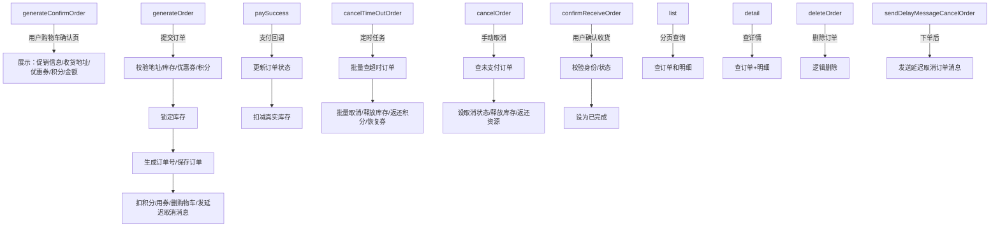

## 6. 数据结构说明

### 6.1 类整体介绍

OmsPortalOrderServiceImpl 是 mall 电商1系统前台商城（portal 模块）中负责订单管理的核心服务实现类，实现了 OmsPortalOrderService 接口。其主要职责是管理前台用户下单、订单确认、支付、取消、收货、查询等订单全生命周期业务流程。它解决了订单生成、优惠券和积分抵扣、库存锁定与扣减、超时自动取消、消息通知、订单信息查询与逻辑删除等一系列电商典型问题，实现了订单业务的高并发、数据一致性和良好用户体验。

#### 类定位与作用

| 领域                 | 作用                                                         |
|----------------------|--------------------------------------------------------------|
| 订单生命周期管理      | 负责订单确认、生成、支付、取消、收货、查询、删除等全流程处理 |
| 业务整合             | 集成会员、购物车、优惠券、积分、库存、订单数据库、消息队列等 |
| 并发与一致性保障     | 利用Redis、消息队列、库存锁定机制处理高并发及数据一致性       |
| 可复用与扩展         | 通过接口和分层、依赖注入易于扩展和集成其他业务               |

---

### 6.2 控制流

#### 6.2.1 主要业务流程调用关系

---

### 6.3 关键属性与配置信息

#### 6.3.1 依赖注入资源

| 字段名                                    | 类型/说明                                   | 主要用途                          |
|--------------------------------------------|---------------------------------------------|-----------------------------------|
| memberService                             | UmsMemberService                            | 会员信息、积分管理                |
| cartItemService                           | OmsCartItemService                          | 购物车商品及促销信息              |
| memberReceiveAddressService                | UmsMemberReceiveAddressService               | 会员收货地址管理                  |
| memberCouponService                       | UmsMemberCouponService                      | 会员优惠券服务                    |
| integrationConsumeSettingMapper            | UmsIntegrationConsumeSettingMapper           | 积分使用规则配置                  |
| skuStockMapper                            | PmsSkuStockMapper                           | 商品SKU库存操作                   |
| couponHistoryDao                          | SmsCouponHistoryDao                         | 优惠券历史数据                    |
| orderMapper                               | OmsOrderMapper                              | 订单主表数据库操作                |
| orderItemDao                              | PortalOrderItemDao                          | 批量订单项数据操作                |
| couponHistoryMapper                       | SmsCouponHistoryMapper                      | 优惠券历史记录数据库操作          |
| redisService                              | RedisService                                | Redis缓存/订单号生成              |
| portalOrderDao                            | PortalOrderDao                              | 订单详情/库存/状态批量处理        |
| orderSettingMapper                        | OmsOrderSettingMapper                       | 订单超时/自动确认配置             |
| orderItemMapper                           | OmsOrderItemMapper                          | 单条订单项数据库操作              |
| cancelOrderSender                         | CancelOrderSender                           | 发送MQ延迟取消订单消息            |

#### 6.3.2 配置项

| 配置项                | 来源                    | 说明                                                         |
|----------------------|-------------------------|--------------------------------------------------------------|
| REDIS_KEY_ORDER_ID   | @Value("${redis.key.orderId}")  | Redis订单号自增键名部分                                     |
| REDIS_DATABASE       | @Value("${redis.database}")     | Redis数据库前缀/库名                                        |

#### 6.3.3 订单与订单项核心字段

| 字段名              | 说明                           | 备注                         |
|---------------------|--------------------------------|------------------------------|
| id                  | 主键ID                         | 订单或订单项唯一标识         |
| memberId            | 会员ID                         | 订单所属用户                 |
| orderSn             | 订单编号                       | 18位，日期+类型+支付+自增    |
| status              | 订单状态                       | 0:未支付,1:待发货,2:已发货...|
| payType             | 支付方式                       | 0:未支付,1:支付宝,2:微信     |
| sourceType          | 订单来源                       | 0:PC, 1:App                  |
| couponId            | 优惠券ID                       |                              |
| useIntegration      | 本单使用积分                   |                              |
| integrationAmount   | 积分抵扣金额                   |                              |
| couponAmount        | 优惠券抵扣金额                 |                              |
| promotionAmount     | 促销优惠金额                   |                              |
| totalAmount         | 总金额（商品合计）             |                              |
| freightAmount       | 运费                           |                              |
| payAmount           | 实际应付金额                   |                              |
| createTime          | 下单时间                       |                              |
| deleteStatus        | 逻辑删除标志                   | 0未删除,1已删除              |
| confirmStatus       | 是否已确认收货                 |                              |
| autoConfirmDay      | 发货后自动确认收货天数         |                              |
| receiverName        | 收货人姓名                     |                              |
| receiverPhone       | 收货人电话                     |                              |
| receiverProvince    | 收货省                         |                              |
| receiverCity        | 收货市                         |                              |
| receiverRegion      | 收货区                         |                              |
| receiverDetailAddress| 收货详细地址                   |                              |

订单项（OmsOrderItem）补充：  
- productId、productName、productBrand、productPic、productAttr、productSkuId、productSkuCode、productCategoryId、productPrice、productQuantity、promotionAmount、couponAmount、integrationAmount、realAmount、promotionName、giftIntegration、giftGrowth

#### 6.3.4 外部资源说明

| 名称                | 作用/用途                                         |
|---------------------|---------------------------------------------------|
| MySQL               | 订单、订单项、优惠券、收货地址等数据持久化         |
| Redis               | 订单号全局唯一自增生成                             |
| MQ（如RabbitMQ）    | 延迟订单取消消息，实现下单后超时自动取消            |
| PageHelper          | 分页查询                                          |

---

### 6.4 主要方法说明

| 方法名                                 | 作用简述                                                                                |
|-----------------------------------------|-----------------------------------------------------------------------------------------|
| generateConfirmOrder(List<Long> cartIds)| 获取购物车商品、促销、收货地址、可用券、积分、金额，供前端确认下单                      |
| generateOrder(OrderParam orderParam)    | 校验收货地址/库存/券/积分→锁定库存→生成订单编号、保存订单、扣券扣分、删购物车、发延迟消息 |
| paySuccess(Long orderId, Integer payType)| 订单支付成功回调，状态置已支付并扣减真实库存                                            |
| cancelTimeOutOrder()                    | 定时批量取消超时未支付订单，释放资源                                                    |
| cancelOrder(Long orderId)               | 手动取消单个未支付订单，释放相关资源                                                    |
| sendDelayMessageCancelOrder(Long orderId)| 下单后发送延迟取消订单消息                                                             |
| confirmReceiveOrder(Long orderId)       | 用户确认收货操作，状态置为已完成                                                        |
| list(Integer status, Integer pageNum, Integer pageSize) | 分页查询当前会员订单列表，附订单项明细                             |
| detail(Long orderId)                    | 查询指定订单及明细                                                                      |
| deleteOrder(Long orderId)               | 逻辑删除订单，仅允许删除已完成或已关闭的订单                                            |
| paySuccessByOrderSn(String orderSn, Integer payType) | 用订单号处理支付成功逻辑                                               |

---

### 6.5 订单状态与业务流转

| status字段取值 | 含义     | 业务场景说明         |
|----------------|----------|----------------------|
| 0              | 待付款   | 用户下单未支付       |
| 1              | 已支付/待发货 | 用户支付成功    |
| 2              | 已发货   | 卖家发货后           |
| 3              | 已完成   | 用户确认收货         |
| 4              | 已关闭   | 超时/用户取消        |
| 5              | 无效订单 | 异常等               |

---

### 6.6 关联数据结构

#### 6.6.1 ConfirmOrderResult

| 字段名                   | 类型               | 说明                   |
|--------------------------|--------------------|------------------------|
| cartPromotionItemList    | List<CartPromotionItem> | 购物车促销商品明细 |
| memberReceiveAddressList | List<UmsMemberReceiveAddress> | 用户所有收货地址 |
| couponHistoryDetailList  | List<SmsCouponHistoryDetail>  | 可用优惠券明细    |
| memberIntegration        | Integer            | 当前积分              |
| integrationConsumeSetting| UmsIntegrationConsumeSetting | 积分使用规则      |
| calcAmount               | CalcAmount         | 金额汇总对象          |

#### 6.6.2 CalcAmount

| 字段名           | 类型         | 说明                     |
|------------------|--------------|--------------------------|
| totalAmount      | BigDecimal   | 商品总金额               |
| freightAmount    | BigDecimal   | 运费                     |
| promotionAmount  | BigDecimal   | 促销优惠金额             |
| payAmount        | BigDecimal   | 应付金额(总-促销)        |

#### 6.6.3 OmsOrderDetail

| 字段名         | 类型                 | 说明                   |
|----------------|----------------------|------------------------|
| (继承自OmsOrder)|                      | 订单基础信息           |
| orderItemList  | List<OmsOrderItem>   | 订单包含商品项列表     |

#### 6.6.4 OmsOrderItem

| 字段名         | 类型         | 说明               |
|----------------|--------------|--------------------|
| productId      | Long         | 商品ID             |
| productName    | String       | 商品名称           |
| productPic     | String       | 商品图片           |
| productAttr    | String       | 商品销售属性(JSON) |
| productBrand   | String       | 品牌               |
| productSn      | String       | 商品编号           |
| productPrice   | BigDecimal   | 商品单价           |
| productQuantity| Integer      | 购买数量           |
| productSkuId   | Long         | SKU ID             |
| productSkuCode | String       | SKU条码            |
| productCategoryId| Long       | 商品分类           |
| promotionAmount| BigDecimal   | 促销优惠金额       |
| couponAmount   | BigDecimal   | 优惠券分摊金额     |
| integrationAmount| BigDecimal | 积分抵扣金额       |
| realAmount     | BigDecimal   | 实际支付金额       |
| promotionName  | String       | 促销活动名称       |
| giftIntegration| Integer      | 赠送积分           |
| giftGrowth     | Integer      | 赠送成长值         |

---

### 6.7 扩展与复用建议

1. 若需扩展订单类型（如拼团、秒杀等），可通过orderType字段及相关业务分支实现。
2. 新增支付方式时，扩展payType字段和支付成功处理分支。
3. 积分、优惠券、促销等规则可通过各自Service和Mapper进行扩展，保证解耦。
4. 支持高并发订单号，使用Redis INCR保证原子性。
5. 延迟消息组件如需更换MQ实现，只需更改cancelOrderSender实现。

---
所属文件id为 566