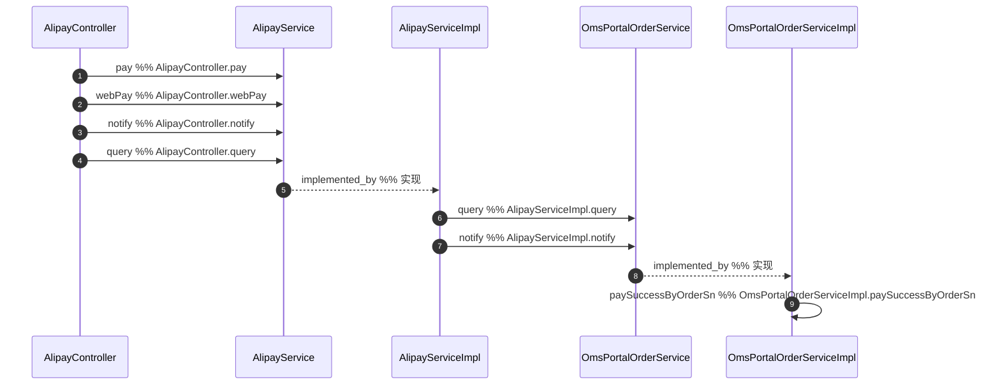

下面介绍关键调用链上文件|类|函数的基本信息

| 所属文件 | 所属类 | 函数解释 |
| --- | --- | --- |
| mall-portal/src/main/java/com/macro/mall/portal/controller/AlipayController.java | AlipayController | AlipayController是一个基于Spring MVC框架的控制器类，专门负责处理与支付宝支付相关的HTTP请求。它提供了包括电脑网站支付、手机网站支付、支付宝异步回调通知处理以及订单交易状态查询等核心支付宝支付接口。该控制器通过注入的AlipayService完成具体的支付业务逻辑，利用AlipayConfig提供的配置信息，向前端返回支付页面或结果，实现与支付宝支付系统的交互。 |
| mall-portal/src/main/java/com/macro/mall/portal/service/OmsPortalOrderService.java | OmsPortalOrderService | OmsPortalOrderService接口是商城门户模块中前台订单管理的核心业务服务接口，负责用户订单的全生命周期管理。它定义了从购物车生成订单确认单、订单创建、支付成功回调、订单取消（自动和手动）、确认收货、订单分页查询、订单详情获取以及订单删除等一系列订单操作的抽象方法，覆盖了用户在门户端进行订单相关操作的主要业务场景。 |
| mall-portal/src/main/java/com/macro/mall/portal/service/AlipayService.java | AlipayService | AlipayService接口定义了支付宝支付相关的核心业务功能，包括生成电脑端支付页面(pay方法)、生成手机端支付页面(webPay方法)、处理支付宝异步回调通知(notify方法)以及查询支付宝交易状态(query方法)。该接口为门户层提供统一的支付服务抽象，支持完整的支付宝支付闭环流程，便于业务层调用支付宝支付能力，实现订单支付、状态同步及回调处理。 |
| mall-portal/src/main/java/com/macro/mall/portal/service/impl/AlipayServiceImpl.java | AlipayServiceImpl | AlipayServiceImpl 是支付宝支付模块的核心实现类，实现了 AlipayService 接口，负责处理支付宝支付相关的业务逻辑。它支持电脑网站支付和手机网站支付两种方式，提供支付请求页面的生成、支付结果异步通知的接收与校验，以及订单支付状态的查询功能。该类通过注入支付宝官方SDK客户端和配置信息，封装了与支付宝接口的交互细节，保证支付流程的安全性和业务数据的一致性，并在支付成功后调用订单服务同步更新订单状态，维持系统业务数据的准确性。 |
| mall-portal/src/main/java/com/macro/mall/portal/service/impl/OmsPortalOrderServiceImpl.java | OmsPortalOrderServiceImpl | OmsPortalOrderServiceImpl类是商城门户前台订单管理的核心服务实现，负责处理用户订单的整个生命周期，包括订单确认信息生成、订单创建、支付成功处理、订单取消（自动超时取消和手动取消）、订单确认收货、订单分页查询、订单详情查看及订单删除等功能。该类协调购物车、用户信息、库存、优惠券、积分等多个子系统，确保订单业务流程的完整性和数据一致性。 |

关键调用链如下

| from | relationship | to |
| --- | --- | --- |
| AlipayServiceImpl.notify | calls | OmsPortalOrderService.paySuccessByOrderSn |
| AlipayController.notify | calls | AlipayService.notify |
| AlipayService | implemented_by | AlipayServiceImpl |
| OmsPortalOrderService | implemented_by | OmsPortalOrderServiceImpl |
| OmsPortalOrderServiceImpl.paySuccessByOrderSn | calls | OmsPortalOrderServiceImpl.paySuccess |
