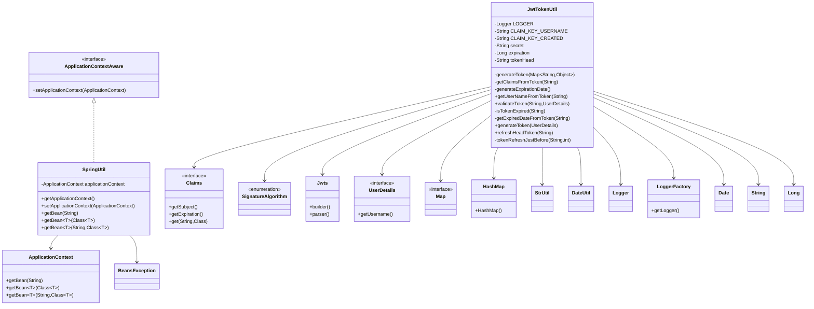

- 概览
  - 这是一个代码类/接口之间的 UML 图，重点关注 JwtTokenUtil 和 SpringUtil 的类结构、方法以及它们与相关类/接口的关系。

- JwtTokenUtil（职责与字段）
  - 主要负责 JWT 的生成、解析、校验与刷新。
  - 关键字段：
    - LOGGER（Logger），通过 LoggerFactory 获取用于日志记录。
    - CLAIM_KEY_USERNAME = "sub"（用于在 claims 中存放用户名）。
    - CLAIM_KEY_CREATED = "created"（用于记录 token 创建时间）。
    - secret（从配置注入，用作签名密钥）。
    - expiration（从配置注入，过期时长，单位秒）。
    - tokenHead（从配置注入，token 前缀）。
  
- JwtTokenUtil（主要方法与逻辑）
  - 私有 String generateToken(Map<String,Object> claims)
    - 使用 Jwts.builder()、setClaims(claims)、setExpiration(generateExpirationDate())、signWith(SignatureAlgorithm.HS512, secret) 并 compact() 生成签名 token。
  - 私有 Claims getClaimsFromToken(String token)
    - 使用 Jwts.parser().setSigningKey(secret).parseClaimsJws(token).getBody() 解析 token；解析异常时记录日志并返回 null。
  - 私有 Date generateExpirationDate()
    - 返回 new Date(System.currentTimeMillis() + expiration * 1000) 作为 token 过期时间。
  - public String getUserNameFromToken(String token)
    - 通过 getClaimsFromToken(token) 获取 claims，再调用 claims.getSubject() 得到用户名；异常时返回 null。
  - public boolean validateToken(String token, UserDetails userDetails)
    - 从 token 获取用户名并与 userDetails.getUsername() 比较，且调用 !isTokenExpired(token) 确认未过期，两个条件同时满足则返回 true。
  - 私有 boolean isTokenExpired(String token)
    - 通过 getExpiredDateFromToken(token) 获取过期时间，比较 expiredDate.before(new Date()) 判断是否过期。
  - 私有 Date getExpiredDateFromToken(String token)
    - 从 claims 获取并返回 claims.getExpiration()。
  - public String generateToken(UserDetails userDetails)
    - 创建 HashMap claims，放入 CLAIM_KEY_USERNAME（username）和 CLAIM_KEY_CREATED（new Date()），调用 generateToken(claims) 生成 token。
  - public String refreshHeadToken(String oldToken)
    - 流程：
      - 判空 oldToken（借助 StrUtil.isEmpty），若空返回 null。
      - 去掉 tokenHead 前缀得到实际 token，判空返回 null。
      - 调用 getClaimsFromToken(token)，若 claims 为 null 返回 null（校验失败）。
      - 若 isTokenExpired(token) 返回 null（过期不支持刷新）。
      - 若 tokenRefreshJustBefore(token, 30*60) 为 true，则直接返回原 token（30 分钟内刚刷新过）；否则更新 claims 中 CLAIM_KEY_CREATED 为 new Date() 并用 generateToken(claims) 生成新的 token。
  - 私有 boolean tokenRefreshJustBefore(String token, int time)
    - 从 claims 中取出创建时间 created = claims.get(CLAIM_KEY_CREATED, Date.class)。
    - 以 refreshDate = new Date()，判断 refreshDate.after(created) && refreshDate.before(DateUtil.offsetSecond(created, time))，若在指定秒数内返回 true，否则 false。

- JwtTokenUtil 的外部依赖（图中箭头所示）
  - Logger / LoggerFactory：用于日志记录（LOGGER 初始化）。
  - Jwts、SignatureAlgorithm：用于构建与解析 JWT。
  - Claims：表示 JWT payload，提供 getSubject(), getExpiration(), get(String,Class) 等方法。
  - UserDetails：用于从数据库用户信息比对 username。
  - Map / HashMap：构造 claims 存放用户名与创建时间。
  - StrUtil：用于判空判断 oldToken/token。
  - DateUtil：用于计算 created 时间加指定秒数（offsetSecond）。
  - Date、String、Long：基本类型/类用于时间和配置字段。

- SpringUtil（职责与字段）
  - 实现 ApplicationContextAware 接口，用于持有 Spring 上下文以便静态访问 Bean。
  - 关键静态字段：
    - private static ApplicationContext applicationContext（在 setApplicationContext 中初始化一次）。

- SpringUtil（主要方法与行为）
  - public static ApplicationContext getApplicationContext()
    - 返回持有的 applicationContext。
  - @Override public void setApplicationContext(ApplicationContext applicationContext) throws BeansException
    - 当 Spring 注入时，如果 SpringUtil.applicationContext 为空则赋值（只赋一次）。
  - public static Object getBean(String name)
    - 通过 getApplicationContext().getBean(name) 获取 Bean。
  - public static <T> T getBean(Class<T> clazz)
    - 通过 getApplicationContext().getBean(clazz) 获取 Bean。
  - public static <T> T getBean(String name, Class<T> clazz)
    - 通过 getApplicationContext().getBean(name, clazz) 获取 Bean。

- SpringUtil 的图中关系
  - SpringUtil 实现（继承） ApplicationContextAware（ApplicationContextAware <|.. SpringUtil）。
  - SpringUtil 依赖 ApplicationContext 与 BeansException（用于 setApplicationContext 的签名与调用 getBean 时委托给 ApplicationContext）。

- 小结（图意）
  - 图展示了 JwtTokenUtil 的属性与方法，以及它与 JWT 相关工具类（Jwts、Claims、SignatureAlgorithm）、辅助工具（DateUtil、StrUtil）、日志（Logger/LoggerFactory）和基础类型的依赖关系；并展示了 SpringUtil 作为持有静态 ApplicationContext 的工具类，实现 ApplicationContextAware 并提供多种 getBean 方法供全局访问。

