```mermaid
classDiagram
    class DynamicSecurityFilter {
        +init(filterConfig)
        +doFilter(servletRequest, servletResponse, filterChain)
        +destroy()
        +getSecureObjectClass()
        +obtainSecurityMetadataSource()
        +setMyAccessDecisionManager(dynamicAccessDecisionManager)
        -dynamicSecurityMetadataSource
        -ignoreUrlsConfig
    }
    class AbstractSecurityInterceptor {
        <<abstract>>
        +beforeInvocation(object)
        +afterInvocation(token, returnedObject)
        +setAccessDecisionManager(accessDecisionManager)
    }
    class Filter {
        <<interface>>
        +init(filterConfig)
        +doFilter(servletRequest, servletResponse, filterChain)
        +destroy()
    }
    class DynamicSecurityMetadataSource {
        +loadDataSource()
        +clearDataSource()
        +getAttributes(o)
        +getAllConfigAttributes()
        +supports(aClass)
        -dynamicSecurityService
        -configAttributeMap
    }
    class FilterInvocationSecurityMetadataSource {
        <<interface>>
        +getAttributes(o)
        +getAllConfigAttributes()
        +supports(aClass)
    }
    class DynamicSecurityService {
        <<interface>>
        +loadDataSource()
    }
    class DynamicAccessDecisionManager {
        +decide(authentication, object, configAttributes)
        +supports(configAttribute)
        +supports(aClass)
    }
    class AccessDecisionManager {
        <<interface>>
        +decide(authentication, object, configAttributes)
        +supports(configAttribute)
        +supports(aClass)
    }
    class IgnoreUrlsConfig {
        +getUrls()
    }
    class FilterInvocation {
        +getChain()
        +getRequest()
        +getResponse()
        +getRequestUrl()
    }
    class ConfigAttribute {
        +getAttribute()
    }
    class Authentication {
        +getAuthorities()
    }
    class GrantedAuthority {
        +getAuthority()
    }
    class PathMatcher {
        +match(pattern, path)
    }
    class AntPathMatcher {
    }
    class InterceptorStatusToken {
    }
    class URLUtil {
        +getPath(url)
    }
    class HttpMethod {
    }
    class ServletRequest {
    }
    class ServletResponse {
    }
    class FilterChain {
        +doFilter(servletRequest, servletResponse)
    }
    class FilterConfig {
    }
    class ServletException {
    }
    class IOException {
    }
    class AccessDeniedException {
    }
    class InsufficientAuthenticationException {
    }
    class Collection~ConfigAttribute~ {
    }
    class Map~String,ConfigAttribute~ {
    }
    class List~ConfigAttribute~ {
    }
    class Iterator~String~ {
    }
    DynamicSecurityFilter --|> AbstractSecurityInterceptor
    DynamicSecurityFilter ..|> Filter
    DynamicSecurityFilter o-- DynamicSecurityMetadataSource
    DynamicSecurityFilter o-- IgnoreUrlsConfig
    DynamicSecurityFilter ..> DynamicAccessDecisionManager
    DynamicSecurityFilter ..> FilterInvocation
    DynamicSecurityFilter ..> PathMatcher
    DynamicSecurityFilter ..> AntPathMatcher
    DynamicSecurityFilter ..> InterceptorStatusToken
    DynamicSecurityFilter ..> HttpMethod
    DynamicSecurityFilter ..> ServletRequest
    DynamicSecurityFilter ..> ServletResponse
    DynamicSecurityFilter ..> FilterChain
    DynamicSecurityFilter ..> ServletException
    DynamicSecurityFilter ..> IOException
    DynamicSecurityMetadataSource ..|> FilterInvocationSecurityMetadataSource
    DynamicSecurityMetadataSource o-- DynamicSecurityService
    DynamicSecurityMetadataSource ..> Map~String,ConfigAttribute~
    DynamicSecurityMetadataSource ..> Collection~ConfigAttribute~
    DynamicSecurityMetadataSource ..> List~ConfigAttribute~
    DynamicSecurityMetadataSource ..> FilterInvocation
    DynamicSecurityMetadataSource ..> URLUtil
    DynamicSecurityMetadataSource ..> PathMatcher
    DynamicSecurityMetadataSource ..> AntPathMatcher
    DynamicSecurityMetadataSource ..> Iterator~String~
    DynamicAccessDecisionManager ..|> AccessDecisionManager
    DynamicAccessDecisionManager ..> Authentication
    DynamicAccessDecisionManager ..> Collection~ConfigAttribute~
    DynamicAccessDecisionManager ..> ConfigAttribute
    DynamicAccessDecisionManager ..> GrantedAuthority
    DynamicAccessDecisionManager ..> AccessDeniedException
    DynamicAccessDecisionManager ..> InsufficientAuthenticationException
    DynamicAccessDecisionManager ..> Iterator~String~
    DynamicSecurityService ..> Map~String,ConfigAttribute~

```

- 本图为代码类与接口之间关系的UML类图，重点展示了动态安全权限相关的核心类及其关系，主要关注 DynamicSecurityFilter、DynamicSecurityMetadataSource、DynamicSecurityService、DynamicAccessDecisionManager 四个类/接口。

- DynamicSecurityFilter 类（核心过滤器）：
  - 继承自 AbstractSecurityInterceptor（抽象安全拦截器），实现了 Filter（过滤器接口）。
  - 主要负责对 HTTP 请求进行安全拦截、校验与放行逻辑。
  - 持有 DynamicSecurityMetadataSource（动态元数据源）和 IgnoreUrlsConfig（忽略URL配置）的组合关系。
  - 可通过 setMyAccessDecisionManager 方法设置 DynamicAccessDecisionManager（动态权限决策管理器）。
  - 方法 doFilter 实现了安全请求的核心流程，包括OPTIONS请求、白名单直接放行，以及通过 AccessDecisionManager 决定是否放行。
  - 依赖 FilterInvocation（过滤器调用对象）、PathMatcher/AntPathMatcher（路径匹配）、InterceptorStatusToken（拦截状态）、和 HTTP 相关类。

- DynamicSecurityMetadataSource 类（动态安全元数据源）：
  - 实现了 FilterInvocationSecurityMetadataSource 接口。
  - 持有 DynamicSecurityService（动态安全服务）的组合关系。
  - 负责加载、维护和获取路径对应的权限数据（ConfigAttribute），并通过 PathMatcher 进行路径匹配。
  - 方法 loadDataSource 通过 dynamicSecurityService 加载权限数据，getAttributes 根据请求路径返回需要的资源权限。

- DynamicSecurityService 接口（动态安全服务）：
  - 提供 loadDataSource 方法，用于加载所有资源与权限的映射关系（Map<String, ConfigAttribute>）。
  - 被 DynamicSecurityMetadataSource 调用，实现资源权限的动态获取。

- DynamicAccessDecisionManager 类（动态权限决策管理器）：
  - 实现 AccessDecisionManager 接口。
  - 方法 decide 负责根据当前用户（Authentication）拥有的权限与请求所需的权限（ConfigAttribute 集合）进行比对，决定是否授权访问，未满足时抛出 AccessDeniedException。
  - 被 DynamicSecurityFilter 作为权限决策组件使用。

- 关系说明：
  - DynamicSecurityFilter 依赖并组合了 DynamicSecurityMetadataSource 和 IgnoreUrlsConfig，设置 DynamicAccessDecisionManager 作为决策器。
  - DynamicSecurityMetadataSource 依赖 DynamicSecurityService 提供权限数据。
  - DynamicAccessDecisionManager 作为 AccessDecisionManager 的实现，负责最终的权限判断。
  - 相关辅助类如 FilterInvocation、ConfigAttribute、Authentication、GrantedAuthority、PathMatcher 等被各核心类调用或依赖。

- 总结：
  - 此UML图清晰展现了动态安全过滤的关键类之间的继承、实现、组合与调用关系，体现了基于动态权限元数据与决策管理器的安全认证机制整体架构。

