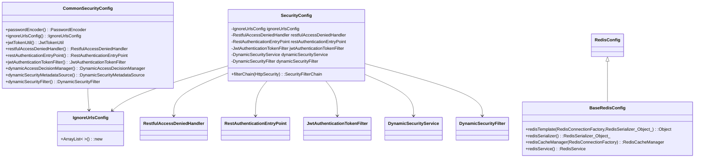

- 本图为代码类/接口之间关系的UML类图，重点展示了 SecurityConfig、CommonSecurityConfig、RedisConfig、IgnoreUrlsConfig 及其相关类之间的关系与依赖。

- SecurityConfig 类：
  - 主要负责安全配置，包含多个私有成员变量：IgnoreUrlsConfig、RestfulAccessDeniedHandler、RestAuthenticationEntryPoint、JwtAuthenticationTokenFilter、DynamicSecurityService、DynamicSecurityFilter。
  - 提供了方法 filterChain(HttpSecurity): SecurityFilterChain。
  - 依赖了 IgnoreUrlsConfig、RestfulAccessDeniedHandler、RestAuthenticationEntryPoint、JwtAuthenticationTokenFilter、DynamicSecurityService、DynamicSecurityFilter 这些类。

- CommonSecurityConfig 类：
  - 提供多个与安全相关的公有方法，包括 passwordEncoder、ignoreUrlsConfig、jwtTokenUtil、restfulAccessDeniedHandler、restAuthenticationEntryPoint、jwtAuthenticationTokenFilter、dynamicAccessDecisionManager、dynamicSecurityMetadataSource、dynamicSecurityFilter 等。
  - 通过 ignoreUrlsConfig() 方法与 IgnoreUrlsConfig 类产生关联。

- IgnoreUrlsConfig 类：
  - 负责忽略特定 URL 的安全配置。
  - 提供构造方法 ArrayList<>()，用于新建列表。

- RedisConfig 与 BaseRedisConfig：
  - RedisConfig 继承自 BaseRedisConfig。
  - BaseRedisConfig 提供了 redisTemplate、redisSerializer、redisCacheManager、redisService 等方法。

- 依赖与继承关系总结：
  - SecurityConfig 通过字段依赖了多个安全相关组件。
  - CommonSecurityConfig 通过方法返回类型或调用依赖了 IgnoreUrlsConfig 等安全组件。
  - RedisConfig 与 BaseRedisConfig 之间为继承关系，BaseRedisConfig 提供了 Redis 相关的基本功能。
  - IgnoreUrlsConfig 作为安全配置的基础组件，被 SecurityConfig 与 CommonSecurityConfig 使用。

- 该UML图帮助理清了安全配置和Redis配置相关核心类之间的结构关系及其依赖情况。

