```mermaid
classDiagram
    class DemoController {
        +CommonResult~List~PmsBrand~~ getBrandList()
        +CommonResult createBrand(PmsBrandDto pmsBrand)
        +CommonResult updateBrand(Long id, PmsBrandDto pmsBrandDto)
        +CommonResult deleteBrand(Long id)
        +CommonResult~CommonPage~PmsBrand~~~ listBrand(Integer pageNum, Integer pageSize)
        +CommonResult~PmsBrand~ brand(Long id)
        -DemoService demoService
    }
    
    class DemoService {
        <<interface>>
        +List~PmsBrand~ listAllBrand()
        +int createBrand(PmsBrandDto pmsBrandDto)
        +int updateBrand(Long id, PmsBrandDto pmsBrandDto)
        +int deleteBrand(Long id)
        +List~PmsBrand~ listBrand(int pageNum, int pageSize)
        +PmsBrand getBrand(Long id)
    }
    
    class DemoServiceImpl {
        +List~PmsBrand~ listAllBrand()
        +int createBrand(PmsBrandDto pmsBrandDto)
        +int updateBrand(Long id, PmsBrandDto pmsBrandDto)
        +int deleteBrand(Long id)
        +List~PmsBrand~ listBrand(int pageNum, int pageSize)
        +PmsBrand getBrand(Long id)
        -PmsBrandMapper brandMapper
    }

    DemoService <|.. DemoServiceImpl
    DemoController --> DemoService
    DemoServiceImpl --> PmsBrandMapper
    DemoServiceImpl --> PmsBrandDto
    DemoServiceImpl --> PmsBrand
    
    class RestTemplateDemoController {
        +Object getForEntity(Long id)
        +Object getForEntity2(Long id)
        +Object getForEntity3(Long id)
        +Object getForObject(Long id)
        +Object postForEntity(PmsBrand brand)
        +Object postForObject(PmsBrand brand)
        +Object postForEntity3(String name)
        -RestTemplate restTemplate
        -String HOST_MALL_ADMIN
    }
    
    class RestTemplateConfig {
        +RestTemplate restTemplate()
    }
    
    class FlagValidatorClass {
        +void initialize(FlagValidator flagValidator)
        +boolean isValid(Integer value, ConstraintValidatorContext constraintValidatorContext)
        -String[] values
    }
    FlagValidatorClass ..|> ConstraintValidator~FlagValidator,Integer~

    class SwaggerConfig {
        +SwaggerProperties swaggerProperties()
        +BeanPostProcessor springfoxHandlerProviderBeanPostProcessor()
    }
    
    class BaseSwaggerConfig {
        <<abstract>>
        +Docket createRestApi()
        +SwaggerProperties swaggerProperties()
        +BeanPostProcessor generateBeanPostProcessor()
    }
    SwaggerConfig <|-- BaseSwaggerConfig
    
    class MyBatisConfig {
    }
    
    class SecurityConfig {
        +SecurityFilterChain filterChain(HttpSecurity httpSecurity)
        -IgnoreUrlsConfig ignoreUrlsConfig
        -RestfulAccessDeniedHandler restfulAccessDeniedHandler
        -RestAuthenticationEntryPoint restAuthenticationEntryPoint
        -JwtAuthenticationTokenFilter jwtAuthenticationTokenFilter
        -DynamicSecurityService dynamicSecurityService
        -DynamicSecurityFilter dynamicSecurityFilter
    }
    SecurityConfig --> AdminUserDetails
    SecurityConfig --> IgnoreUrlsConfig
    SecurityConfig --> RestfulAccessDeniedHandler
    SecurityConfig --> RestAuthenticationEntryPoint
    SecurityConfig --> JwtAuthenticationTokenFilter
    SecurityConfig --> DynamicSecurityService
    SecurityConfig --> DynamicSecurityFilter
    
    class AdminUserDetails {
        +Collection~GrantedAuthority~ getAuthorities()
        +String getPassword()
        +String getUsername()
        +boolean isAccountNonExpired()
        +boolean isAccountNonLocked()
        +boolean isCredentialsNonExpired()
        +boolean isEnabled()
        -UmsAdmin umsAdmin
        -List~UmsResource~ resourceList
    }
    AdminUserDetails ..|> UserDetails
    AdminUserDetails --> UmsAdmin
    AdminUserDetails --> UmsResource
    
    class MallDemoApplication {
        +main(String[] args)
    }
    
    class PmsBrandDto {
        +String getName()
        +void setName(String name)
        +String getFirstLetter()
        +void setFirstLetter(String firstLetter)
        +Integer getSort()
        +void setSort(Integer sort)
        +Integer getFactoryStatus()
        +void setFactoryStatus(Integer factoryStatus)
        +Integer getShowStatus()
        +void setShowStatus(Integer showStatus)
        +String getLogo()
        +void setLogo(String logo)
        +String getBigPic()
        +void setBigPic(String bigPic)
        +String getBrandStory()
        +void setBrandStory(String brandStory)
        -String name
        -String firstLetter
        -Integer sort
        -Integer factoryStatus
        -Integer showStatus
        -String logo
        -String bigPic
        -String brandStory
    }
    
    class MallDemoApplicationTests {
        +void contextLoads()
        +void testLogStash()
        -Logger logger
    }

```

- 本图为**代码类/接口之间的UML关系图**，展示了 Mall Demo 应用中核心类、接口及其主要成员方法和类之间的继承、实现与依赖关系。
- 重点内容如下：

---

- `DemoController`（品牌管理示例接口，控制层）  
    - 公开方法：品牌的增删改查、分页获取、单条获取等（如 `getBrandList`, `createBrand`, `updateBrand`, `deleteBrand`, `listBrand`, `brand`）。
    - 内部依赖成员：`DemoService`（业务层接口）。
    - 与 `DemoService` 通过调用关系 (`-->`) 关联。

- `DemoService`（品牌管理业务接口）  
    - 声明了品牌相关的业务操作方法（如 `listAllBrand`, `createBrand`, `updateBrand`, `deleteBrand`, `listBrand`, `getBrand`）。
    - 为接口 (`<<interface>>`)，由 `DemoServiceImpl` 实现。
    - 与 `DemoController` 之间为接口调用关系。

- `DemoServiceImpl`（品牌管理业务实现类）  
    - 实现 `DemoService`（`<|..` 继承关系）。
    - 依赖 `PmsBrandMapper`（数据访问层）、`PmsBrandDto`、`PmsBrand`。
    - 包含与品牌业务相关的具体实现方法。

- `RestTemplateDemoController`（RestTemplate 调用示例控制器）  
    - 提供多种 HTTP 调用品牌相关接口的演示方法（如 `getForEntity`, `getForObject`, `postForEntity`, `postForObject` 等）。
    - 依赖成员：`RestTemplate`（由 `RestTemplateConfig` 提供），`HOST_MALL_ADMIN`（远程主机地址字符串）。

- `RestTemplateConfig`（RestTemplate 配置类）  
    - 提供 `RestTemplate` Bean 的方法（`restTemplate()`），供控制器依赖注入使用。

- `FlagValidatorClass`  
    - 实现接口 `ConstraintValidator<FlagValidator, Integer>`（`..|>` 继承关系）。
    - 实现方法：`initialize`（初始化校验器）、`isValid`（校验逻辑）。

- `SwaggerConfig`（Swagger API 文档配置类）  
    - 继承自抽象类 `BaseSwaggerConfig`（`<|--` 继承关系）。
    - 重写 `swaggerProperties()`，提供接口文档属性配置。
    - 提供 `springfoxHandlerProviderBeanPostProcessor()` Bean，用于兼容 Springfox。

- `BaseSwaggerConfig`（Swagger 基础配置抽象类）  
    - 定义了 `createRestApi`、`swaggerProperties`、`generateBeanPostProcessor` 等方法。
    - 为抽象基类，供 `SwaggerConfig` 继承和扩展。

- `MyBatisConfig`  
    - MyBatis 框架相关的配置类，无方法或成员。

- `SecurityConfig`（安全配置类）  
    - 配置 Spring Security 相关安全过滤链（`filterChain`）。
    - 依赖于多个安全相关 Bean（如 `IgnoreUrlsConfig`, `RestfulAccessDeniedHandler`, `RestAuthenticationEntryPoint`, `JwtAuthenticationTokenFilter`, `DynamicSecurityService`, `DynamicSecurityFilter`）。
    - 与 `AdminUserDetails`、`IgnoreUrlsConfig` 等类有依赖关系。

- `AdminUserDetails`  
    - 实现接口 `UserDetails`（`..|>` 继承关系）。
    - 持有 `UmsAdmin`（后台用户信息）、`List<UmsResource>`（资源列表）。
    - 实现用户权限及状态相关方法（如 `getAuthorities`, `getPassword`, `getUsername` 等）。
    - 与 `UmsAdmin`、`UmsResource` 有关联。

- `PmsBrandDto`  
    - 品牌数据传输对象，包含品牌的各种属性（如 `name`, `firstLetter`, `sort`, `factoryStatus`, `showStatus`, `logo`, `bigPic`, `brandStory`）及其 getter/setter。

- `MallDemoApplication`  
    - Spring Boot 应用主类，包含 `main` 方法（程序入口）。

- `MallDemoApplicationTests`  
    - 应用测试类，包含测试方法（如 `contextLoads`, `testLogStash`），用于日志和环境加载测试。

---

- 关系说明：
    - 实线箭头（`-->`）表示依赖或关联，如控制器依赖服务、服务实现依赖数据访问对象。
    - 空心三角箭头（`<|--`、`<|..`、`..|>`）表示继承或实现关系，如实现接口或继承抽象类。
    - 类之间的依赖和实现关系，清晰反映了各层之间的职责划分与调用路径，符合标准的 Spring Boot 分层架构设计思想。

