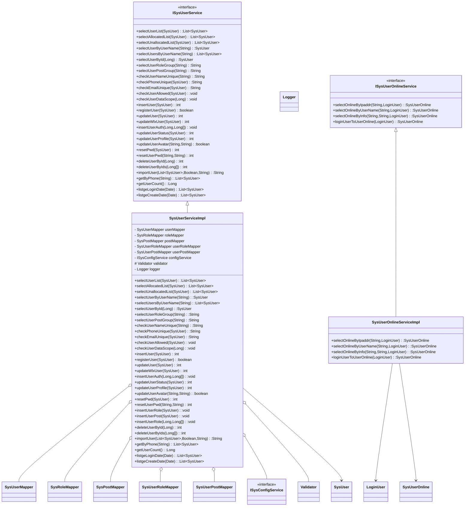

```mermaid
classDiagram
    class ISysUserService {
        <<interface>>
        +selectUserList(SysUser):List~SysUser~
        +selectAllocatedList(SysUser):List~SysUser~
        +selectUnallocatedList(SysUser):List~SysUser~
        +selectUserByUserName(String):SysUser
        +selectUsersByUserName(String):List~SysUser~
        +selectUserById(Long):SysUser
        +selectUserRoleGroup(String):String
        +selectUserPostGroup(String):String
        +checkUserNameUnique(String):String
        +checkPhoneUnique(SysUser):String
        +checkEmailUnique(SysUser):String
        +checkUserAllowed(SysUser):void
        +checkUserDataScope(Long):void
        +insertUser(SysUser):int
        +registerUser(SysUser):boolean
        +updateUser(SysUser):int
        +updateWlxUser(SysUser):int
        +insertUserAuth(Long,Long[]):void
        +updateUserStatus(SysUser):int
        +updateUserProfile(SysUser):int
        +updateUserAvatar(String,String):boolean
        +resetPwd(SysUser):int
        +resetUserPwd(String,String):int
        +deleteUserById(Long):int
        +deleteUserByIds(Long[]):int
        +importUser(List~SysUser~,Boolean,String):String
        +getByPhone(String):List~SysUser~
        +getUserCount():Long
        +listgeLoginDate(Date):List~SysUser~
        +listgeCreateDate(Date):List~SysUser~
    }

    class SysUserServiceImpl {
        - SysUserMapper userMapper
        - SysRoleMapper roleMapper
        - SysPostMapper postMapper
        - SysUserRoleMapper userRoleMapper
        - SysUserPostMapper userPostMapper
        - ISysConfigService configService
        # Validator validator
        - Logger logger
        +selectUserList(SysUser):List~SysUser~
        +selectAllocatedList(SysUser):List~SysUser~
        +selectUnallocatedList(SysUser):List~SysUser~
        +selectUserByUserName(String):SysUser
        +selectUsersByUserName(String):List~SysUser~
        +selectUserById(Long):SysUser
        +selectUserRoleGroup(String):String
        +selectUserPostGroup(String):String
        +checkUserNameUnique(String):String
        +checkPhoneUnique(SysUser):String
        +checkEmailUnique(SysUser):String
        +checkUserAllowed(SysUser):void
        +checkUserDataScope(Long):void
        +insertUser(SysUser):int
        +registerUser(SysUser):boolean
        +updateUser(SysUser):int
        +updateWlxUser(SysUser):int
        +insertUserAuth(Long,Long[]):void
        +updateUserStatus(SysUser):int
        +updateUserProfile(SysUser):int
        +updateUserAvatar(String,String):boolean
        +resetPwd(SysUser):int
        +resetUserPwd(String,String):int
        +insertUserRole(SysUser):void
        +insertUserPost(SysUser):void
        +insertUserRole(Long,Long[]):void
        +deleteUserById(Long):int
        +deleteUserByIds(Long[]):int
        +importUser(List~SysUser~,Boolean,String):String
        +getByPhone(String):List~SysUser~
        +getUserCount():Long
        +listgeLoginDate(Date):List~SysUser~
        +listgeCreateDate(Date):List~SysUser~
    }

    ISysUserService <|-- SysUserServiceImpl

    class SysUser {
    }

    class SysUserMapper {
    }

    class SysRoleMapper {
    }

    class SysPostMapper {
    }

    class SysUserRoleMapper {
    }

    class SysUserPostMapper {
    }

    class ISysConfigService {
        <<interface>>
    }

    class Validator {
    }

    class Logger {
    }

    SysUserServiceImpl o-- SysUserMapper
    SysUserServiceImpl o-- SysRoleMapper
    SysUserServiceImpl o-- SysPostMapper
    SysUserServiceImpl o-- SysUserRoleMapper
    SysUserServiceImpl o-- SysUserPostMapper
    SysUserServiceImpl o-- ISysConfigService
    SysUserServiceImpl o-- Validator
    SysUserServiceImpl --> SysUser

    class ISysUserOnlineService {
        <<interface>>
        +selectOnlineByIpaddr(String,LoginUser):SysUserOnline
        +selectOnlineByUserName(String,LoginUser):SysUserOnline
        +selectOnlineByInfo(String,String,LoginUser):SysUserOnline
        +loginUserToUserOnline(LoginUser):SysUserOnline
    }

    class SysUserOnlineServiceImpl {
        +selectOnlineByIpaddr(String,LoginUser):SysUserOnline
        +selectOnlineByUserName(String,LoginUser):SysUserOnline
        +selectOnlineByInfo(String,String,LoginUser):SysUserOnline
        +loginUserToUserOnline(LoginUser):SysUserOnline
    }

    ISysUserOnlineService <|-- SysUserOnlineServiceImpl

    class LoginUser {
    }

    class SysUserOnline {
    }

    SysUserOnlineServiceImpl --> LoginUser
    SysUserOnlineServiceImpl --> SysUserOnline

```
- 图类型
  - 这是一个类/接口之间关系的 UML 类图，重点关注 SysUserServiceImpl 和 SysUserOnlineServiceImpl 及其相关类/接口关系。

- SysUserServiceImpl（public class SysUserServiceImpl implements ISysUserService）
  - 实现关系
    - 实现接口：ISysUserService（实现了接口中声明的所有用户相关方法）。
  - 成员字段（依赖/聚合）
    - 私有字段：SysUserMapper userMapper、SysRoleMapper roleMapper、SysPostMapper postMapper、SysUserRoleMapper userRoleMapper、SysUserPostMapper userPostMapper、ISysConfigService configService
    - 受保护字段：Validator validator
    - 私有静态日志对象由 LoggerFactory.getLogger(...) 提供（在源信息中以 logger 表示）
    - 图中以聚合/组合关系表示 SysUserServiceImpl o-- 这些 Mapper、ISysConfigService 和 Validator
    - 与实体类 SysUser 存在依赖关系（SysUserServiceImpl --> SysUser）
  - 主要方法（按功能类别概述，均来自类/接口声明）
    - 查询/检索
      - selectUserList(SysUser): List<SysUser>
      - selectAllocatedList(SysUser): List<SysUser>
      - selectUnallocatedList(SysUser): List<SysUser>
      - selectUserByUserName(String): SysUser
      - selectUsersByUserName(String): List<SysUser>
      - selectUserById(Long): SysUser
      - getByPhone(String): List<SysUser>
      - getUserCount(): Long
      - listgeLoginDate(Date): List<SysUser>
      - listgeCreateDate(Date): List<SysUser>
    - 角色/岗位相关组装
      - selectUserRoleGroup(String): String
      - selectUserPostGroup(String): String
      - insertUserRole(SysUser): void
      - insertUserPost(SysUser): void
      - insertUserRole(Long, Long[]): void
    - 校验与权限检查
      - checkUserNameUnique(String): String
      - checkPhoneUnique(SysUser): String
      - checkEmailUnique(SysUser): String
      - checkUserAllowed(SysUser): void
      - checkUserDataScope(Long): void
    - 用户增删改与认证相关
      - insertUser(SysUser): int
      - registerUser(SysUser): boolean
      - updateUser(SysUser): int
      - updateWlxUser(SysUser): int
      - insertUserAuth(Long, Long[]): void
      - updateUserStatus(SysUser): int
      - updateUserProfile(SysUser): int
      - updateUserAvatar(String, String): boolean
      - resetPwd(SysUser): int
      - resetUserPwd(String, String): int
      - deleteUserById(Long): int
      - deleteUserByIds(Long[]): int
    - 导入/批量操作
      - importUser(List<SysUser>, Boolean, String): String

- ISysUserService（public interface）
  - 定义的方法（被 SysUserServiceImpl 实现，方法签名与上面对应）
    - 包含查询、校验、增删改、导入、统计与按日期筛选等一系列用户相关方法（具体签名见 SysUserServiceImpl 对应实现）。

- SysUserOnlineServiceImpl（public class SysUserOnlineServiceImpl implements ISysUserOnlineService）
  - 实现关系
    - 实现接口：ISysUserOnlineService（实现接口中声明的在线用户相关方法）。
  - 成员字段
    - 源信息未列出具体字段名（仅方法列出）。
  - 主要方法（在线用户相关）
    - selectOnlineByIpaddr(String, LoginUser): SysUserOnline
    - selectOnlineByUserName(String, LoginUser): SysUserOnline
    - selectOnlineByInfo(String, String, LoginUser): SysUserOnline
    - loginUserToUserOnline(LoginUser): SysUserOnline
  - 依赖/关联
    - 方法和关系指向 LoginUser（SysUserOnlineServiceImpl --> LoginUser）
    - 方法返回/关联 SysUserOnline（SysUserOnlineServiceImpl --> SysUserOnline）

- ISysUserOnlineService（public interface）
  - 定义的方法
    - selectOnlineByIpaddr(String, LoginUser): SysUserOnline
    - selectOnlineByUserName(String, LoginUser): SysUserOnline
    - selectOnlineByInfo(String, String, LoginUser): SysUserOnline
    - loginUserToUserOnline(LoginUser): SysUserOnline

- 关系汇总（基于图中箭头/连线含义）
  - SysUserServiceImpl 实现了 ISysUserService，并聚合/使用多种 Mapper、ISysConfigService 与 Validator，且依赖实体 SysUser。
  - SysUserOnlineServiceImpl 实现了 ISysUserOnlineService，并与 LoginUser 和 SysUserOnline 存在依赖/转换关系（方法以 LoginUser 为输入并产生 SysUserOnline）。

