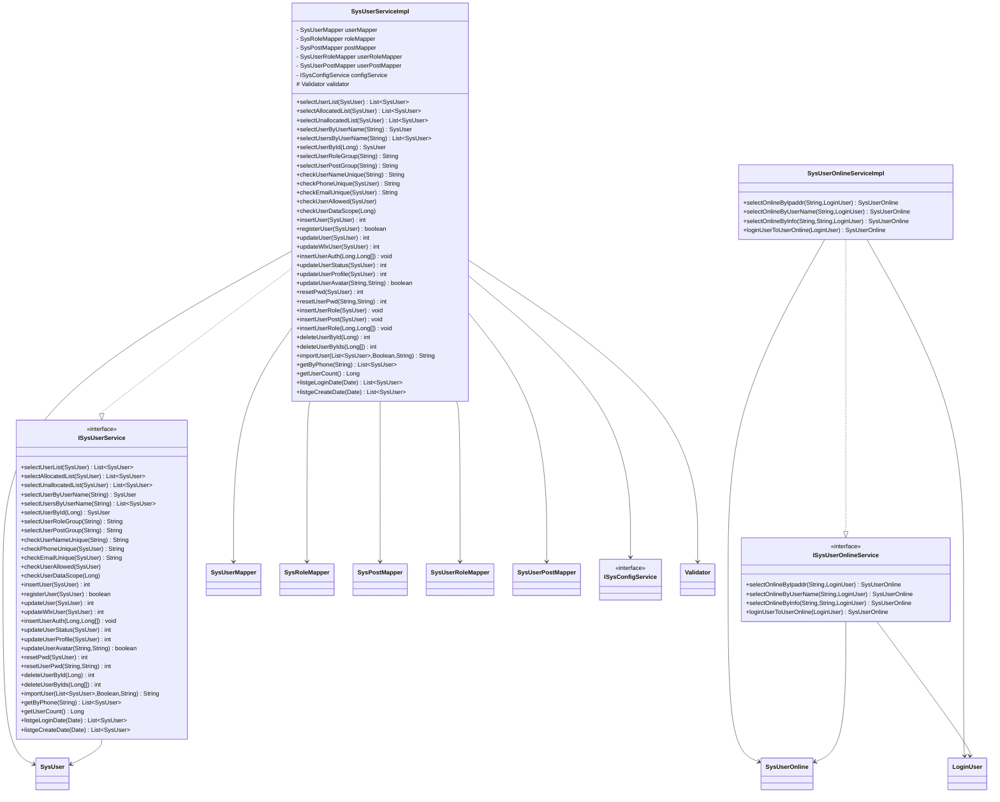

```mermaid
classDiagram
    class SysUserServiceImpl {
        - SysUserMapper userMapper
        - SysRoleMapper roleMapper
        - SysPostMapper postMapper
        - SysUserRoleMapper userRoleMapper
        - SysUserPostMapper userPostMapper
        - ISysConfigService configService
        # Validator validator
        +selectUserList(SysUser) List~SysUser~
        +selectAllocatedList(SysUser) List~SysUser~
        +selectUnallocatedList(SysUser) List~SysUser~
        +selectUserByUserName(String) SysUser
        +selectUsersByUserName(String) List~SysUser~
        +selectUserById(Long) SysUser
        +selectUserRoleGroup(String) String
        +selectUserPostGroup(String) String
        +checkUserNameUnique(String) String
        +checkPhoneUnique(SysUser) String
        +checkEmailUnique(SysUser) String
        +checkUserAllowed(SysUser)
        +checkUserDataScope(Long)
        +insertUser(SysUser) int
        +registerUser(SysUser) boolean
        +updateUser(SysUser) int
        +updateWlxUser(SysUser) int
        +insertUserAuth(Long,Long[]) void
        +updateUserStatus(SysUser) int
        +updateUserProfile(SysUser) int
        +updateUserAvatar(String,String) boolean
        +resetPwd(SysUser) int
        +resetUserPwd(String,String) int
        +insertUserRole(SysUser) void
        +insertUserPost(SysUser) void
        +insertUserRole(Long,Long[]) void
        +deleteUserById(Long) int
        +deleteUserByIds(Long[]) int
        +importUser(List~SysUser~,Boolean,String) String
        +getByPhone(String) List~SysUser~
        +getUserCount() Long
        +listgeLoginDate(Date) List~SysUser~
        +listgeCreateDate(Date) List~SysUser~
    }

    class ISysUserService {
        <<interface>>
        +selectUserList(SysUser) List~SysUser~
        +selectAllocatedList(SysUser) List~SysUser~
        +selectUnallocatedList(SysUser) List~SysUser~
        +selectUserByUserName(String) SysUser
        +selectUsersByUserName(String) List~SysUser~
        +selectUserById(Long) SysUser
        +selectUserRoleGroup(String) String
        +selectUserPostGroup(String) String
        +checkUserNameUnique(String) String
        +checkPhoneUnique(SysUser) String
        +checkEmailUnique(SysUser) String
        +checkUserAllowed(SysUser)
        +checkUserDataScope(Long)
        +insertUser(SysUser) int
        +registerUser(SysUser) boolean
        +updateUser(SysUser) int
        +updateWlxUser(SysUser) int
        +insertUserAuth(Long,Long[]) void
        +updateUserStatus(SysUser) int
        +updateUserProfile(SysUser) int
        +updateUserAvatar(String,String) boolean
        +resetPwd(SysUser) int
        +resetUserPwd(String,String) int
        +deleteUserById(Long) int
        +deleteUserByIds(Long[]) int
        +importUser(List~SysUser~,Boolean,String) String
        +getByPhone(String) List~SysUser~
        +getUserCount() Long
        +listgeLoginDate(Date) List~SysUser~
        +listgeCreateDate(Date) List~SysUser~
    }

    class SysUserOnlineServiceImpl {
        +selectOnlineByIpaddr(String,LoginUser) SysUserOnline
        +selectOnlineByUserName(String,LoginUser) SysUserOnline
        +selectOnlineByInfo(String,String,LoginUser) SysUserOnline
        +loginUserToUserOnline(LoginUser) SysUserOnline
    }

    class ISysUserOnlineService {
        <<interface>>
        +selectOnlineByIpaddr(String,LoginUser) SysUserOnline
        +selectOnlineByUserName(String,LoginUser) SysUserOnline
        +selectOnlineByInfo(String,String,LoginUser) SysUserOnline
        +loginUserToUserOnline(LoginUser) SysUserOnline
    }

    class SysUser {
    }

    class SysUserMapper {
    }

    class SysRoleMapper {
    }

    class SysPostMapper {
    }

    class SysUserRoleMapper {
    }

    class SysUserPostMapper {
    }

    class ISysConfigService {
        <<interface>>
    }

    class Validator {
    }

    class SysUserOnline {
    }

    class LoginUser {
    }

    SysUserServiceImpl ..|> ISysUserService
    SysUserOnlineServiceImpl ..|> ISysUserOnlineService

    SysUserServiceImpl --> SysUserMapper
    SysUserServiceImpl --> SysRoleMapper
    SysUserServiceImpl --> SysPostMapper
    SysUserServiceImpl --> SysUserRoleMapper
    SysUserServiceImpl --> SysUserPostMapper
    SysUserServiceImpl --> ISysConfigService
    SysUserServiceImpl --> Validator

    SysUserServiceImpl --> SysUser
    ISysUserService --> SysUser

    SysUserOnlineServiceImpl --> SysUserOnline
    ISysUserOnlineService --> SysUserOnline

    SysUserOnlineServiceImpl --> LoginUser
    ISysUserOnlineService --> LoginUser

```
- 整体说明  
  - 该图是一个“用户相关服务”的类/接口关系 UML 图，重点展示两个实现类：`SysUserServiceImpl` 和 `SysUserOnlineServiceImpl` 与其对应接口及依赖类之间的关系。

- `SysUserServiceImpl` 与 `ISysUserService` 的关系  
  - `SysUserServiceImpl` **实现**接口 `ISysUserService`（`SysUserServiceImpl ..|> ISysUserService`）。  
  - 接口 `ISysUserService` 定义了用户管理相关的全部方法，`SysUserServiceImpl` 对这些方法做具体实现：
    - 用户查询：`selectUserList`、`selectAllocatedList`、`selectUnallocatedList`、`selectUserByUserName`、`selectUsersByUserName`、`selectUserById`  
    - 用户关联信息：`selectUserRoleGroup`（角色组）、`selectUserPostGroup`（岗位组）  
    - 唯一性与权限校验：`checkUserNameUnique`、`checkPhoneUnique`、`checkEmailUnique`、`checkUserAllowed`、`checkUserDataScope`  
    - 用户增删改：`insertUser`、`updateUser`、`updateWlxUser`、`deleteUserById`、`deleteUserByIds`  
    - 注册与资料维护：`registerUser`、`updateUserStatus`、`updateUserProfile`、`updateUserAvatar`  
    - 密码相关：`resetPwd`、`resetUserPwd`  
    - 用户与角色/岗位关系维护：`insertUserAuth`、`insertUserRole(SysUser)`、`insertUserPost(SysUser)`、`insertUserRole(Long, Long[])`  
    - 导入和统计：`importUser`、`getByPhone`、`getUserCount`、`listgeLoginDate`、`listgeCreateDate`  
  - `ISysUserService` 中的方法签名与 `SysUserServiceImpl` 保持一致，说明实现类完整实现了接口定义的所有用户服务能力。

- `SysUserServiceImpl` 的依赖关系  
  - `SysUserServiceImpl` 通过关联关系（`-->`）依赖多种 Mapper 和服务，用于支撑其用户业务逻辑：
    - `SysUserMapper`：负责用户数据访问  
    - `SysRoleMapper`：负责角色数据访问  
    - `SysPostMapper`：负责岗位数据访问  
    - `SysUserRoleMapper`：负责用户-角色关系数据访问  
    - `SysUserPostMapper`：负责用户-岗位关系数据访问  
    - `ISysConfigService`：获取系统配置相关信息  
    - `Validator`：用于对用户数据进行校验  
  - `SysUserServiceImpl` 与 `SysUser` 之间存在使用关系（`--> SysUser`），`ISysUserService` 也同样依赖 `SysUser`，表明用户实体是这些接口和实现的核心业务对象。

- `SysUserOnlineServiceImpl` 与 `ISysUserOnlineService` 的关系  
  - `SysUserOnlineServiceImpl` **实现**接口 `ISysUserOnlineService`（`SysUserOnlineServiceImpl ..|> ISysUserOnlineService`）。  
  - 接口 `ISysUserOnlineService` 定义了在线用户相关的查询与转换能力，`SysUserOnlineServiceImpl` 进行具体实现：
    - 根据 IP 和登录用户查询在线信息：`selectOnlineByIpaddr(String, LoginUser)`  
    - 根据用户名和登录用户查询在线信息：`selectOnlineByUserName(String, LoginUser)`  
    - 根据复合信息（如 IP 和用户名）查询在线信息：`selectOnlineByInfo(String, String, LoginUser)`  
    - 将 `LoginUser` 转换为 `SysUserOnline`：`loginUserToUserOnline(LoginUser)`  

- `SysUserOnlineServiceImpl` 的依赖关系  
  - `SysUserOnlineServiceImpl` 与 `SysUserOnline` 存在使用关系（`--> SysUserOnline`），说明这些方法返回在线用户实体对象。  
  - `SysUserOnlineServiceImpl` 与 `LoginUser` 存在使用关系（`--> LoginUser`），且接口 `ISysUserOnlineService` 同样依赖 `LoginUser`，说明在线用户服务以登录用户信息为输入，生成或查询在线用户数据。

- 参与但未展开的类  
  - `SysUser`、`SysUserOnline`、`LoginUser` 等在图中只展示为占位类，没有字段和方法的详细信息，仅表明它们是用户服务与在线用户服务中被使用的核心数据对象。  
  - `SysUserMapper`、`SysRoleMapper`、`SysPostMapper`、`SysUserRoleMapper`、`SysUserPostMapper` 只在图中作为被依赖的 Mapper 类存在，图中未给出其具体方法。  
  - `ISysConfigService` 为配置服务接口，`Validator` 为校验类，图中同样仅体现出 `SysUserServiceImpl` 对它们的依赖关系。

