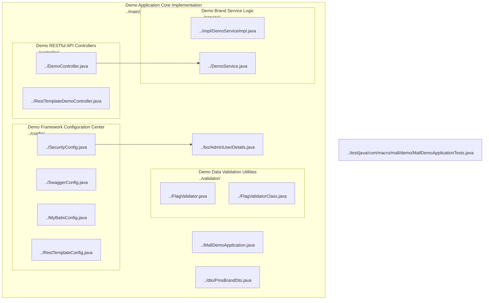
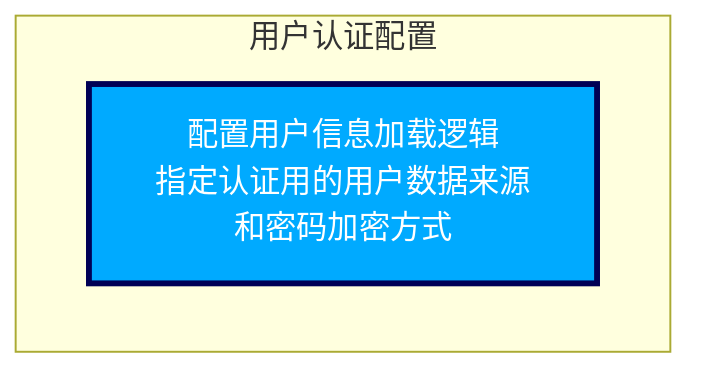

## 1. 模块功能概述

Demo Application Layered Framework 模块是一个基于 Spring Boot 的电商演示系统，采用分层架构设计，核心职责在于为品牌管理等核心业务提供结构清晰、易于扩展的实现范例。模块通过控制层（Controller）、服务层（Service）、数据访问层（Mapper）、数据传输对象（DTO）、校验器（Validator）等组件的协同，完整支撑了品牌的增删改查（CRUD）功能，涵盖品牌数据的获取、分页、创建、更新、删除等典型操作。同时，模块通过统一的响应封装（CommonResult）和接口文档自动生成（Swagger/OpenAPI），提升了前后端协作和接口维护效率。

此外，模块包含了基础设施配置，如 Spring Security 权限认证与用户信息封装、MyBatis 数据访问自动配置、RestTemplate 远程服务调用能力、Swagger 文档配置兼容处理等，确保系统具备良好的安全性、可观测性和外部系统对接能力。通过自定义参数校验注解和集成测试用例，保障了业务数据的有效性和系统的稳定性。整体上，该模块为电商应用的快速开发、测试和后续运维提供了坚实的基础框架和最佳实践示例。

## 2. 核心组件介绍

### 2.1 DemoController(Class)

DemoController属于文件mall-demo/src/main/java/com/macro/mall/demo/controller/DemoController.java, 该文件属于包com.macro.mall.demo.controller

- **主要职责**
  - DemoController是一个基于Spring MVC框架的控制器类，负责品牌管理相关的RESTful接口实现。它提供了品牌的增删改查操作，包括获取全部品牌列表、分页查询、根据ID查询、添加、更新和删除品牌。该控制器通过注入的DemoService完成具体业务逻辑，并统一使用CommonResult封装响应结果。同时，使用Swagger和OpenAPI注解支持接口文档的自动生成。

- **实现方式**
  - 当客户端发送HTTP请求到指定的品牌管理URL，如/brand/listAll、/brand/create等，Spring MVC框架根据请求路径和HTTP方法匹配到DemoController中的对应方法。方法接收请求参数（路径参数、请求体或查询参数），并通过注入的DemoService调用相应业务逻辑方法。服务层返回操作结果（通常是受影响行数或实体对象），控制器根据结果构造CommonResult响应对象，封装成功或失败信息返回给客户端。方法中使用@Validated注解自动校验输入参数，校验失败时请求会被拦截并返回错误。整个流程中，控制器负责请求解析、参数校验、调用业务服务、封装响应和日志记录，保证接口的规范性和统一性。Swagger/OpenAPI注解为每个接口自动生成文档，方便接口测试与维护。

- **使用时机**
  - DemoController在项目中主要被前端客户端或其他调用方通过HTTP请求访问，例如浏览器、移动端应用或其他服务调用品牌管理相关API时被触发。

### 2.2 RestTemplateDemoController(Class)

RestTemplateDemoController属于文件mall-demo/src/main/java/com/macro/mall/demo/controller/RestTemplateDemoController.java, 该文件属于包com.macro.mall.demo.controller

- **主要职责**
  - RestTemplateDemoController是一个基于Spring MVC框架的控制器类，主要用于演示如何使用Spring的RestTemplate客户端发起HTTP请求调用远程商城后台管理系统的REST接口。它封装了多种HTTP调用的示例，包括GET请求的路径变量传递、参数映射和URI构造，以及POST请求的JSON请求体和表单请求体发送。所有调用结果均以统一的CommonResult格式返回，方便前端使用和统一处理。

- **实现方式**
  - RestTemplateDemoController通过Spring的@Controller和@RequestMapping注解定义请求映射，注入RestTemplate对象和远程服务基础URL。每个接口方法对应一个HTTP请求，接收路径参数或请求体，构造完整的请求URL或请求实体，然后调用RestTemplate的getForEntity、getForObject、postForEntity、postForObject等方法发起HTTP请求。请求完成后，将远程接口返回的CommonResult对象提取并返回给调用者。该流程依赖Spring MVC的参数绑定和注解机制，实现请求接收、远程调用、响应体转换和结果返回的完整链路。不同方法演示了通过路径变量、参数映射、URI构造、JSON请求体和表单请求体等多种调用方式，以满足不同业务场景的需求。

- **使用时机**
  - RestTemplateDemoController通常在需要调用远程商城后台管理系统REST接口进行品牌信息查询、品牌创建和产品属性分类创建等业务操作时被调用，主要作为后台服务或前端请求转发层的接口提供者。

### 2.3 FlagValidator(Annotation)

FlagValidator属于文件mall-demo/src/main/java/com/macro/mall/demo/validator/FlagValidator.java, 该文件属于包com.macro.mall.demo.validator

- **主要职责**
  - FlagValidator 是一个基于 javax.validation 框架的自定义注解，用于校验被标注的字段或方法参数的值是否包含在预定义的字符串数组范围内。该注解可应用于字段和方法参数，支持自定义错误消息、校验分组和负载参数，确保传入的用户状态或标识符合业务规定的有效值范围。

- **实现方式**
  - 当被标注的字段或参数被校验时，javax.validation 框架会检测到 FlagValidator 注解，并调用其绑定的校验器 FlagValidatorClass。校验器从注解的 value 属性中获取允许的字符串数组，然后将被校验的值与该数组进行匹配。如果值存在于允许范围内，校验通过；否则校验失败，返回注解中定义的错误消息（默认为"flag is not found"，可被自定义覆盖）。校验过程支持结合分组（groups 属性）和负载（payload 属性），实现更细粒度的校验控制，方便集成到业务流程中保证数据合法性。

- **使用时机**
  - 该注解主要用于实体类的字段或接口方法的参数上，用于在数据接收或处理前校验字段值是否合法，通常应用于用户状态、标识符等需要限定在特定范围内的字符串值的校验。

### 2.4 FlagValidatorClass(Class)

FlagValidatorClass属于文件mall-demo/src/main/java/com/macro/mall/demo/validator/FlagValidatorClass.java, 该文件属于包com.macro.mall.demo.validator

- **主要职责**
  - FlagValidatorClass是一个实现了javax.validation.ConstraintValidator接口的校验器类，用于校验传入的Integer类型值是否属于一组预定义的允许值。它通过初始化时传入的字符串数组values，判断传入的整数转换成字符串后是否存在于该数组中，从而决定该整数值是否合法。

- **实现方式**
  - FlagValidatorClass实现了ConstraintValidator接口，首先在initialize方法中接收FlagValidator注解实例，从中获取value属性的字符串数组并赋值给私有字段values。随后在isValid方法中，接收待校验的Integer值，将其转换为字符串形式，与values数组中的每个字符串逐一比较。只要发现有匹配，立即返回true表示合法，否则遍历完成后返回false表示非法。该流程保证了传入的整数必须严格属于允许的字符串集合对应的整数值，校验逻辑简单且高效，易于扩展和维护。

- **使用时机**
  - 该校验器通常在业务模型中对需要校验状态标记的Integer字段使用时触发，具体调用时机是在数据绑定或数据校验阶段，借助javax.validation框架自动调用该校验器进行合法性判断，常见于请求参数校验、持久层实体校验等场景。

### 2.5 SwaggerConfig(Class)

SwaggerConfig属于文件mall-demo/src/main/java/com/macro/mall/demo/config/SwaggerConfig.java, 该文件属于包com.macro.mall.demo.config

- **主要职责**
  - SwaggerConfig是一个Spring Boot配置类，用于配置Swagger 2的API文档生成。该类继承自BaseSwaggerConfig，通过重写swaggerProperties方法提供了API文档的基本配置信息，包括扫描的控制器包路径、文档标题、描述、联系人、版本号以及是否启用安全配置。此外，它还定义了一个BeanPostProcessor Bean，用于解决Springfox与Spring框架版本之间的兼容性问题，确保Swagger UI和API文档的正常显示和交互。

- **实现方式**
  - 当Spring Boot应用启动时，Spring容器扫描到SwaggerConfig类，由于其标注了@Configuration和@EnableSwagger2注解，因此被识别为配置类并加载。容器调用swaggerProperties方法，获取包含API文档基础信息的SwaggerProperties对象。BaseSwaggerConfig利用此对象创建Swagger的Docket实例，指定API扫描的包路径、文档标题等信息，实现API文档的自动生成。swaggerProperties中enableSecurity字段控制是否启用Swagger的安全配置，通过条件判断注入相关安全Bean。springfoxHandlerProviderBeanPostProcessor方法注册一个BeanPostProcessor，该处理器在Spring Bean初始化后通过反射访问并调整Springfox的请求处理映射，解决Springfox与不同Spring版本间因内部实现差异导致的兼容性问题，保证Swagger UI能正常显示和交互，避免运行时错误。

- **使用时机**
  - 本配置类在Spring容器启动阶段被加载，Spring框架自动扫描@Configuration注解的类并实例化。SwaggerConfig通过重写swaggerProperties方法提供Swagger文档的核心配置，BaseSwaggerConfig根据这些配置构建Swagger的Docket实例用于接口扫描和文档生成。同时，定义的BeanPostProcessor在Spring Bean生命周期中对Springfox相关Bean进行后处理，解决兼容性问题。

### 2.6 MyBatisConfig(Class)

MyBatisConfig属于文件mall-demo/src/main/java/com/macro/mall/demo/config/MyBatisConfig.java, 该文件属于包com.macro.mall.demo.config

- **主要职责**
  - MyBatisConfig是一个Spring配置类，用于配置MyBatis框架。通过在类上使用@Configuration注解将其声明为配置类，并通过@MapperScan注解指定扫描com.macro.mall.mapper包中的MyBatis Mapper接口，实现Mapper接口的自动扫描和注册，简化MyBatis与Spring的集成配置。

- **实现方式**
  - 在Spring应用启动时，Spring容器扫描所有带有@Configuration注解的类。MyBatisConfig类上的@MapperScan注解指示Spring框架扫描com.macro.mall.mapper包下的所有Mapper接口。Spring通过MyBatis-Spring集成机制为这些接口创建动态代理对象，并将代理对象注册为Spring管理的Bean。这样，开发者在其他组件中通过依赖注入即可直接使用这些Mapper接口，调用数据库操作方法时，代理对象会委派给MyBatis执行对应的SQL语句，实现数据库访问的自动化管理。

- **使用时机**
  - 当Spring应用启动时，Spring容器扫描带有@Configuration注解的配置类。MyBatisConfig类通过@MapperScan注解告知Spring自动扫描com.macro.mall.mapper包下的所有Mapper接口，Spring随后为这些接口创建代理对象并注册为Bean，实现MyBatis接口的自动装配和数据库操作的便捷调用。

### 2.7 SecurityConfig(Class)

SecurityConfig属于文件mall-demo/src/main/java/com/macro/mall/demo/config/SecurityConfig.java, 该文件属于包com.macro.mall.demo.config

- **主要职责**
  - SecurityConfig 是基于 Spring Security 框架的安全配置类，通过继承 WebSecurityConfigurerAdapter，负责配置整个应用程序的安全策略。它主要定义了 HTTP 请求的访问授权规则、认证机制、登录和注销流程，以及密码加密方式。同时，SecurityConfig 自定义了 UserDetailsService，从数据库动态加载用户信息进行认证，保障认证流程的安全性。

- **实现方式**
  - SecurityConfig 通过重写 WebSecurityConfigurerAdapter 的 configure(HttpSecurity http) 方法，定义 HTTP 请求的访问授权规则。目前配置为所有请求允许访问（permitAll），启用了 HTTP Basic 认证和表单登录，指定了登录页面及失败跳转 URL，同时配置注销路径和注销成功后跳转首页。CSRF 保护被禁用，且关闭了 X-Frame-Options 头部以支持页面嵌入。通过 configure(AuthenticationManagerBuilder auth) 方法，指定使用自定义的 UserDetailsService 结合 BCryptPasswordEncoder 进行用户认证和密码验证。UserDetailsService 实现中通过 UmsAdminMapper 从数据库查询用户名对应的用户记录，若找到则封装为 AdminUserDetails 供认证流程使用，否则抛出异常阻止登录。整个流程保证了基于数据库的用户认证和密码安全性，同时支持灵活的权限配置和登录注销控制。

- **使用时机**
  - 该安全配置类在应用启动时由 Spring 容器加载并初始化，随后在整个应用运行期间负责拦截和处理所有 HTTP 请求的安全校验，以及用户登录认证流程。

### 2.8 RestTemplateConfig(Class)

RestTemplateConfig属于文件mall-demo/src/main/java/com/macro/mall/demo/config/RestTemplateConfig.java, 该文件属于包com.macro.mall.demo.config

- **主要职责**
  - RestTemplateConfig是一个Spring框架中的配置类，负责定义并注册一个RestTemplate类型的Bean实例。该Bean实例可被项目中其他组件通过依赖注入方式统一使用，从而方便进行RESTful HTTP请求的发送和响应处理。

- **实现方式**
  - RestTemplateConfig类使用@Configuration注解标记为Spring配置类，Spring容器启动时扫描到该类。类中定义的restTemplate方法被@Bean注解标记，Spring容器调用该方法创建RestTemplate实例，并将其实例注册到Spring的应用上下文中。项目中其他组件通过@Autowired等依赖注入注解引用该RestTemplate Bean，利用其API发起RESTful HTTP请求，完成远程服务调用。

- **使用时机**
  - 项目启动时，Spring容器扫描该配置类并实例化RestTemplate Bean，其他需要发送REST请求的组件在运行时通过依赖注入获得该RestTemplate实例并调用其方法进行HTTP交互。

### 2.9 DemoServiceImpl(Class)

DemoServiceImpl属于文件mall-demo/src/main/java/com/macro/mall/demo/service/impl/DemoServiceImpl.java, 该文件属于包com.macro.mall.demo.service.impl

- **主要职责**
  - DemoServiceImpl是com.macro.mall.demo.service.impl包中DemoService接口的实现类，负责实现品牌（PmsBrand）相关的业务逻辑。该类通过注入的PmsBrandMapper完成了品牌的增删改查操作，包括查询所有品牌、分页查询品牌、按ID获取品牌详情、新建品牌、更新品牌和删除品牌等功能，支撑demo模块中品牌管理的核心业务需求。

- **实现方式**
  - DemoServiceImpl通过Spring的@Autowired注解注入PmsBrandMapper，调用其对应的数据库操作方法实现业务逻辑。具体流程包括：
- listAllBrand方法调用selectByExample传入空的PmsBrandExample对象，实现无条件查询所有品牌。
- createBrand方法通过BeanUtils.copyProperties将传入的PmsBrandDto转换为实体PmsBrand，调用insertSelective进行选择性插入，避免插入null字段。
- updateBrand方法先将DTO转换为实体，设置ID后调用updateByPrimaryKeySelective实现选择性更新，实现局部字段更新。
- deleteBrand调用deleteByPrimaryKey执行物理删除。
- listBrand方法启动PageHelper分页插件，设置分页参数后调用selectByExample查询分页结果。
- getBrand方法通过selectByPrimaryKey根据ID查询单个品牌实体。
整个流程依赖MyBatis动态SQL实现选择性插入和更新，分页通过PageHelper实现。业务层不直接处理事务和异常，依赖调用方或框架统一管理。

- **使用时机**
  - DemoServiceImpl主要在demo模块涉及品牌管理的业务场景中被调用，如控制层接收到品牌相关的请求时，调用该服务层实现进行品牌数据的增删改查和分页查询操作。

### 2.10 DemoService(Interface)

DemoService属于文件mall-demo/src/main/java/com/macro/mall/demo/service/DemoService.java, 该文件属于包com.macro.mall.demo.service

- **主要职责**
  - DemoService接口是一个Java业务服务层接口，定义了对PmsBrand品牌实体进行标准的增删改查（CRUD）操作。它提供了获取所有品牌列表、分页查询品牌、根据ID查询品牌详情、创建新品牌、更新已有品牌以及删除品牌的方法，主要用于演示和实现品牌管理相关的业务逻辑。

- **实现方式**
  - 调用方通过传入必要参数（如品牌ID、分页信息、品牌数据传输对象等）调用接口方法。接口的实现类根据方法职责执行对应数据库操作或业务逻辑。例如，createBrand方法接受PmsBrandDto对象，拷贝属性后调用数据库插入操作并返回影响行数；listBrand使用分页插件基于pageNum和pageSize查询数据库；updateBrand通过ID定位并更新品牌信息；deleteBrand根据ID删除品牌记录；getBrand通过ID查询品牌详情；listAllBrand查询并返回所有品牌。返回值包括实体对象列表、单个实体或操作影响行数，具体异常处理和参数校验由实现层负责。

- **使用时机**
  - 该接口主要在项目中涉及品牌管理的业务场景中被调用，如控制层接收到品牌相关请求时，通过DemoService接口完成品牌数据的增删改查和分页查询操作。

### 2.11 MallDemoApplication(Class)

MallDemoApplication属于文件mall-demo/src/main/java/com/macro/mall/demo/MallDemoApplication.java, 该文件属于包com.macro.mall.demo

- **主要职责**
  - MallDemoApplication是一个典型的Spring Boot应用启动类，标注了@SpringBootApplication注解，包含main方法作为应用的入口点，用于启动整个Spring Boot应用上下文。

- **实现方式**
  - 当应用启动时，JVM调用MallDemoApplication的main方法，main方法内部调用SpringApplication.run(MallDemoApplication.class, args)。这一调用触发Spring Boot框架的自动配置机制，创建并初始化Spring应用上下文，进行组件扫描，加载配置信息，最终启动内嵌的Web服务器，完成整个应用的启动过程。

- **使用时机**
  - 该类在项目启动时被JVM调用，作为整个Spring Boot应用的入口点，通过main方法触发应用上下文的初始化和启动。

### 2.12 AdminUserDetails(Class)

AdminUserDetails属于文件mall-demo/src/main/java/com/macro/mall/demo/bo/AdminUserDetails.java, 该文件属于包com.macro.mall.demo.bo

- **主要职责**
  - AdminUserDetails 是一个实现了 Spring Security 中 UserDetails 接口的类，用于封装后台管理员用户 UmsAdmin 的认证和授权信息。该类通过 UmsAdmin 对象提供用户名、密码以及账户状态信息，同时实现了获取用户权限的方法，以支持 Spring Security 的认证和授权流程。

- **实现方式**
  - AdminUserDetails 通过构造方法接收一个 UmsAdmin 实例，内部保存该管理员用户的详细信息。实现 UserDetails 接口中的方法：getUsername() 和 getPassword() 返回 UmsAdmin 中存储的用户名和密码；getAuthorities() 当前返回一个固定的 "TEST" 权限列表，后续可能扩展为基于用户角色动态生成权限集合；isAccountNonExpired()、isAccountNonLocked()、isCredentialsNonExpired() 和 isEnabled() 方法均返回 true，表示账户始终处于有效状态，未实现账户状态的动态管理。该类作为用户安全信息的桥梁，被安全框架调用以完成认证和授权判断。

- **使用时机**
  - AdminUserDetails 类在系统进行用户认证时被调用，主要用于将数据库中查询到的 UmsAdmin 用户对象封装为 Spring Security 所需的 UserDetails 对象，供认证管理器进行身份验证和权限校验。

### 2.13 PmsBrandDto(Class)

PmsBrandDto属于文件mall-demo/src/main/java/com/macro/mall/demo/dto/PmsBrandDto.java, 该文件属于包com.macro.mall.demo.dto

- **主要职责**
  - PmsBrandDto是一个Java数据传输对象（DTO）类，用于封装品牌相关信息，包括品牌名称、品牌首字母、排序字段、厂家制造商状态、显示状态、品牌logo、品牌大图和品牌故事等属性。

- **实现方式**
  - PmsBrandDto通过封装私有成员变量存储品牌的各项属性，提供对应的getter和setter方法供外部访问和修改。字段上使用@ApiModelProperty注解描述属性含义，用于生成API文档。通过@NotNull、@Min和自定义@FlagValidator注解，实现对字段的有效性校验，保证必填字段和枚举状态字段的合法性。在数据传输过程中，框架会自动触发这些注解的校验逻辑，阻止非法数据进入业务层，确保数据正确和业务需求一致。

- **使用时机**
  - PmsBrandDto主要在业务逻辑层和表示层之间传递品牌信息数据时使用，如处理前端请求中的品牌数据输入、向前端返回品牌详情、以及服务层调用时作为参数或返回结果的数据载体。

### 2.14 MallDemoApplicationTests(Class)

MallDemoApplicationTests属于文件mall-demo/src/test/java/com/macro/mall/demo/MallDemoApplicationTests.java, 该文件属于包com.macro.mall.demo

- **主要职责**
  - MallDemoApplicationTests是一个基于Spring Boot的测试类，包含两个测试方法。一个空的contextLoads方法用于验证Spring应用上下文能否成功加载，确保应用启动无异常；另一个testLogStash方法用于测试日志组件对PmsProduct业务对象序列化后的日志输出，验证日志记录功能和日志格式的正确性。

- **实现方式**
  - 该测试类使用@SpringBootTest注解启动Spring Boot测试环境。contextLoads方法为空，测试框架执行时自动加载Spring应用上下文，若无异常则测试通过。testLogStash方法中，首先创建Jackson的ObjectMapper实例用于JSON序列化，构造一个PmsProduct对象并设置其id、名称、品牌名称。随后将该对象序列化成JSON字符串，分别通过SLF4J的logger以info和error两个日志级别输出日志。日志的具体实现和配置未明确说明，可能使用Logback或其他日志框架。该流程验证了业务对象的序列化、日志格式及日志记录接口的集成情况。

- **使用时机**
  - 该测试类在项目的单元测试阶段被调用，主要用于自动化测试过程中验证应用上下文加载和日志输出功能，确保基础环境和日志系统正常。

## 3. 模块内架构图

## 4. 关键控制流分析

### 4.1 SecurityConfig.configure 控制流分析

- 该图为"代码控制流图"，描述了Spring Security用户认证配置的核心控制逻辑。
- 图中唯一节点A1表示：
  - 配置用户信息加载逻辑，包括指定认证所用的用户数据来源（即自定义的UserDetailsService），以及指定密码加密方式（BCryptPasswordEncoder）。
- 控制流对应的代码实现为：
  - 在`configure`方法中，调用`auth.userDetailsService(userDetailsService())`，指定用户信息的加载方式；
  - 再调用`.passwordEncoder(new BCryptPasswordEncoder())`，指定密码的加密和校验算法。
- 此配置确保Spring Security在认证流程中：
  - 通过自定义的UserDetailsService实现动态加载用户详情（如通过数据库查询）；
  - 使用BCryptPasswordEncoder进行密码加密与比对，提高认证安全性。

下面介绍该函数所属的文件、类、函数的基本信息

| 文件 | 类 | 函数 |
| --- | --- | --- |
| mall-demo/src/main/java/com/macro/mall/demo/config/SecurityConfig.java | SecurityConfig | SecurityConfig.configure |
| SecurityConfig 是基于 Spring Security 框架的安全配置类，继承自 WebSecurityConfigurerAdapter，用于配置整个应用的安全策略。它定义了 HTTP 请求的授权规则、认证机制、登录与退出页面行为，并禁用了 CSRF 保护和部分安全头部。该类还通过自定义 UserDetailsService 从数据库中加载用户信息，完成用户认证。 | SecurityConfig 是基于 Spring Security 框架的安全配置类，通过继承 WebSecurityConfigurerAdapter，负责配置整个应用程序的安全策略。它主要定义了 HTTP 请求的访问授权规则、认证机制、登录和注销流程，以及密码加密方式。同时，SecurityConfig 自定义了 UserDetailsService，从数据库动态加载用户信息进行认证，保障认证流程的安全性。 | 该方法是Spring Security框架中继承自WebSecurityConfigurerAdapter的安全配置类中的重写方法，负责配置AuthenticationManagerBuilder，指定用户认证时使用的自定义UserDetailsService以及密码加密器。通过该方法，系统能够使用基于数据库的用户信息加载逻辑和BCrypt加密算法来完成用户认证。 |

## 5. 和其他模块之间的关系

### 5.1 调用其他模块的关系

#### 5.1.1 Product Core and Review Models（模块ID：18488）
本模块中的MallDemoApplicationTests、DemoController、DemoService、DemoServiceImpl等组件调用了Product Core and Review Models模块的PmsProduct和PmsBrand类。PmsProduct为商城系统中商品的核心数据模型，涵盖商品的基础信息、价格、库存、促销等多维度属性，是商品管理的基础。而PmsBrand则代表品牌相关的数据结构，为商品和品牌的关联、品牌信息的管理提供支撑。对这些类的调用实现了本模块对商品及品牌数据的读取、处理及相关业务逻辑的实现。

#### 5.1.2 Business Domain Data Models（模块ID：18496）
本模块的DemoServiceImpl、AdminUserDetails、DemoController、DemoService、MallDemoApplicationTests、SecurityConfig等组件调用了Business Domain Data Models模块中的PmsBrand、PmsBrandExample、UmsAdmin、UmsAdminExample等类。PmsBrand和PmsBrandExample用于品牌数据的操作与查询条件构建，UmsAdmin和UmsAdminExample则为用户权限和管理端账号的核心实体及查询对象。这些调用为品牌管理、用户身份认证和权限控制等业务提供了重要的数据支持。

#### 5.1.3 E-Commerce Data Model and Persistence Suite（模块ID：18499）
本模块的DemoServiceImpl、DemoController、MallDemoApplicationTests、SecurityConfig、AdminUserDetails等组件调用了E-Commerce Data Model and Persistence Suite模块的PmsBrand、PmsBrandExample、PmsProduct、UmsAdmin、UmsAdminExample、UmsAdminMapper、PmsBrandMapper等类。这些类涵盖商品、品牌、用户等核心业务的数据模型、数据库操作对象和查询辅助类，为本模块实现商品、品牌、管理员等对象的增删查改操作提供了基础。

#### 5.1.4 Core Utilities and Configuration（模块ID：18475）
DemoController和SwaggerConfig分别调用了Core Utilities and Configuration模块的CommonResult、CommonPage、SwaggerProperties和BaseSwaggerConfig等类。这些类在统一接口返回格式、分页处理、Swagger文档生成等方面提供了通用能力，极大提升了本模块接口的一致性与开发效率。

#### 5.1.5 Entity Database Mapper Interfaces（模块ID：18497）
DemoServiceImpl调用了Entity Database Mapper Interfaces模块的PmsBrandMapper。PmsBrandMapper为品牌相关的数据持久化操作提供了映射接口，是品牌数据与数据库之间的桥梁。

#### 5.1.6 Entity Query Helper Classes（模块ID：18477, 18476）
SecurityConfig和DemoServiceImpl分别调用了Entity Query Helper Classes模块的UmsAdminExample和PmsBrandExample。这些类为构建灵活的数据库查询条件提供了帮助，便于对管理员和品牌等数据进行复杂查询。

#### 5.1.7 Generic Entity Query Builder Suite（模块ID：18495）
DemoServiceImpl和SecurityConfig调用了Generic Entity Query Builder Suite模块的PmsBrandExample和UmsAdminExample，为通用的数据查询构建提供了工具，提高了复杂查询的开发效率。

#### 5.1.8 Admin User and Permission Models（模块ID：18489）
AdminUserDetails和SecurityConfig调用了Admin User and Permission Models模块的UmsAdmin。该类为后台用户及权限相关的数据模型，支持后台管理端的用户认证与权限分配。

### 5.2 被其他模块调用的关系

本模块未被其他模块直接调用，暂无被调用关系。

## 6. 模块数据结构

```mermaid
classDiagram
    class DemoController {
        +CommonResult~List~PmsBrand~~ getBrandList()
        +CommonResult createBrand(PmsBrandDto pmsBrand)
        +CommonResult updateBrand(Long id, PmsBrandDto pmsBrandDto)
        +CommonResult deleteBrand(Long id)
        +CommonResult~CommonPage~PmsBrand~~~ listBrand(Integer pageNum, Integer pageSize)
        +CommonResult~PmsBrand~ brand(Long id)
        -DemoService demoService
    }

    class DemoService {
        <<interface>>
        +List~PmsBrand~ listAllBrand()
        +int createBrand(PmsBrandDto pmsBrandDto)
        +int updateBrand(Long id, PmsBrandDto pmsBrandDto)
        +int deleteBrand(Long id)
        +List~PmsBrand~ listBrand(int pageNum, int pageSize)
        +PmsBrand getBrand(Long id)
    }

    class DemoServiceImpl {
        +List~PmsBrand~ listAllBrand()
        +int createBrand(PmsBrandDto pmsBrandDto)
        +int updateBrand(Long id, PmsBrandDto pmsBrandDto)
        +int deleteBrand(Long id)
        +List~PmsBrand~ listBrand(int pageNum, int pageSize)
        +PmsBrand getBrand(Long id)
        -PmsBrandMapper brandMapper
    }

    DemoService <|.. DemoServiceImpl
    DemoController --> DemoService
    DemoServiceImpl --> PmsBrandMapper
    DemoServiceImpl --> PmsBrandDto
    DemoServiceImpl --> PmsBrand

    class RestTemplateDemoController {
        +Object getForEntity(Long id)
        +Object getForEntity2(Long id)
        +Object getForEntity3(Long id)
        +Object getForObject(Long id)
        +Object postForEntity(PmsBrand brand)
        +Object postForObject(PmsBrand brand)
        +Object postForEntity3(String name)
        -RestTemplate restTemplate
        -String HOST_MALL_ADMIN
    }

    class RestTemplateConfig {
        +RestTemplate restTemplate()
    }

    class FlagValidatorClass {
        +void initialize(FlagValidator flagValidator)
        +boolean isValid(Integer value, ConstraintValidatorContext constraintValidatorContext)
        -String[] values
    }
    FlagValidatorClass ..|> ConstraintValidator~FlagValidator,Integer~

    class SwaggerConfig {
        +SwaggerProperties swaggerProperties()
        +BeanPostProcessor springfoxHandlerProviderBeanPostProcessor()
    }

    class BaseSwaggerConfig {
        <<abstract>>
        +Docket createRestApi()
        +SwaggerProperties swaggerProperties()
        +BeanPostProcessor generateBeanPostProcessor()
    }
    SwaggerConfig <|-- BaseSwaggerConfig

    class MyBatisConfig {
    }

    class SecurityConfig {
        +SecurityFilterChain filterChain(HttpSecurity httpSecurity)
        -IgnoreUrlsConfig ignoreUrlsConfig
        -RestfulAccessDeniedHandler restfulAccessDeniedHandler
        -RestAuthenticationEntryPoint restAuthenticationEntryPoint
        -JwtAuthenticationTokenFilter jwtAuthenticationTokenFilter
        -DynamicSecurityService dynamicSecurityService
        -DynamicSecurityFilter dynamicSecurityFilter
    }
    SecurityConfig --> AdminUserDetails
    SecurityConfig --> IgnoreUrlsConfig
    SecurityConfig --> RestfulAccessDeniedHandler
    SecurityConfig --> RestAuthenticationEntryPoint
    SecurityConfig --> JwtAuthenticationTokenFilter
    SecurityConfig --> DynamicSecurityService
    SecurityConfig --> DynamicSecurityFilter

    class AdminUserDetails {
        +Collection~GrantedAuthority~ getAuthorities()
        +String getPassword()
        +String getUsername()
        +boolean isAccountNonExpired()
        +boolean isAccountNonLocked()
        +boolean isCredentialsNonExpired()
        +boolean isEnabled()
        -UmsAdmin umsAdmin
        -List~UmsResource~ resourceList
    }
    AdminUserDetails ..|> UserDetails
    AdminUserDetails --> UmsAdmin
    AdminUserDetails --> UmsResource

    class MallDemoApplication {
        +main(String[] args)
    }

    class PmsBrandDto {
        +String getName()
        +void setName(String name)
        +String getFirstLetter()
        +void setFirstLetter(String firstLetter)
        +Integer getSort()
        +void setSort(Integer sort)
        +Integer getFactoryStatus()
        +void setFactoryStatus(Integer factoryStatus)
        +Integer getShowStatus()
        +void setShowStatus(Integer showStatus)
        +String getLogo()
        +void setLogo(String logo)
        +String getBigPic()
        +void setBigPic(String bigPic)
        +String getBrandStory()
        +void setBrandStory(String brandStory)
        -String name
        -String firstLetter
        -Integer sort
        -Integer factoryStatus
        -Integer showStatus
        -String logo
        -String bigPic
        -String brandStory
    }

    class MallDemoApplicationTests {
        +void contextLoads()
        +void testLogStash()
        -Logger logger
    }

```

- 本图为**代码类/接口之间的UML关系图**，展示了 Mall Demo 应用中核心类、接口及其主要成员方法和类之间的继承、实现与依赖关系。
- 重点内容如下：

---

- `DemoController`（品牌管理示例接口，控制层）
    - 公开方法：品牌的增删改查、分页获取、单条获取等（如 `getBrandList`, `createBrand`, `updateBrand`, `deleteBrand`, `listBrand`, `brand`）。
    - 内部依赖成员：`DemoService`（业务层接口）。
    - 与 `DemoService` 通过调用关系 (`-->`) 关联。

- `DemoService`（品牌管理业务接口）
    - 声明了品牌相关的业务操作方法（如 `listAllBrand`, `createBrand`, `updateBrand`, `deleteBrand`, `listBrand`, `getBrand`）。
    - 为接口 (`<<interface>>`)，由 `DemoServiceImpl` 实现。
    - 与 `DemoController` 之间为接口调用关系。

- `DemoServiceImpl`（品牌管理业务实现类）
    - 实现 `DemoService`（`<|..` 继承关系）。
    - 依赖 `PmsBrandMapper`（数据访问层）、`PmsBrandDto`、`PmsBrand`。
    - 包含与品牌业务相关的具体实现方法。

- `RestTemplateDemoController`（RestTemplate 调用示例控制器）
    - 提供多种 HTTP 调用品牌相关接口的演示方法（如 `getForEntity`, `getForObject`, `postForEntity`, `postForObject` 等）。
    - 依赖成员：`RestTemplate`（由 `RestTemplateConfig` 提供），`HOST_MALL_ADMIN`（远程主机地址字符串）。

- `RestTemplateConfig`（RestTemplate 配置类）
    - 提供 `RestTemplate` Bean 的方法（`restTemplate()`），供控制器依赖注入使用。

- `FlagValidatorClass`
    - 实现接口 `ConstraintValidator<FlagValidator, Integer>`（`..|>` 继承关系）。
    - 实现方法：`initialize`（初始化校验器）、`isValid`（校验逻辑）。

- `SwaggerConfig`（Swagger API 文档配置类）
    - 继承自抽象类 `BaseSwaggerConfig`（`<|--` 继承关系）。
    - 重写 `swaggerProperties()`，提供接口文档属性配置。
    - 提供 `springfoxHandlerProviderBeanPostProcessor()` Bean，用于兼容 Springfox。

- `BaseSwaggerConfig`（Swagger 基础配置抽象类）
    - 定义了 `createRestApi`、`swaggerProperties`、`generateBeanPostProcessor` 等方法。
    - 为抽象基类，供 `SwaggerConfig` 继承和扩展。

- `MyBatisConfig`
    - MyBatis 框架相关的配置类，无方法或成员。

- `SecurityConfig`（安全配置类）
    - 配置 Spring Security 相关安全过滤链（`filterChain`）。
    - 依赖于多个安全相关 Bean（如 `IgnoreUrlsConfig`, `RestfulAccessDeniedHandler`, `RestAuthenticationEntryPoint`, `JwtAuthenticationTokenFilter`, `DynamicSecurityService`, `DynamicSecurityFilter`）。
    - 与 `AdminUserDetails`、`IgnoreUrlsConfig` 等类有依赖关系。

- `AdminUserDetails`
    - 实现接口 `UserDetails`（`..|>` 继承关系）。
    - 持有 `UmsAdmin`（后台用户信息）、`List<UmsResource>`（资源列表）。
    - 实现用户权限及状态相关方法（如 `getAuthorities`, `getPassword`, `getUsername` 等）。
    - 与 `UmsAdmin`、`UmsResource` 有关联。

- `PmsBrandDto`
    - 品牌数据传输对象，包含品牌的各种属性（如 `name`, `firstLetter`, `sort`, `factoryStatus`, `showStatus`, `logo`, `bigPic`, `brandStory`）及其 getter/setter。

- `MallDemoApplication`
    - Spring Boot 应用主类，包含 `main` 方法（程序入口）。

- `MallDemoApplicationTests`
    - 应用测试类，包含测试方法（如 `contextLoads`, `testLogStash`），用于日志和环境加载测试。

---

- 关系说明：
    - 实线箭头（`-->`）表示依赖或关联，如控制器依赖服务、服务实现依赖数据访问对象。
    - 空心三角箭头（`<|--`、`<|..`、`..|>`）表示继承或实现关系，如实现接口或继承抽象类。
    - 类之间的依赖和实现关系，清晰反映了各层之间的职责划分与调用路径，符合标准的 Spring Boot 分层架构设计思想。
